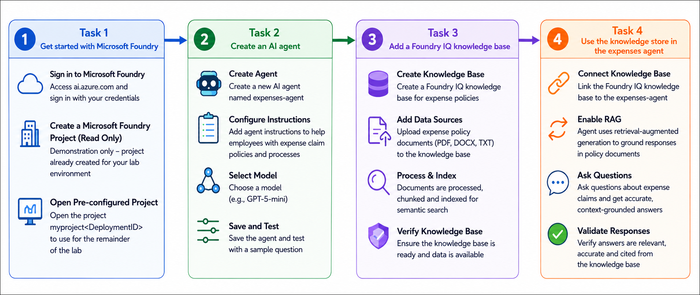

# AI-901: Microsoft Azure AI Fundamentals Workshop

Welcome to your AI-901: Microsoft Azure AI Fundamentals workshop! We've prepared a seamless environment for you to explore and learn Azure Services. Let's begin by making the most of this experience.

# Get started with Microsoft Foundry

### Overall Estimated timing: 45 Minutes

## Overview

In this hands-on lab, you will build and enhance an AI agent within Microsoft Foundry that can assist employees with expense claim policies and procedures. You will start by accessing a pre-configured Microsoft Foundry project and creating an AI agent named **expenses-agent** with specific instructions to help employees understand expense policies. Then, you will create a Foundry IQ knowledge base to store and manage your organization's expense policy documentation. Finally, you will integrate the knowledge base with your agent to enable it to provide accurate, context-grounded responses to employee questions about expense claims. This hands-on experience demonstrates how to use Foundry IQ as a central knowledge management system that improves agent accuracy and reliability by connecting agents to real company data and policies.

## Objectives

By the end of this lab, you will be able to create and configure AI agents in Microsoft Foundry, build knowledge bases using Foundry IQ, and connect them to provide intelligent, context-aware responses.

1. **Get started with Microsoft Foundry**: Access a pre-configured Microsoft Foundry project and familiarize yourself with the project workspace and portal interface.

2. **Create an AI agent**: Build a new AI agent called expenses-agent and configure it with system instructions that define its role as an advisor on company expense policies.

3. **Add a Foundry IQ knowledge base**: Set up a Foundry IQ resource and create a knowledge base connected to your company's expense policy documentation stored in Azure Blob Storage.

4. **Use the knowledge store in the expenses agent**: Connect the knowledge base to your agent and verify that it can now provide accurate, policy-based answers with citations from the knowledge base. 

## Pre-requisites

To get the most out of this lab, you should have:

- **Basic understanding of AI and chatbots**: Know what AI agents are and how they can answer questions.
- **Familiarity with the Azure portal**: Ability to navigate and use basic Azure services.
- **Understanding of cloud concepts**: Basic knowledge of resources, subscriptions, and resource groups in Azure.
- **No coding experience required**: This lab uses the Microsoft Foundry portal interface, so you do not need to write any code.

## Architecture

In this hands-on lab, the architecture demonstrates how an AI agent uses a knowledge base to provide accurate answers based on company policies and procedures.

1. **Microsoft Foundry Project**: A pre-configured project workspace where you create AI agents, manage deployments, and configure knowledge bases.

2. **Expenses Agent**: An AI agent created within Foundry that is trained to help employees with expense claim questions. It can be enhanced with knowledge from policy documents.

3. **Model Deployment**: A generative AI model that powers the expenses agent. This model generates responses based on user questions and available knowledge.

4. **Foundry IQ Knowledge Base**: A searchable database that stores your company's expense policy documents. It retrieves relevant information when the agent is asked a question.

5. **Azure Blob Storage**: Cloud storage where the expense policy documents are stored. The knowledge base indexes these documents for quick retrieval.

6. **Knowledge Retrieval Flow**: When a user asks the agent a question, it searches the knowledge base, finds relevant policies, and provides an answer with citations to the source documents. 

## Architecture Diagram

## Explanation of Components

1. **Microsoft Foundry Portal**: The web-based interface where you manage AI projects, create agents, and configure knowledge bases. It provides a user-friendly workspace for building AI applications without coding.

2. **Expenses Agent**: An AI agent designed to answer employee questions about expense policies. It has system instructions that guide its responses and can be connected to a knowledge base for accurate information.

3. **Generative AI Model**: The language model that powers the agent. It understands user questions and generates helpful responses. In this lab, a pre-deployed model is available for your use.

4. **Foundry IQ**: A knowledge management system that allows you to upload and organize company documents (like expense policies). It makes this information searchable and accessible to agents.

5. **Knowledge Base**: A searchable database created within Foundry IQ that stores your expense policy documents. When the agent needs to answer a question, it searches this knowledge base for relevant information.

6. **Azure Blob Storage**: Cloud storage service where the actual policy documents are stored. The knowledge base connects to these documents to retrieve the most up-to-date policy information.

7. **Access Control (IAM)**: Azure's security system that controls which applications and agents can access which resources. In this lab, you'll set permissions so the agent can read from the knowledge base.

8. **Citations and Grounding**: The agent can reference specific sections of policy documents in its responses, showing users exactly where the information came from. This builds trust and ensures accuracy. 

# Getting Started with lab
 
Welcome to your AI-901: Microsoft Azure AI Fundamentals workshop! We've prepared a seamless environment for you to explore and learn about machine learning and AI concepts and related Microsoft Azure services. Let's begin by making the most of this experience:
 
## Accessing Your Lab Environment
 
Once you're ready to dive in, your virtual machine and **Guide** will be right at your fingertips within your web browser.
 

## Virtual Machine & Lab Guide
 
Your virtual machine is your workhorse throughout the workshop. The lab guide is your roadmap to success.

## Exploring Your Lab Resources
 
To get a better understanding of your lab resources and credentials, navigate to the **Environment** tab.
 

## Lab Guide Zoom In/Zoom Out
 
To adjust the zoom level for the environment page, click the **A↕: 100%** icon located next to the timer in the lab environment.

## Utilizing the Split Window Feature
 
For convenience, you can open the lab guide in a separate window by selecting the **Split Window** button from the Top right corner.
 

## Managing Your Virtual Machine
 
Feel free to **Start, Stop, or Restart (2)** your virtual machine as needed from the **Resources (1)** tab. Your experience is in your hands!
 

## Track Your Progress

Click on the **Progress** tab to track your progress in the lab. The percentage increases as you complete each validation and reaches 100% when all validations are successfully completed.  

On the **Progress (1)** tab, you can view your overall points and validation status, **Validations 0/1 (2)**.    

## Lab Duration Extension

1. To extend the duration of the lab, kindly click the **Hourglass** icon in the top right corner of the lab environment. 

    

    >**Note:** You will get the **Hourglass** icon when 10 minutes are remaining in the lab.

2. Click **OK** to extend your lab duration.
 
    

3. If you have not extended the duration prior to when the lab is about to end, a pop-up will appear, giving you the option to extend. Click **OK** to proceed.

## Let's Get Started with Azure Portal
 
1. On your virtual machine, click on the **Azure Portal** icon as shown below:
 
    

2. You'll see the **Sign into Microsoft Azure** tab. Here, enter your **credentials (1)** and click on **Next (2)**:
 
    - **Email/Username:** <inject key="AzureAdUserEmail"></inject>
 
      
 
3. Next, provide your **password (1)** and click on **Next (2)**:
 
    - **Password:** <inject key="AzureAdUserPassword"></inject>
 
      
 
4. If you see the pop-up **Stay-Signed in?**, click **Yes**.

    
 
5. If a **Welcome to Microsoft Azure** pop-up window appears, simply click **Maybe later**.

    

## Support Contact
 
The CloudLabs support team is available 24/7, 365 days a year, via email and live chat to ensure seamless assistance at any time. We offer dedicated support channels explicitly tailored for both learners and instructors, ensuring that all your needs are promptly and efficiently addressed.
 
Learner Support Contacts:
 
- Email Support: cloudlabs-support@spektrasystems.com
- Live Chat Support: https://cloudlabs.ai/labs-support

Click on **Next** from the lower right corner to move on to the next page.

   .png)

## Happy Learning !!
