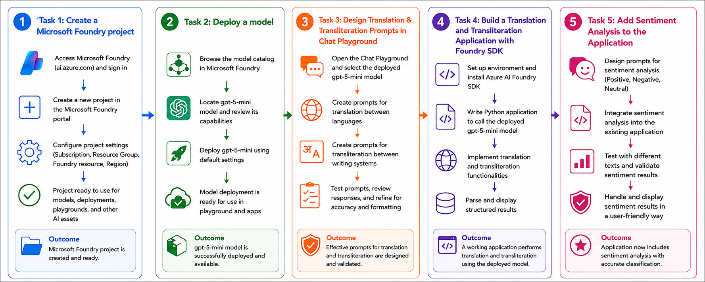

# AI-901: Microsoft Azure AI Fundamentals Workshop

Welcome to your AI-901: Microsoft Azure AI Fundamentals workshop! We're excited to guide you through hands-on learning with Azure AI services. Let’s continue by diving deeper into content moderation.

# Module 08: Language Translation with Microsoft Foundry

### Overall Estimated Timing: 60 Minutes

## Overview

In this lab, you will use Microsoft Foundry to build a multilingual text-processing application powered by a deployed GPT-5 Mini model. You will begin by creating a Microsoft Foundry project and deploying a model that will be used throughout the lab. Using the Chat Playground, you will design and test prompts for translation and transliteration, learning how generative AI can translate text between languages and convert text between writing systems while preserving meaning.

You will then build a Python application using the Azure AI Foundry SDK and connect it to your deployed model. The application will perform translation, transliteration, and language detection tasks using prompt engineering. Finally, you will extend the application by adding sentiment analysis capabilities, enabling the model to classify text as Positive, Negative, or Neutral. Through these activities, you will gain hands-on experience integrating generative AI models into applications and using a single deployment to perform multiple natural language processing tasks.

## Objectives

By the end of this lab, you will be able to:

1. **Create a Microsoft Foundry project:** Set up and configure a Microsoft Foundry project and obtain the project endpoint required for model integration and application development.

2. **Deploy a generative AI model:** Browse the Microsoft Foundry model catalog and deploy a GPT-5 Mini model using the recommended default configuration.

3. **Design and test translation prompts:** Use the Chat Playground to create and evaluate prompts that translate text between different languages.

4. **Design and test transliteration prompts:** Explore how generative AI can convert text between writing systems while preserving the original language and meaning.

5. **Build a Python application with the Azure AI Foundry SDK:** Create an application that connects to a deployed model and performs text-processing tasks programmatically.

6. **Implement translation, transliteration, and language detection:** Use prompt engineering to perform multiple multilingual text-processing tasks with a single deployed model.

7. **Add sentiment analysis capabilities:** Extend the application to classify text as Positive, Negative, or Neutral using the same GPT-5 Mini deployment.

8. **Understand multi-purpose AI model usage:** Learn how a single generative AI model can support multiple natural language processing scenarios through effective prompting and application integration.

## Pre-requisites

* Basic knowledge of Python programming and running commands from a terminal or command-line interface.
* General understanding of generative AI models and prompt-based interactions.
* Basic knowledge of language translation, transliteration, and sentiment analysis concepts.

## Architecture

This lab demonstrates how Microsoft Foundry and the Azure AI Foundry SDK can be used to build a multilingual text-processing application powered by a deployed GPT-5 Mini model. The architecture highlights how user input is processed through prompts and sent to the deployed model to perform multiple natural language processing tasks.

1. **Microsoft Foundry Project:** A centralized workspace used to manage AI resources, model deployments, project settings, and application connectivity.

2. **GPT-5 Mini Model Deployment:** The generative AI model deployed within Microsoft Foundry that processes prompts and generates responses for translation, transliteration, language detection, and sentiment analysis tasks.

3. **Chat Playground:** A browser-based interface used to design, test, and refine translation and transliteration prompts before integrating them into an application.

4. **Azure AI Foundry SDK Application:** A Python application that connects to the Foundry project and invokes the deployed model programmatically using the project endpoint and deployment name.

5. **Prompt-Based NLP Processing:** User input is sent to the deployed model through carefully designed prompts, enabling the model to perform translation, transliteration, language detection, and sentiment analysis using a single deployment.

6. **Generated Results:** The model returns translated text, transliterated text, detected language information, or sentiment classifications, which are then displayed by the application to the user.

## Architecture Diagram

## Explanation of Components

1. **Microsoft Foundry Project:**
   The project acts as the central workspace for managing AI resources, model deployments, project settings, and application integration used throughout the lab.

2. **GPT-5 Mini Model Deployment:**
   A generative AI model deployed within Microsoft Foundry that processes prompts and generates responses for translation, transliteration, language detection, and sentiment analysis tasks.

3. **Chat Playground:**
   A browser-based interface used to interact with the deployed model, experiment with prompts, and evaluate translation and transliteration capabilities before integrating them into an application.

4. **Azure AI Foundry SDK:**
   A Python SDK that enables applications to connect to Microsoft Foundry projects, authenticate securely, and invoke deployed AI models programmatically.

5. **Translation Functionality:**
   The capability of the deployed model to convert text from one language to another while preserving the original meaning and context.

6. **Transliteration Functionality:**
   The process of converting text from one writing system to another without changing the language or meaning of the original text.

7. **Language Detection:**
   A text-processing capability that identifies the language of the input text and can be combined with translation to provide output in a target language.

8. **Sentiment Analysis:**
   A natural language processing task that classifies text as Positive, Negative, or Neutral based on the overall tone and sentiment expressed in the content.

9. **Prompt-Based Processing:**
   The technique of guiding model behavior through carefully designed prompts, enabling a single deployed model to perform multiple language-related tasks without additional training.

10. **Application Output:**
    The results generated by the model, including translated text, transliterated text, detected language information, and sentiment classifications, which are displayed to the user through the Python application.

# Getting Started with lab
 
Welcome to your AI-901: Microsoft Azure AI Fundamentals workshop! We've prepared a seamless environment for you to explore and learn about machine learning and AI concepts and related Microsoft Azure services. Let's begin by making the most of this experience:
 
## Accessing Your Lab Environment
 
Once you're ready to dive in, your virtual machine and **Guide** will be right at your fingertips within your web browser.
 

### Virtual Machine & Lab Guide
 
Your virtual machine is your workhorse throughout the workshop. The lab guide is your roadmap to success.

## Exploring Your Lab Resources
 
To get a better understanding of your lab resources and credentials, navigate to the **Environment** tab.
 

## Lab Guide Zoom In/Zoom Out
 
To adjust the zoom level for the environment page, click the **A↕: 100%** icon located next to the timer in the lab environment.

## Utilizing the Split Window Feature
 
For convenience, you can open the lab guide in a separate window by selecting the **Split Window** button from the Top right corner.
 

## Managing Your Virtual Machine
 
Feel free to **Start, Stop, or Restart (2)** your virtual machine as needed from the **Resources (1)** tab. Your experience is in your hands!
 

## Track Your Progress

Click on the **Progress** tab to track your progress in the lab. The percentage increases as you complete each validation and reaches 100% when all validations are successfully completed.  

On the **Progress (1)** tab, you can view your overall points and validation status, **Validations 0/1 (2)**.    

## Lab Duration Extension

1. To extend the duration of the lab, kindly click the **Hourglass** icon in the top right corner of the lab environment. 

    

    >**Note:** You will get the **Hourglass** icon when 10 minutes are remaining in the lab.

2. Click **OK** to extend your lab duration.
 
   

3. If you have not extended the duration prior to when the lab is about to end, a pop-up will appear, giving you the option to extend. Click **OK** to proceed.

## Let's Get Started with Azure Portal
 
1. On your virtual machine, click on the Azure Portal icon as shown below:
 
   .png)

2. You'll see the **Sign into Microsoft Azure** tab. Here, enter your credentials:
 
   - **Email/Username:** <inject key="AzureAdUserEmail"></inject>
 
       
 
3. Next, provide your password:
 
   - **Temporary Access Pass:** <inject key="AzureAdUserPassword"></inject>
 
     
 
4. If prompted to stay signed in, you can click **No**.

    
 
7. If a **Welcome to Microsoft Azure** pop-up window appears, simply click **Maybe later**.

    

## Support Contact
 
The CloudLabs support team is available 24/7, 365 days a year, via email and live chat to ensure seamless assistance at any time. We offer dedicated support channels explicitly tailored for both learners and instructors, ensuring that all your needs are promptly and efficiently addressed.
 
Learner Support Contacts:
 
- Email Support: cloudlabs-support@spektrasystems.com
- Live Chat Support: https://cloudlabs.ai/labs-support

Click on **Next** from the lower right corner to move on to the next page.

   .png)

## Happy Learning !!
