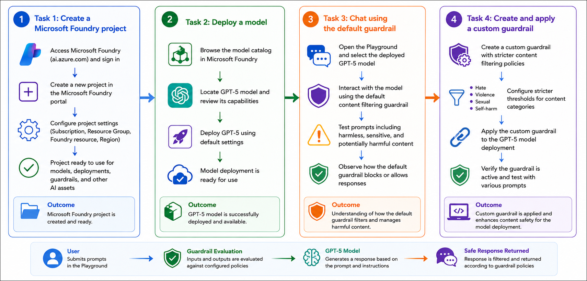

# AI-901: Microsoft Azure AI Fundamentals Workshop

Welcome to your AI-901: Microsoft Azure AI Fundamentals workshop! We're excited to guide you through hands-on learning with Azure AI services. Let’s continue by diving deeper into content moderation.

# Module 07: Apply guardrails to prevent the output of harmful content

### Overall Estimated Timing: 30 Minutes

## Overview

In this lab, you will explore how to use Microsoft Foundry to implement responsible AI practices through the use of content safety guardrails. You will create a Microsoft Foundry project, deploy a GPT-5 model, and interact with the model using the default content filtering configuration. By testing a variety of prompts, including harmful, offensive, and sensitive requests, you will observe how built-in guardrails help manage AI-generated content.

You will then create and apply a custom guardrail with stricter filtering thresholds for categories such as Hate, Violence, Sexual, and Self-harm content. Finally, you will verify the guardrail configuration and understand how content filtering supports the development of safe, responsible, and trustworthy AI applications.

## Objectives

By the end of this lab, you will be able to:

1. **Create a Microsoft Foundry project:** Set up and configure a Microsoft Foundry project to manage AI resources, model deployments, and guardrail configurations.

2. **Deploy a generative AI model:** Browse the Microsoft Foundry model catalog, review model details, and deploy a GPT-5 model using the recommended default settings.

3. **Explore default content safety guardrails:** Interact with a deployed model and observe how built-in content filters handle potentially harmful, offensive, and sensitive prompts.

4. **Test model behavior with different prompt types:** Evaluate the responses generated for prompts related to violence, hate speech, and self-harm, and understand how default guardrails influence model outputs.

5. **Create and configure custom guardrails:** Define stricter content filtering policies for Hate, Violence, Sexual, and Self-harm categories by configuring custom guardrail settings.

6. **Apply guardrails to model deployments:** Associate a custom guardrail with a deployed model and verify that the updated content safety controls are active.

7. **Understand responsible AI practices:** Learn how content filtering and guardrails help reduce harmful content generation and support the development of safe, responsible, and trustworthy AI applications.

## Pre-requisites

* Basic knowledge of the Azure portal and navigating cloud resources.
* Familiarity with Microsoft Foundry and its project-based workspace experience.
* General understanding of generative AI models and prompt-based interactions.
* Basic awareness of Responsible AI concepts, including content safety and content moderation.

## Architecture

This lab demonstrates how Microsoft Foundry uses content safety guardrails to control interactions with generative AI models. The architecture highlights how prompts and model responses are evaluated against safety policies before being returned to the user.

1. **Microsoft Foundry Project:** A centralized workspace used to manage AI resources, model deployments, and guardrail configurations.

2. **GPT-5 Model Deployment:** The generative AI model that processes user prompts and generates responses within the Foundry project.

3. **Content Safety Guardrails:** Built-in and custom content filtering policies that evaluate prompts and model responses for harmful content categories such as Hate, Violence, Sexual, and Self-harm.

4. **Foundry Playground:** A browser-based interface used to interact with the deployed model, test prompts, and observe the effects of content filtering.

5. **Filtered Responses:** User prompts and model completions are checked against the configured guardrails, ensuring that potentially harmful content is blocked or moderated before being displayed.

## Architecture Diagram

## Explanation of Components

1. **Microsoft Foundry Project:**
   The project serves as the central workspace for managing AI resources, model deployments, playground experiences, and guardrail configurations used throughout the lab.

2. **GPT-5 Model Deployment:**
   A generative AI model deployed within the Foundry project that processes user prompts and generates responses based on its training and configured safety settings.

3. **Content Safety Guardrails:**
   Safety controls that evaluate user prompts and model responses for harmful content. These guardrails help detect and mitigate risks related to hate speech, violence, sexual content, and self-harm.

4. **Default Guardrail Configuration:**
   The built-in content filtering policy applied to model deployments by default. It provides a balanced approach to content moderation by blocking potentially harmful content while allowing safe interactions.

5. **Custom Guardrails:**
   User-defined content filtering policies that enable organizations to adjust blocking thresholds for specific risk categories and enforce stricter responsible AI requirements.

6. **Foundry Playground Experience:**
   A browser-based interface used to interact with the deployed model, test prompts, observe model behavior, and validate the impact of content filtering settings.

7. **Prompt and Response Evaluation:**
   The process by which both user inputs and AI-generated outputs are analyzed against configured guardrail policies before a response is returned to the user.

8. **Filtered Responses:**
   The final outputs returned to users after content safety checks have been applied, helping ensure that harmful or inappropriate content is blocked or moderated according to organizational policies.

# Getting Started with lab
 
Welcome to your AI-901: Microsoft Azure AI Fundamentals workshop! We've prepared a seamless environment for you to explore and learn about machine learning and AI concepts and related Microsoft Azure services. Let's begin by making the most of this experience:
 
## Accessing Your Lab Environment
 
Once you're ready to dive in, your virtual machine and **Guide** will be right at your fingertips within your web browser.
 

### Virtual Machine & Lab Guide
 
Your virtual machine is your workhorse throughout the workshop. The lab guide is your roadmap to success.

## Exploring Your Lab Resources
 
To get a better understanding of your lab resources and credentials, navigate to the **Environment** tab.
 

## Lab Guide Zoom In/Zoom Out
 
To adjust the zoom level for the environment page, click the **A↕: 100%** icon located next to the timer in the lab environment.

## Utilizing the Split Window Feature
 
For convenience, you can open the lab guide in a separate window by selecting the **Split Window** button from the Top right corner.
 

## Managing Your Virtual Machine
 
Feel free to **Start, Stop, or Restart (2)** your virtual machine as needed from the **Resources (1)** tab. Your experience is in your hands!
 

## Track Your Progress

Click on the **Progress** tab to track your progress in the lab. The percentage increases as you complete each validation and reaches 100% when all validations are successfully completed.  

On the **Progress (1)** tab, you can view your overall points and validation status, **Validations 0/1 (2)**.    

## Lab Duration Extension

1. To extend the duration of the lab, kindly click the **Hourglass** icon in the top right corner of the lab environment. 

    

    >**Note:** You will get the **Hourglass** icon when 10 minutes are remaining in the lab.

2. Click **OK** to extend your lab duration.
 
   

3. If you have not extended the duration prior to when the lab is about to end, a pop-up will appear, giving you the option to extend. Click **OK** to proceed.

## Let's Get Started with Azure Portal
 
1. On your virtual machine, click on the Azure Portal icon as shown below:
 
   .png)

2. You'll see the **Sign into Microsoft Azure** tab. Here, enter your credentials:
 
   - **Email/Username:** <inject key="AzureAdUserEmail"></inject>
 
       
 
3. Next, provide your password:
 
   - **Temporary Access Pass:** <inject key="AzureAdUserPassword"></inject>
 
     
 
4. If prompted to stay signed in, you can click **No**.

    
 
7. If a **Welcome to Microsoft Azure** pop-up window appears, simply click **Maybe later**.

    

## Support Contact
 
The CloudLabs support team is available 24/7, 365 days a year, via email and live chat to ensure seamless assistance at any time. We offer dedicated support channels explicitly tailored for both learners and instructors, ensuring that all your needs are promptly and efficiently addressed.
 
Learner Support Contacts:
 
- Email Support: cloudlabs-support@spektrasystems.com
- Live Chat Support: https://cloudlabs.ai/labs-support

Click on **Next** from the lower right corner to move on to the next page.

   .png)

## Happy Learning !!
