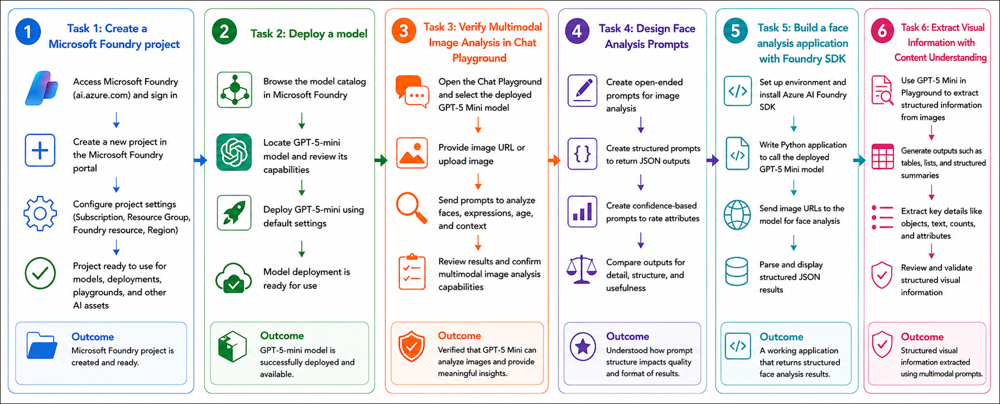
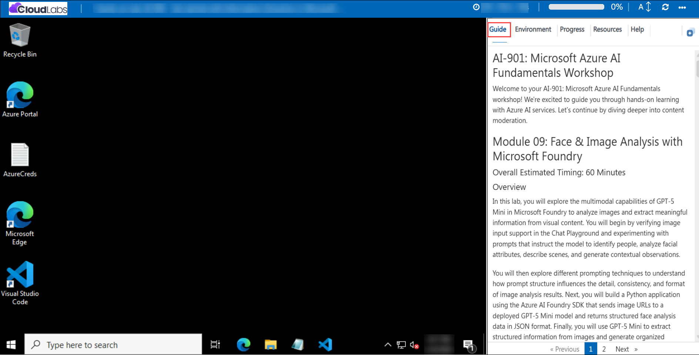

# AI-901: Microsoft Azure AI Fundamentals Workshop

Welcome to your AI-901: Microsoft Azure AI Fundamentals workshop! We're excited to guide you through hands-on learning with Azure AI services. Let’s continue by diving deeper into content moderation.

# Module 09: Face & Image Analysis with Microsoft Foundry

### Overall Estimated Timing: 60 Minutes

### Overview

In this lab, you will explore the multimodal capabilities of GPT-5 Mini in Microsoft Foundry to analyze images and extract meaningful information from visual content. You will begin by verifying image input support in the Chat Playground and experimenting with prompts that instruct the model to identify people, analyze facial attributes, describe scenes, and generate contextual observations.

You will then explore different prompting techniques to understand how prompt structure influences the detail, consistency, and format of image analysis results. Next, you will build a Python application using the Azure AI Foundry SDK that sends image URLs to a deployed GPT-5 Mini model and returns structured face analysis data in JSON format. Finally, you will use GPT-5 Mini to extract structured information from images and generate organized outputs such as tables and summaries.

Through these activities, you will gain hands-on experience building multimodal AI applications, designing effective prompts for image analysis, and using Microsoft Foundry to process and interpret visual content.

### Objectives

By the end of this lab, you will be able to:

1. **Verify multimodal model capabilities:** Confirm that GPT-5 Mini supports image inputs and can analyze visual content in Microsoft Foundry.

2. **Design image analysis prompts:** Create and test prompts that instruct the model to identify people, analyze facial attributes, describe scenes, and generate contextual observations.

3. **Compare prompting strategies:** Evaluate how open-ended, structured, and confidence-based prompts affect the quality, detail, and format of image analysis results.

4. **Build a multimodal application:** Develop a Python application using the Azure AI Foundry SDK to perform image and face analysis programmatically.

5. **Analyze images using URLs:** Send publicly accessible image URLs to a deployed GPT-5 Mini model and process the returned analysis results.

6. **Generate structured outputs:** Use prompt engineering techniques to obtain structured JSON responses suitable for application integration and downstream processing.

7. **Extract structured insights from images:** Use GPT-5 Mini to transform visual information into organized outputs such as tables, summaries, and structured reports.

8. **Understand multimodal AI use cases in Foundry:** Learn how multimodal AI models can interpret visual content and support real-world image analysis scenarios.

## Pre-requisites

* Basic knowledge of Python programming and executing commands from a terminal.
* Familiarity with Microsoft Foundry and navigating project workspaces.
* General understanding of generative AI models and prompt engineering concepts.
* Basic awareness of computer vision concepts such as image analysis, face detection, and visual attribute extraction.
* Access to a Microsoft Foundry environment with permissions to create projects and deploy models.

### Architecture

This lab demonstrates how Microsoft Foundry and a deployed GPT-5 Mini multimodal model can be used to analyze images, extract visual information, and generate structured outputs through prompt-driven image analysis.

1. **Microsoft Foundry Project:** A centralized workspace used to manage AI resources, model deployments, project settings, and application development.

2. **GPT-5 Mini Multimodal Deployment:** A deployed multimodal model capable of processing both text and image inputs to generate descriptive, analytical, and structured responses.

3. **Chat Playground:** A browser-based interface used to test image analysis prompts, upload images, and evaluate model responses interactively.

4. **Azure AI Foundry SDK Application:** A Python application that connects to the Foundry project and programmatically invokes the deployed GPT-5 Mini model.

5. **Image Inputs:** Visual content provided either through image URLs or uploaded image files, which are analyzed by the multimodal model.

6. **Prompt-Driven Image Analysis:** User-defined prompts that guide the model to perform tasks such as face analysis, scene description, people identification, and structured information extraction.

7. **Structured Data Generation:** Prompt engineering techniques used to generate organized outputs such as JSON objects, tables, summaries, and visual attribute reports.

8. **Analysis Results:** The outputs generated by the model, including face counts, facial attributes, scene descriptions, contextual observations, confidence assessments, and other structured insights derived from images.

## Architecture Diagram

### Explanation of Components

1. **Microsoft Foundry Project:**
   The project serves as the central workspace for managing AI resources, model deployments, playground experiences, and application configurations used throughout the lab.

2. **GPT-5 Mini Multimodal Model:**
   A multimodal AI model capable of processing both text and image inputs, enabling image understanding, face analysis, scene interpretation, and visual reasoning tasks.

3. **Chat Playground:**
   A browser-based interface used to interact with the deployed model, test multimodal prompts, upload images, and evaluate image analysis results.

4. **Visual Prompts:**
   Prompts that combine image inputs with text instructions to guide the model in analyzing visual content and generating relevant responses.

5. **Image Inputs:**
   Images provided either through publicly accessible URLs or uploaded files, allowing the model to analyze visual content without additional preprocessing.

6. **Face Analysis:**
   The process of identifying and describing visible faces within an image, including facial expressions, estimated age ranges, head orientation, confidence levels, and contextual observations.

7. **Azure AI Foundry SDK:**
   A Python SDK that enables developers to connect applications to Microsoft Foundry projects and invoke deployed AI models programmatically.

8. **Structured Output Prompting:**
   A prompt engineering technique used to instruct the model to return results in predefined formats such as JSON objects, tables, or structured summaries, making outputs easier to process programmatically.

9. **Prompt-Driven Information Extraction:**
   A technique that uses carefully designed prompts to extract specific information from images, such as people counts, facial attributes, scene descriptions, and structured insights.

10. **Analysis Results:**
    The final outputs generated by the model, including face counts, facial attributes, confidence assessments, scene descriptions, contextual observations, and structured visual information extracted from images.

# Getting Started with lab
 
Welcome to your AI-901: Microsoft Azure AI Fundamentals workshop! We've prepared a seamless environment for you to explore and learn about machine learning and AI concepts and related Microsoft Azure services. Let's begin by making the most of this experience:
 
## Accessing Your Lab Environment
 
Once you're ready to dive in, your virtual machine and **Guide** will be right at your fingertips within your web browser.
 

### Virtual Machine & Lab Guide
 
Your virtual machine is your workhorse throughout the workshop. The lab guide is your roadmap to success.

## Exploring Your Lab Resources
 
To get a better understanding of your lab resources and credentials, navigate to the **Environment** tab.
 

## Lab Guide Zoom In/Zoom Out
 
To adjust the zoom level for the environment page, click the **A↕: 100%** icon located next to the timer in the lab environment.

## Utilizing the Split Window Feature
 
For convenience, you can open the lab guide in a separate window by selecting the **Split Window** button from the Top right corner.
 

## Managing Your Virtual Machine
 
Feel free to **Start, Stop, or Restart (2)** your virtual machine as needed from the **Resources (1)** tab. Your experience is in your hands!
 

## Track Your Progress

Click on the **Progress** tab to track your progress in the lab. The percentage increases as you complete each validation and reaches 100% when all validations are successfully completed.  

On the **Progress (1)** tab, you can view your overall points and validation status, **Validations 0/1 (2)**.    

## Lab Duration Extension

1. To extend the duration of the lab, kindly click the **Hourglass** icon in the top right corner of the lab environment. 

    

    >**Note:** You will get the **Hourglass** icon when 10 minutes are remaining in the lab.

2. Click **OK** to extend your lab duration.
 
   

3. If you have not extended the duration prior to when the lab is about to end, a pop-up will appear, giving you the option to extend. Click **OK** to proceed.

## Let's Get Started with Azure Portal
 
1. On your virtual machine, click on the Azure Portal icon as shown below:
 
   .png)

2. You'll see the **Sign into Microsoft Azure** tab. Here, enter your credentials:
 
   - **Email/Username:** <inject key="AzureAdUserEmail"></inject>
 
       
 
3. Next, provide your password:
 
   - **Temporary Access Pass:** <inject key="AzureAdUserPassword"></inject>
 
     
 
4. If prompted to stay signed in, you can click **No**.

    
 
7. If a **Welcome to Microsoft Azure** pop-up window appears, simply click **Maybe later**.

    

## Support Contact
 
The CloudLabs support team is available 24/7, 365 days a year, via email and live chat to ensure seamless assistance at any time. We offer dedicated support channels explicitly tailored for both learners and instructors, ensuring that all your needs are promptly and efficiently addressed.
 
Learner Support Contacts:
 
- Email Support: cloudlabs-support@spektrasystems.com
- Live Chat Support: https://cloudlabs.ai/labs-support

Click on **Next** from the lower right corner to move on to the next page.

   .png)

## Happy Learning !!
