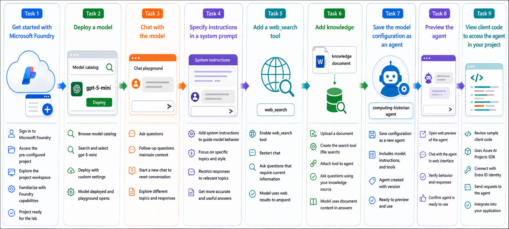

# AI-901: Microsoft Azure AI Fundamentals Workshop

Welcome to your AI-901: Microsoft Azure AI Fundamentals workshop! We're excited to guide you through hands-on learning with Azure AI services. Let’s continue by diving deeper into content moderation.

# Module 2a: Get started with generative AI and agents in Microsoft Foundry

### Overall Estimated Timing: 60 Minutes

## Overview

In this hands-on lab, you will explore how to build and customize AI agents using a pre-configured Microsoft Foundry resource and project. You will deploy a generative AI model from the Microsoft Foundry model catalog, interact with it in the chat playground, and customize its behavior by defining system instructions.

You will enhance the model by enabling built-in tools such as **Web Search** and **File Search**, allowing it to retrieve current information and answer questions using custom knowledge sources. After configuring the model, you will save it as a reusable AI agent, preview it in a web-based interface, and review sample client code that demonstrates how to integrate the agent into an application using the Azure AI Projects SDK.

By the end of this lab, you will understand how Microsoft Foundry enables developers to build, configure, deploy, and integrate intelligent AI agents with custom instructions, tools, and knowledge sources. 

## Objectives

By the end of this lab, you will be able to deploy and customize a generative AI model, build an AI agent, and integrate it into an application using Microsoft Foundry.

1. **Explore a Microsoft Foundry project**: Access a pre-configured Microsoft Foundry project and become familiar with the project workspace used for AI development.

2. **Deploy and interact with a generative AI model**: Deploy a model from the Microsoft Foundry model catalog and use the chat playground to explore conversational AI capabilities.

3. **Customize model behavior**: Configure system instructions to define the model's role, behavior, and response boundaries.

4. **Enhance the model with tools and knowledge**: Enable the Web Search tool for real-time information retrieval and add a File Search knowledge source to ground responses using custom documents.

5. **Create and preview an AI agent**: Save the configured model as a reusable AI agent and validate its behavior using the built-in web preview experience.

6. **Review agent integration**: Examine sample client code that uses the Azure AI Projects SDK to connect to and interact with the AI agent from an application. 

## Pre-requisites

* Basic knowledge of Azure Portal.
* Familiarity with generative AI concepts and chat-based AI interactions.  

## Architecture

In this hands-on lab, the architecture demonstrates how Microsoft Foundry combines deployed AI models, configurable tools, custom knowledge, and reusable AI agents to build intelligent applications.

1. **Pre-configured Microsoft Foundry Project**: A Microsoft Foundry project provides the workspace for deploying models, configuring AI agents, managing tools, and storing project resources.

2. **Model Deployment**: A generative AI model is deployed from the Microsoft Foundry model catalog and made available through the chat playground for testing and customization.

3. **Agent Configuration**: The deployed model is customized using system instructions and enhanced with built-in tools such as Web Search and File Search to extend its capabilities.

4. **Knowledge Integration**: A custom document is indexed and attached as a knowledge source, enabling the agent to retrieve and use project-specific information when responding to user queries.

5. **Agent Deployment and Application Integration**: The configured model is saved as a reusable AI agent that can be previewed in a web interface and accessed programmatically using the Azure AI Projects SDK. 

## Architecture Diagram

## Explanation of Components

1. **Microsoft Foundry Project**: A project workspace that organizes AI assets, model deployments, agents, tools, and project configurations. It provides a centralized environment for developing and managing AI applications.

2. **Model Catalog**: A collection of AI models from Microsoft, OpenAI, and other providers. Developers can browse available models, review their capabilities, and deploy them for use within their projects.

3. **Model Deployment**: A deployed instance of a selected AI model that enables users to interact with the model through the playground or applications using a secure endpoint.

4. **System Instructions**: Custom prompts that define the model's role, behavior, tone, and response boundaries, allowing developers to tailor the model for specific use cases.

5. **Web Search Tool**: A built-in Microsoft Foundry tool that enables the model to retrieve current information from the web, improving responses for queries requiring up-to-date knowledge.

6. **File Search Tool (Knowledge Source)**: A retrieval tool that indexes uploaded documents and allows the model to answer questions using project-specific content in addition to its pretrained knowledge.

7. **AI Agent**: A reusable AI solution that combines a deployed model, system instructions, and connected tools into a single agent that can be shared, previewed, and integrated into applications.

8. **Agent Playground**: An interactive environment for testing, refining, and validating the behavior of an AI agent before it is used in production applications.

9. **Azure AI Projects SDK**: A client SDK that enables applications to securely connect to a Microsoft Foundry project, reference a specific AI agent, and interact with it programmatically using Microsoft Entra ID authentication. 

# Getting Started with lab
 
Welcome to your AI-901: Microsoft Azure AI Fundamentals workshop! We've prepared a seamless environment for you to explore and learn about machine learning and AI concepts and related Microsoft Azure services. Let's begin by making the most of this experience:
 
## Accessing Your Lab Environment
 
Once you're ready to dive in, your virtual machine and **Guide** will be right at your fingertips within your web browser.
 

## Virtual Machine & Lab Guide
 
Your virtual machine is your workhorse throughout the workshop. The lab guide is your roadmap to success.

## Exploring Your Lab Resources
 
To get a better understanding of your lab resources and credentials, navigate to the **Environment** tab.
 

## Lab Guide Zoom In/Zoom Out
 
To adjust the zoom level for the environment page, click the **A↕: 100%** icon located next to the timer in the lab environment.

## Utilizing the Split Window Feature
 
For convenience, you can open the lab guide in a separate window by selecting the **Split Window** button from the Top right corner.
 

## Managing Your Virtual Machine
 
Feel free to **Start, Stop, or Restart (2)** your virtual machine as needed from the **Resources (1)** tab. Your experience is in your hands!
 

## Track Your Progress

Click on the **Progress** tab to track your progress in the lab. The percentage increases as you complete each validation and reaches 100% when all validations are successfully completed.  

On the **Progress (1)** tab, you can view your overall points and validation status, **Validations 0/1 (2)**.    

## Lab Duration Extension

1. To extend the duration of the lab, kindly click the **Hourglass** icon in the top right corner of the lab environment. 

    

    >**Note:** You will get the **Hourglass** icon when 10 minutes are remaining in the lab.

2. Click **OK** to extend your lab duration.
 
   

3. If you have not extended the duration prior to when the lab is about to end, a pop-up will appear, giving you the option to extend. Click **OK** to proceed.

## Let's Get Started with Azure Portal
 
1. On your virtual machine, click on the Azure Portal icon as shown below:
 
   .png)

2. You'll see the **Sign into Microsoft Azure** tab. Here, enter your credentials:
 
   - **Email/Username:** <inject key="AzureAdUserEmail"></inject>
 
       
 
3. Next, provide your password:
 
   - **Temporary Access Pass:** <inject key="AzureAdUserPassword"></inject>
 
     
 
4. If prompted to stay signed in, you can click **No**.

    
 
7. If a **Welcome to Microsoft Azure** pop-up window appears, simply click **Maybe later**.

    

## Support Contact
 
The CloudLabs support team is available 24/7, 365 days a year, via email and live chat to ensure seamless assistance at any time. We offer dedicated support channels explicitly tailored for both learners and instructors, ensuring that all your needs are promptly and efficiently addressed.
 
Learner Support Contacts:
 
- Email Support: cloudlabs-support@spektrasystems.com
- Live Chat Support: https://cloudlabs.ai/labs-support

Click on **Next** from the lower right corner to move on to the next page.

   .png)

## Happy Learning !!
