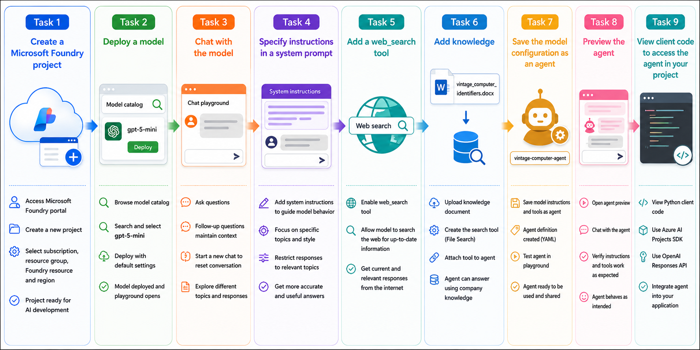

# AI-901: Microsoft Azure AI Fundamentals Workshop

Welcome to your AI-901: Microsoft Azure AI Fundamentals workshop! We're excited to guide you through hands-on learning with Azure AI services. Let’s continue by diving deeper into content moderation.

# Module 2a: Get started with generative AI and agents in Microsoft Foundry

### Overall Estimated Timing: 60 Minutes

## Overview

In this lab, you will explore Microsoft Foundry to build and enhance a generative AI agent. You will create a Microsoft Foundry project, deploy a GPT model, and interact with it using the chat playground. You'll customize the model's behavior with system instructions, extend its capabilities using Web Search and File Search tools, and save it as a reusable agent. Finally, you'll preview the agent and review the sample client code used to integrate it into applications. This lab demonstrates how to build, customize, and deploy intelligent AI agents using Microsoft Foundry.

## Objectives

By the end of this lab, you will be able to:

1. **Create a Microsoft Foundry project:** Set up a Microsoft Foundry project and provision the Azure resources required to build and manage AI solutions.

2. **Deploy and interact with a generative AI model:** Deploy a GPT model from the Microsoft Foundry model catalog and use the chat playground to explore conversational AI capabilities.

3. **Customize model behavior with system instructions:** Configure system instructions to define the model’s role, tone, and response boundaries for a specific use case.

4. **Enhance the model using AI tools and custom knowledge:** Extend the model with Web Search for current information and File Search for domain-specific knowledge to improve response quality.

5. **Create, preview, and integrate an AI agent:** Save the configured model as a reusable AI agent, preview its behavior, and review the sample client code required to integrate it into applications using the Azure AI Projects SDK.

## Pre-requisites

* Basic knowledge of Azure Portal.
* Familiarity with generative AI concepts and chat-based AI interactions.  

## Architecture

This lab demonstrates how Microsoft Foundry enables the end-to-end development of generative AI agents, from project creation and model deployment to agent configuration and application integration. The architecture illustrates how models, tools, and knowledge sources work together to deliver an intelligent, context-aware AI assistant.

1. **Microsoft Foundry Project:** A centralized workspace used to manage AI resources, including model deployments, agents, tools, and playgrounds for developing, testing, and managing AI solutions.

2. **Generative AI Model:** A GPT model (such as **gpt-5-mini**) deployed from the Microsoft Foundry model catalog and used to generate responses in the chat playground.

3. **System Instructions:** Custom instructions that define the model's role, behavior, tone, and response boundaries, enabling it to perform specialized tasks.

4. **AI Tools:** Built-in tools that extend the model's capabilities, including **Web Search** for retrieving current information from the internet and **File Search** for querying uploaded documents.

5. **Knowledge Source:** A custom document (for example, **vintage_computer_identifiers.docx**) uploaded and indexed as a File Search knowledge source, allowing the agent to answer questions using domain-specific information.

6. **Agent Configuration:** A reusable AI agent that combines the deployed model, system instructions, and connected tools into a task-specific assistant that can be tested, reused, and shared.

7. **Client Integration:** Applications connect to the agent using the **Azure AI Projects SDK** and the **OpenAI Responses API**, enabling seamless integration of AI-powered experiences into custom applications and enterprise solutions.

## Architecture Diagram

## Explanation of Components

1. **Microsoft Foundry Project:** The project serves as the central workspace for developing and managing AI solutions in Microsoft Foundry. It provides access to model deployments, agents, tools, the model catalog, and playgrounds for testing and experimentation.

2. **Generative AI Model:** This is the deployed GPT model (for example, **gpt-5-mini**) that powers conversations in the chat playground. It generates responses based on user prompts and can be customized through system instructions and connected tools.

3. **System Instructions:** System instructions define the model's role, behavior, tone, and response boundaries. They ensure the model responds consistently and remains focused on the intended domain, such as the history of computing and AI.

4. **AI Tools:** AI tools extend the capabilities of the model beyond its built-in knowledge. In this lab, **Web Search** enables the model to retrieve up-to-date information from the internet, while **File Search** allows it to query uploaded documents for domain-specific knowledge.

5. **Knowledge Source:** A custom document, such as **vintage_computer_identifiers.docx**, is uploaded and indexed as a knowledge source. The model uses this information to answer questions about vintage computer serial numbers, product identifiers, and other specialized data that is not part of its training.

6. **Agent Configuration:** An agent combines the deployed model, system instructions, and connected tools into a reusable AI assistant. This configuration enables consistent behavior and allows the agent to be previewed and reused across different applications.

7. **Client Integration:** Applications interact with the agent using the **Azure AI Projects SDK** and the **OpenAI Responses API**. This enables developers to integrate the agent into custom applications, chatbots, and enterprise solutions for intelligent, real-time AI interactions.

# Getting Started with lab
 
Welcome to your AI-901: Microsoft Azure AI Fundamentals workshop! We've prepared a seamless environment for you to explore and learn about machine learning and AI concepts and related Microsoft Azure services. Let's begin by making the most of this experience:
 
## Accessing Your Lab Environment
 
Once you're ready to dive in, your virtual machine and **Guide** will be right at your fingertips within your web browser.
 

## Virtual Machine & Lab Guide
 
Your virtual machine is your workhorse throughout the workshop. The lab guide is your roadmap to success.

## Exploring Your Lab Resources
 
To get a better understanding of your lab resources and credentials, navigate to the **Environment** tab.
 

## Lab Guide Zoom In/Zoom Out
 
To adjust the zoom level for the environment page, click the **A↕: 100%** icon located next to the timer in the lab environment.

## Utilizing the Split Window Feature
 
For convenience, you can open the lab guide in a separate window by selecting the **Split Window** button from the Top right corner.
 

## Managing Your Virtual Machine
 
Feel free to **Start, Stop, or Restart (2)** your virtual machine as needed from the **Resources (1)** tab. Your experience is in your hands!
 

## Track Your Progress

Click on the **Progress** tab to track your progress in the lab. The percentage increases as you complete each validation and reaches 100% when all validations are successfully completed.  

On the **Progress (1)** tab, you can view your overall points and validation status, **Validations 0/1 (2)**.    

## Lab Duration Extension

1. To extend the duration of the lab, kindly click the **Hourglass** icon in the top right corner of the lab environment. 

    

    >**Note:** You will get the **Hourglass** icon when 10 minutes are remaining in the lab.

2. Click **OK** to extend your lab duration.
 
   

3. If you have not extended the duration prior to when the lab is about to end, a pop-up will appear, giving you the option to extend. Click **OK** to proceed.

## Let's Get Started with Azure Portal
 
1. On your virtual machine, click on the Azure Portal icon as shown below:
 
   .png)

2. You'll see the **Sign into Microsoft Azure** tab. Here, enter your credentials:
 
   - **Email/Username:** <inject key="AzureAdUserEmail"></inject>
 
       
 
3. Next, provide your password:
 
   - **Temporary Access Pass:** <inject key="AzureAdUserPassword"></inject>
 
     
 
4. If prompted to stay signed in, you can click **No**.

    
 
7. If a **Welcome to Microsoft Azure** pop-up window appears, simply click **Maybe later**.

    

## Support Contact
 
The CloudLabs support team is available 24/7, 365 days a year, via email and live chat to ensure seamless assistance at any time. We offer dedicated support channels explicitly tailored for both learners and instructors, ensuring that all your needs are promptly and efficiently addressed.
 
Learner Support Contacts:
 
- Email Support: cloudlabs-support@spektrasystems.com
- Live Chat Support: https://cloudlabs.ai/labs-support

Click on **Next** from the lower right corner to move on to the next page.

   .png)

## Happy Learning !!
