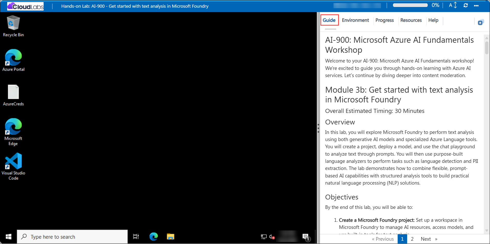

# AI-901: Microsoft Azure AI Fundamentals Workshop

Welcome to your AI-901: Microsoft Azure AI Fundamentals workshop! We're excited to guide you through hands-on learning with Azure AI services. Let’s continue by diving deeper into content moderation.

# Module 3b: Get started with text analysis in Microsoft Foundry

### Overall Estimated Timing: 45 Minutes

## Overview

In this lab, you will explore text analysis capabilities in Microsoft Foundry using both generative AI models and specialized Azure Language services. You will create a Microsoft Foundry project, deploy a GPT model, and use the chat playground to summarize text through natural language prompts. You will then use Azure Language analyzers to detect the language of input text and identify personally identifiable information (PII). Finally, you will review the sample client code for integrating Azure Language capabilities into your own applications. This lab demonstrates how Microsoft Foundry combines generative AI with purpose-built language services to support real-world natural language processing (NLP) scenarios.

## Objectives

By the end of this lab, you will be able to:

1. **Create a Microsoft Foundry project:** Set up a Microsoft Foundry project to provision AI resources and access models and AI services.

2. **Deploy and interact with a generative AI model:** Deploy a GPT model from the Microsoft Foundry model catalog and use the chat playground to summarize text using natural language prompts.

3. **Use Azure Language analyzers for structured text analysis:** Detect the language of input text and identify personally identifiable information (PII) using specialized Azure Language services.

4. **Compare generative AI and specialized language services:** Understand when to use prompt-based AI models versus purpose-built language analyzers for different text analysis scenarios.

5. **Explore integration options with sample code:** Review the sample Python code provided by Microsoft Foundry to understand how Azure Language capabilities can be integrated into custom applications.

## Pre-requisites

* Basic familiarity with the Azure portal and navigating cloud-based services.
* Understanding of generative AI concepts and prompt-based interactions.
* Basic knowledge of natural language processing (NLP) concepts such as sentiment analysis and entity recognition.

## Architecture

This lab demonstrates how Microsoft Foundry combines generative AI models with specialized Azure Language services to support both flexible and deterministic text analysis workflows.

1. **Microsoft Foundry Project:** A centralized workspace used to provision AI resources, manage model deployments, and access AI services and playgrounds within Microsoft Foundry.

2. **Generative AI Model:** A GPT model (such as **gpt-5**) deployed from the Microsoft Foundry model catalog and used in the chat playground to perform prompt-based text summarization.

3. **Chat Playground:** An interactive environment for testing prompts, configuring model instructions, and evaluating model responses through conversational interactions.

4. **Azure Language Services:** Purpose-built language analyzers that provide structured and deterministic results for tasks such as language detection and personally identifiable information (PII) recognition.

5. **Azure Language Playground:** An interface for interacting with Azure Language analyzers, enabling users to submit text, review analysis results, and experiment with different language processing capabilities.

6. **Sample Client Code:** Automatically generated Python code that demonstrates how to authenticate and integrate Azure Language services into custom applications using the Azure AI Text Analytics SDK.

7. **Application Integration:** Client applications consume Azure Language services through SDKs and REST APIs, enabling automated text analysis in enterprise applications, workflows, and AI-powered solutions.
 
## Architecture Diagram

-archdiagram.png)

## Explanation of Components

1. **Microsoft Foundry Project:** The project serves as the central workspace for managing AI resources in Microsoft Foundry. It enables you to organize models, access the model catalog, deploy resources, and use playgrounds for testing and experimentation.

2. **Generative AI Model:** This is the deployed model (for example, GPT-5) used in the chat playground to perform text analysis tasks such as sentiment analysis, entity extraction, and summarization through natural language prompts.

3. **Chat Playground:** The chat playground provides an interactive environment to test and evaluate the capabilities of the deployed model. It allows you to input prompts, observe responses, and refine interactions in real time.

4. **Prompt-Based Analysis:** This approach uses natural language instructions to guide the model in performing tasks like sentiment detection, named entity recognition, and summarization, offering flexibility across a wide range of text analysis scenarios.

5. **Azure Language Analyzers:** These are specialized, purpose-built tools available in Foundry that perform specific text analysis tasks—such as language detection and PII extraction—returning structured and deterministic results.

6. **AI Services Integration:** Azure Language services within Foundry enable you to apply prebuilt models for consistent and reliable analysis, making them suitable for automation and production scenarios where predictable outputs are required.

7. **Sample Code Integration:** Foundry provides sample code (for example, in Python) that demonstrates how to integrate text analysis capabilities into applications using SDKs and APIs, enabling you to build real-world AI-powered solutions.

# Getting Started with lab
 
Welcome to your AI-901: Microsoft Azure AI Fundamentals workshop! We've prepared a seamless environment for you to explore and learn about machine learning and AI concepts and related Microsoft Azure services. Let's begin by making the most of this experience:
 
## Accessing Your Lab Environment
 
Once you're ready to dive in, your virtual machine and **Guide** will be right at your fingertips within your web browser.
 

## Virtual Machine & Lab Guide
 
Your virtual machine is your workhorse throughout the workshop. The lab guide is your roadmap to success.

## Exploring Your Lab Resources
 
To get a better understanding of your lab resources and credentials, navigate to the **Environment** tab.
 

## Lab Guide Zoom In/Zoom Out
 
To adjust the zoom level for the environment page, click the **A↕: 100%** icon located next to the timer in the lab environment.

## Utilizing the Split Window Feature
 
For convenience, you can open the lab guide in a separate window by selecting the **Split Window** button from the Top right corner.
 

## Managing Your Virtual Machine
 
Feel free to **Start, Stop, or Restart (2)** your virtual machine as needed from the **Resources (1)** tab. Your experience is in your hands!
 

## Track Your Progress

Click on the **Progress** tab to track your progress in the lab. The percentage increases as you complete each validation and reaches 100% when all validations are successfully completed.  

On the **Progress (1)** tab, you can view your overall points and validation status, **Validations 0/1 (2)**.    

## Lab Duration Extension

1. To extend the duration of the lab, kindly click the **Hourglass** icon in the top right corner of the lab environment. 

    

    >**Note:** You will get the **Hourglass** icon when 10 minutes are remaining in the lab.

2. Click **OK** to extend your lab duration.
 
   

3. If you have not extended the duration prior to when the lab is about to end, a pop-up will appear, giving you the option to extend. Click **OK** to proceed.

## Let's Get Started with Azure Portal
 
1. On your virtual machine, click on the Azure Portal icon as shown below:
 
   .png)

2. You'll see the **Sign into Microsoft Azure** tab. Here, enter your credentials:
 
   - **Email/Username:** <inject key="AzureAdUserEmail"></inject>
 
       
 
3. Next, provide your password:
 
   - **Temporary Access Pass:** <inject key="AzureAdUserPassword"></inject>
 
     
 
4. If prompted to stay signed in, you can click **No**.

    
 
7. If a **Welcome to Microsoft Azure** pop-up window appears, simply click **Maybe later**.

    

## Support Contact
 
The CloudLabs support team is available 24/7, 365 days a year, via email and live chat to ensure seamless assistance at any time. We offer dedicated support channels explicitly tailored for both learners and instructors, ensuring that all your needs are promptly and efficiently addressed.
 
Learner Support Contacts:
 
- Email Support: cloudlabs-support@spektrasystems.com
- Live Chat Support: https://cloudlabs.ai/labs-support

Click on **Next** from the lower right corner to move on to the next page.

   .png)

## Happy Learning !!
