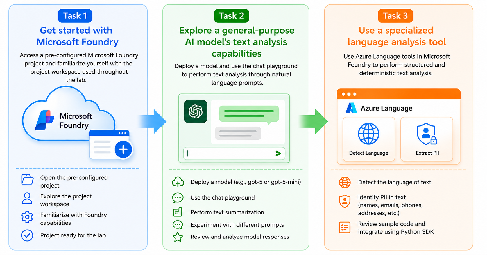

# AI-901: Microsoft Azure AI Fundamentals Workshop

Welcome to your AI-901: Microsoft Azure AI Fundamentals workshop! We're excited to guide you through hands-on learning with Azure AI services. Let’s continue by diving deeper into content moderation.

# Module 3b: Get started with text analysis in Microsoft Foundry

### Overall Estimated Timing: 45 Minutes

## Overview

In this hands-on lab, you will explore text analysis capabilities in Microsoft Foundry by using both generative AI models and specialized Azure Language services within a pre-configured Microsoft Foundry project. You will deploy a generative AI model and use the chat playground to summarize text using natural language prompts.

You will then use Azure Language analyzers to detect the language of text and identify personally identifiable information (PII). Finally, you will review sample code that demonstrates how to integrate Azure Language capabilities into your own applications using the Azure AI Text Analytics SDK.

By the end of this lab, you will understand how Microsoft Foundry combines the flexibility of generative AI with purpose-built language analysis services to support a wide range of natural language processing (NLP) scenarios.

## Objectives

By the end of this lab, you will be able to use generative AI models and Azure Language services in Microsoft Foundry to perform common text analysis tasks.

1. **Explore a Microsoft Foundry project**: Access a pre-configured Microsoft Foundry project and become familiar with the workspace used throughout the lab.

2. **Deploy and use a generative AI model**: Deploy a GPT model from the Microsoft Foundry model catalog and use the chat playground to summarize text using natural language prompts.

3. **Use Azure Language analyzers**: Detect the language of text and identify personally identifiable information (PII) using specialized Azure Language services available in Microsoft Foundry.

4. **Review application integration**: Examine sample code that demonstrates how to integrate Azure Language capabilities into applications using the Azure AI Text Analytics SDK. 

## Pre-requisites

* Basic familiarity with the Azure portal and navigating cloud-based services.
* Understanding of generative AI concepts and prompt-based interactions.
* Basic knowledge of natural language processing (NLP) concepts such as sentiment analysis and entity recognition.

## Architecture

In this hands-on lab, the architecture demonstrates how Microsoft Foundry combines generative AI models with specialized Azure Language services to perform different types of text analysis.

1. **Pre-configured Microsoft Foundry Project**: A Microsoft Foundry project provides the workspace for deploying AI models and accessing Azure Language services used throughout the lab.

2. **Generative AI Model Deployment**: A GPT model is deployed from the Microsoft Foundry model catalog and used in the chat playground to perform text summarization through natural language prompts.

3. **Azure Language Services**: Specialized language analyzers process text to detect the primary language and identify personally identifiable information (PII), providing capabilities beyond general-purpose generative AI.

4. **Application Integration**: Sample client code demonstrates how applications can securely connect to Azure Language services using the Azure AI Text Analytics SDK to perform text analysis programmatically. 
 
## Architecture Diagram

## Explanation of Components

1. **Microsoft Foundry Project**: A centralized workspace used to manage AI assets, model deployments, Azure AI services, and project configurations required for developing AI-powered applications.

2. **Model Catalog**: A collection of AI models from Microsoft, OpenAI, and other providers. Developers can browse, evaluate, and deploy models based on their application requirements.

3. **GPT Model Deployment**: A deployed generative AI model that processes natural language prompts in the chat playground to perform tasks such as text summarization and general-purpose text analysis.

4. **Chat Playground**: An interactive environment for testing deployed AI models, experimenting with prompts, and evaluating model responses before integrating them into applications.

5. **Azure Language Services**: Specialized AI services that provide advanced natural language processing capabilities, including language detection, personally identifiable information (PII) recognition, sentiment analysis, entity recognition, and other language analysis features.

6. **Language Detection Analyzer**: A built-in Azure Language analyzer that identifies the primary language of input text, enabling applications to route content to appropriate language-specific processing workflows.

7. **Text PII Redaction Analyzer**: An Azure Language analyzer that detects and identifies personally identifiable information (PII), such as names, addresses, phone numbers, and email addresses, helping organizations support privacy and compliance requirements.

8. **Azure AI Text Analytics SDK**: A client SDK that enables developers to integrate Azure Language services into their applications, authenticate using Azure credentials, and programmatically perform text analysis tasks such as language detection and PII recognition. 

# Getting Started with lab
 
Welcome to your AI-901: Microsoft Azure AI Fundamentals workshop! We've prepared a seamless environment for you to explore and learn about machine learning and AI concepts and related Microsoft Azure services. Let's begin by making the most of this experience:
 
## Accessing Your Lab Environment
 
Once you're ready to dive in, your virtual machine and **Guide** will be right at your fingertips within your web browser.
 

## Virtual Machine & Lab Guide
 
Your virtual machine is your workhorse throughout the workshop. The lab guide is your roadmap to success.

## Exploring Your Lab Resources
 
To get a better understanding of your lab resources and credentials, navigate to the **Environment** tab.
 

## Lab Guide Zoom In/Zoom Out
 
To adjust the zoom level for the environment page, click the **A↕: 100%** icon located next to the timer in the lab environment.

## Utilizing the Split Window Feature
 
For convenience, you can open the lab guide in a separate window by selecting the **Split Window** button from the Top right corner.
 

## Managing Your Virtual Machine
 
Feel free to **Start, Stop, or Restart (2)** your virtual machine as needed from the **Resources (1)** tab. Your experience is in your hands!
 

## Track Your Progress

Click on the **Progress** tab to track your progress in the lab. The percentage increases as you complete each validation and reaches 100% when all validations are successfully completed.  

On the **Progress (1)** tab, you can view your overall points and validation status, **Validations 0/1 (2)**.    

## Lab Duration Extension

1. To extend the duration of the lab, kindly click the **Hourglass** icon in the top right corner of the lab environment. 

    

    >**Note:** You will get the **Hourglass** icon when 10 minutes are remaining in the lab.

2. Click **OK** to extend your lab duration.
 
   

3. If you have not extended the duration prior to when the lab is about to end, a pop-up will appear, giving you the option to extend. Click **OK** to proceed.

## Let's Get Started with Azure Portal
 
1. On your virtual machine, click on the Azure Portal icon as shown below:
 
   .png)

2. You'll see the **Sign into Microsoft Azure** tab. Here, enter your credentials:
 
   - **Email/Username:** <inject key="AzureAdUserEmail"></inject>
 
       
 
3. Next, provide your password:
 
   - **Temporary Access Pass:** <inject key="AzureAdUserPassword"></inject>
 
     
 
4. If prompted to stay signed in, you can click **No**.

    
 
7. If a **Welcome to Microsoft Azure** pop-up window appears, simply click **Maybe later**.

    

## Support Contact
 
The CloudLabs support team is available 24/7, 365 days a year, via email and live chat to ensure seamless assistance at any time. We offer dedicated support channels explicitly tailored for both learners and instructors, ensuring that all your needs are promptly and efficiently addressed.
 
Learner Support Contacts:
 
- Email Support: cloudlabs-support@spektrasystems.com
- Live Chat Support: https://cloudlabs.ai/labs-support

Click on **Next** from the lower right corner to move on to the next page.

   .png)

## Happy Learning !!
