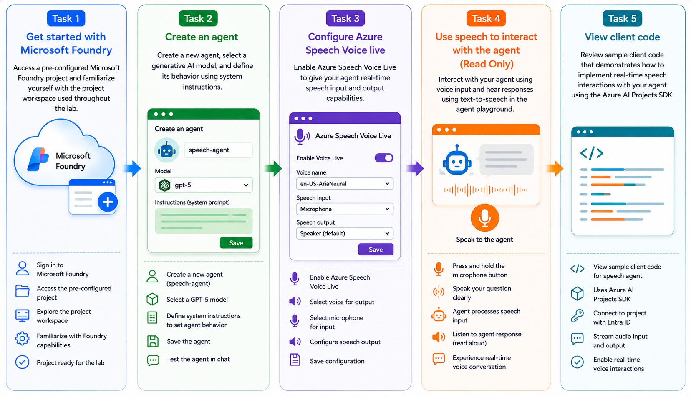

# AI-901: Microsoft Azure AI Fundamentals Workshop

Welcome to your AI-901: Microsoft Azure AI Fundamentals workshop! We're excited to guide you through hands-on learning with Azure AI services. Let’s continue by diving deeper into content moderation.

# Module 4a: Get started with speech in Microsoft Foundry

### Overall Estimated Duration: 30 Minutes

## Overview

In this hands-on lab, you will explore speech-enabled AI experiences in Microsoft Foundry by using a pre-configured Microsoft Foundry resource and project. You will create an AI agent, configure its behavior using system instructions, and enable Azure Speech Voice Live to add real-time speech input and output capabilities.

You will explore how voice interactions work within the agent playground, understand how speech is converted to text for processing by a generative AI model, and how responses are synthesized back into natural-sounding speech. Finally, you will review sample client code that demonstrates how to integrate speech-enabled AI agents into applications using Microsoft Foundry APIs and SDKs.

By the end of this lab, you will understand how Microsoft Foundry combines generative AI and Azure Speech services to build intelligent, voice-enabled conversational applications.

## Objectives

By the end of this lab, you will be able to create and configure a speech-enabled AI agent and understand how real-time voice interactions are implemented in Microsoft Foundry.

1. **Explore a Microsoft Foundry project**: Access a pre-configured Microsoft Foundry project and become familiar with the workspace used throughout the lab.

2. **Create and configure an AI agent**: Create an AI agent, select a generative AI model, and define its behavior using system instructions.

3. **Enable Azure Speech Voice Live**: Configure speech input and output settings to add real-time voice capabilities to the AI agent.

4. **Explore speech interactions**: Understand how speech input is converted into text, processed by the AI model, and returned as synthesized speech through the agent playground.

5. **Review application integration**: Examine sample client code that demonstrates how to integrate speech-enabled AI agents into applications using Microsoft Foundry APIs and SDKs. 

## Pre-requisites

* Basic knowledge of the Azure portal.
* Familiarity with generative AI concepts and chat-based AI interactions.
* Basic understanding of speech-based AI concepts such as speech-to-text and text-to-speech.  

## Architecture

In this hands-on lab, the architecture demonstrates how Microsoft Foundry integrates generative AI models with Azure Speech services to enable real-time voice conversations.

1. **Pre-configured Microsoft Foundry Project**: A Microsoft Foundry project provides the workspace for creating AI agents, configuring speech capabilities, and managing project resources.

2. **AI Agent Configuration**: An AI agent is created using a deployed generative AI model and customized with system instructions that define its behavior and responses.

3. **Azure Speech Voice Live**: Speech Voice Live enables real-time speech recognition and speech synthesis, allowing users to communicate with the AI agent using natural voice interactions.

4. **Voice Interaction Workflow**: Spoken user input is converted into text using speech recognition, processed by the generative AI model, and converted back into natural speech using text-to-speech synthesis.

5. **Application Integration**: Sample client code demonstrates how applications can connect to Microsoft Foundry, access the speech-enabled AI agent, and manage real-time audio streaming using supported APIs and SDKs. 
 
## Architecture Diagram

## Explanation of Components

1. **Microsoft Foundry Project**: A centralized workspace used to organize AI assets, agents, deployed models, tools, and project configurations required for developing AI-powered applications.

2. **AI Agent**: A reusable conversational AI solution built on a deployed generative AI model. The agent combines model capabilities with configurable instructions to deliver responses tailored to a specific purpose.

3. **Generative AI Model**: A deployed language model (such as GPT-5) that interprets user prompts, generates contextual responses, and powers the conversational capabilities of the AI agent.

4. **System Instructions**: Configuration prompts that define the agent's role, behavior, communication style, and response boundaries, enabling developers to customize how the agent interacts with users.

5. **Azure Speech Voice Live**: A real-time speech service that enables bidirectional voice communication by providing speech recognition for spoken input and speech synthesis for AI-generated responses.

6. **Speech-to-Text (STT)**: A speech recognition capability that converts spoken audio into text before submitting it to the generative AI model for processing.

7. **Text-to-Speech (TTS)**: A speech synthesis capability that converts the AI model's text response into natural-sounding audio for playback to the user.

8. **Agent Playground**: An interactive environment for configuring, testing, and validating speech-enabled AI agents before integrating them into applications.

9. **Client Application**: An application that connects to the Microsoft Foundry project and communicates with the speech-enabled AI agent, handling real-time audio streaming, user interactions, and AI responses through supported APIs and SDKs. 

# Getting Started with lab
 
Welcome to your AI-901: Microsoft Azure AI Fundamentals workshop! We've prepared a seamless environment for you to explore and learn about machine learning and AI concepts and related Microsoft Azure services. Let's begin by making the most of this experience:
 
## Accessing Your Lab Environment
 
Once you're ready to dive in, your virtual machine and **Guide** will be right at your fingertips within your web browser.
 

## Virtual Machine & Lab Guide
 
Your virtual machine is your workhorse throughout the workshop. The lab guide is your roadmap to success.

## Exploring Your Lab Resources
 
To get a better understanding of your lab resources and credentials, navigate to the **Environment** tab.
 

## Lab Guide Zoom In/Zoom Out
 
To adjust the zoom level for the environment page, click the **A↕: 100%** icon located next to the timer in the lab environment.

## Utilizing the Split Window Feature
 
For convenience, you can open the lab guide in a separate window by selecting the **Split Window** button from the Top right corner.
 

## Managing Your Virtual Machine
 
Feel free to **Start, Stop, or Restart (2)** your virtual machine as needed from the **Resources (1)** tab. Your experience is in your hands!
 

## Track Your Progress

Click on the **Progress** tab to track your progress in the lab. The percentage increases as you complete each validation and reaches 100% when all validations are successfully completed.  

On the **Progress (1)** tab, you can view your overall points and validation status, **Validations 0/1 (2)**.    

## Lab Duration Extension

1. To extend the duration of the lab, kindly click the **Hourglass** icon in the top right corner of the lab environment. 

    

    >**Note:** You will get the **Hourglass** icon when 10 minutes are remaining in the lab.

2. Click **OK** to extend your lab duration.
 
   

3. If you have not extended the duration prior to when the lab is about to end, a pop-up will appear, giving you the option to extend. Click **OK** to proceed.

## Let's Get Started with Azure Portal
 
1. On your virtual machine, click on the Azure Portal icon as shown below:
 
   .png)

2. You'll see the **Sign into Microsoft Azure** tab. Here, enter your credentials:
 
   - **Email/Username:** <inject key="AzureAdUserEmail"></inject>
 
       
 
3. Next, provide your password:
 
   - **Temporary Access Pass:** <inject key="AzureAdUserPassword"></inject>
 
     
 
4. If prompted to stay signed in, you can click **No**.

    
 
7. If a **Welcome to Microsoft Azure** pop-up window appears, simply click **Maybe later**.

    

## Support Contact
 
The CloudLabs support team is available 24/7, 365 days a year, via email and live chat to ensure seamless assistance at any time. We offer dedicated support channels explicitly tailored for both learners and instructors, ensuring that all your needs are promptly and efficiently addressed.
 
Learner Support Contacts:
 
- Email Support: cloudlabs-support@spektrasystems.com
- Live Chat Support: https://cloudlabs.ai/labs-support

Click on **Next** from the lower right corner to move on to the next page.

   .png)

## Happy Learning !!
