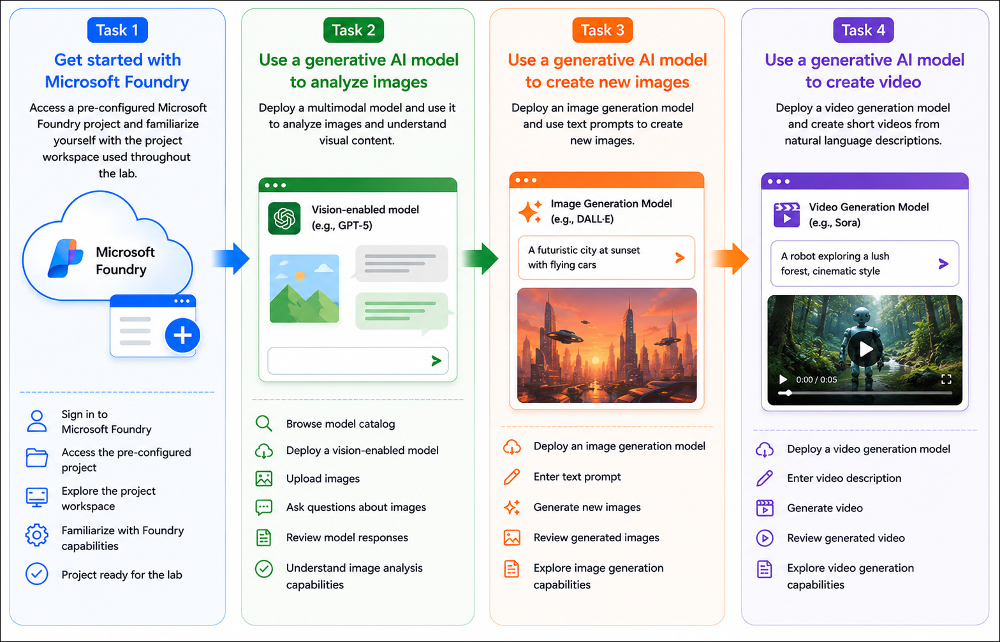

# AI-901: Microsoft Azure AI Fundamentals Workshop

Welcome to your AI-901: Microsoft Azure AI Fundamentals workshop! We're excited to guide you through hands-on learning with Azure AI services. Let’s continue by diving deeper into content moderation.

# Module 5a: Get started with computer vision in Microsoft Foundry

### Overall Estimated Timing: 60 Minutes

## Overview

In this hands-on lab, you will explore computer vision capabilities in Microsoft Foundry by using a pre-configured Microsoft Foundry resource and project. You will deploy a vision-enabled generative AI model to analyze images, use an image generation model to create images from natural language prompts, and deploy a video generation model to create short videos from text descriptions.

You will interact with each model through the Microsoft Foundry playgrounds to understand how multimodal AI can interpret and generate visual content. Finally, you will review sample code that demonstrates how to integrate image analysis, image generation, and video generation capabilities into your own applications using OpenAI APIs and SDKs.

By the end of this lab, you will understand how Microsoft Foundry enables developers to build intelligent applications that analyze images and generate both images and videos using generative AI models. 

## Objectives

By the end of this lab, you will be able to deploy and use multimodal AI models for image analysis, image generation, and video generation in Microsoft Foundry.

1. **Explore a Microsoft Foundry project**: Access a pre-configured Microsoft Foundry project and become familiar with the workspace used throughout the lab.

2. **Analyze images using a multimodal AI model**: Deploy a vision-enabled generative AI model and use it to understand and describe image content through natural language prompts.

3. **Generate images from text prompts**: Deploy an image generation model and create images based on descriptive text using the image playground.

4. **Generate videos from text prompts**: Deploy a video generation model and create short videos from natural language descriptions using the video playground.

5. **Review application integration**: Examine sample code that demonstrates how to integrate image analysis, image generation, and video generation capabilities into applications using OpenAI APIs and SDKs. 

## Pre-requisites

* Basic knowledge of Azure Portal.
* Familiarity with generative AI concepts and chat-based AI interactions.  

## Architecture

In this hands-on lab, the architecture demonstrates how Microsoft Foundry supports multimodal AI workflows for understanding and generating visual content.

1. **Pre-configured Microsoft Foundry Project**: A Microsoft Foundry project provides the workspace for deploying multimodal AI models, managing model deployments, and accessing vision-related playgrounds.

2. **Vision-enabled Generative AI Model**: A multimodal language model is deployed to analyze uploaded images, interpret visual content, and generate natural language responses.

3. **Image Generation Model**: A text-to-image model generates images from descriptive prompts, enabling developers to create visual content through natural language.

4. **Video Generation Model**: A text-to-video model generates short videos from natural language descriptions, extending generative AI capabilities to dynamic visual media.

5. **Application Integration**: Sample code demonstrates how applications can securely connect to deployed models and use OpenAI APIs and SDKs to analyze images and generate images and videos programmatically. 

## Architecture Diagram

## Explanation of Components

1. **Microsoft Foundry Project**: A centralized workspace used to organize AI assets, deployed models, playgrounds, and project configurations required for developing multimodal AI applications.

2. **Vision-enabled Generative AI Model**: A multimodal AI model capable of processing both text and images. It analyzes uploaded images, understands visual content, and generates descriptive or contextual responses in natural language.

3. **Image Playground**: An interactive environment for testing image analysis and image generation models by uploading images or entering natural language prompts.

4. **Image Generation Model**: A text-to-image model that creates high-quality images based on natural language descriptions, enabling developers to generate visual content for a wide range of scenarios.

5. **Video Generation Model**: A text-to-video model that generates short videos from descriptive prompts, allowing applications to create dynamic visual content using generative AI.

6. **Model Deployments**: Deployed instances of vision, image generation, and video generation models that expose secure endpoints for playgrounds and client applications.

7. **OpenAI APIs and SDKs**: Client libraries and REST APIs that enable developers to integrate image analysis, image generation, and video generation capabilities into applications using authenticated requests.

8. **Client Application**: An application that connects to Microsoft Foundry to analyze images, generate images from text prompts, and create videos programmatically using deployed AI models. 

# Getting Started with lab
 
Welcome to your AI-901: Microsoft Azure AI Fundamentals workshop! We've prepared a seamless environment for you to explore and learn about machine learning and AI concepts and related Microsoft Azure services. Let's begin by making the most of this experience:
 
## Accessing Your Lab Environment
 
Once you're ready to dive in, your virtual machine and **Guide** will be right at your fingertips within your web browser.
 

### Virtual Machine & Lab Guide
 
Your virtual machine is your workhorse throughout the workshop. The lab guide is your roadmap to success.

## Exploring Your Lab Resources
 
To get a better understanding of your lab resources and credentials, navigate to the **Environment** tab.
 

## Lab Guide Zoom In/Zoom Out
 
To adjust the zoom level for the environment page, click the **A↕: 100%** icon located next to the timer in the lab environment.

## Utilizing the Split Window Feature
 
For convenience, you can open the lab guide in a separate window by selecting the **Split Window** button from the Top right corner.
 

## Managing Your Virtual Machine
 
Feel free to **Start, Stop, or Restart (2)** your virtual machine as needed from the **Resources (1)** tab. Your experience is in your hands!
 

## Track Your Progress

Click on the **Progress** tab to track your progress in the lab. The percentage increases as you complete each validation and reaches 100% when all validations are successfully completed.  

On the **Progress (1)** tab, you can view your overall points and validation status, **Validations 0/1 (2)**.    

## Lab Duration Extension

1. To extend the duration of the lab, kindly click the **Hourglass** icon in the top right corner of the lab environment. 

    

    >**Note:** You will get the **Hourglass** icon when 10 minutes are remaining in the lab.

2. Click **OK** to extend your lab duration.
 
   

3. If you have not extended the duration prior to when the lab is about to end, a pop-up will appear, giving you the option to extend. Click **OK** to proceed.

## Let's Get Started with Azure Portal
 
1. On your virtual machine, click on the Azure Portal icon as shown below:
 
   .png)

2. You'll see the **Sign into Microsoft Azure** tab. Here, enter your credentials:
 
   - **Email/Username:** <inject key="AzureAdUserEmail"></inject>
 
       
 
3. Next, provide your password:
 
   - **Temporary Access Pass:** <inject key="AzureAdUserPassword"></inject>
 
     
 
4. If prompted to stay signed in, you can click **No**.

    
 
7. If a **Welcome to Microsoft Azure** pop-up window appears, simply click **Maybe later**.

    

## Support Contact
 
The CloudLabs support team is available 24/7, 365 days a year, via email and live chat to ensure seamless assistance at any time. We offer dedicated support channels explicitly tailored for both learners and instructors, ensuring that all your needs are promptly and efficiently addressed.
 
Learner Support Contacts:
 
- Email Support: cloudlabs-support@spektrasystems.com
- Live Chat Support: https://cloudlabs.ai/labs-support

Click on **Next** from the lower right corner to move on to the next page.

   .png)

## Happy Learning !!
