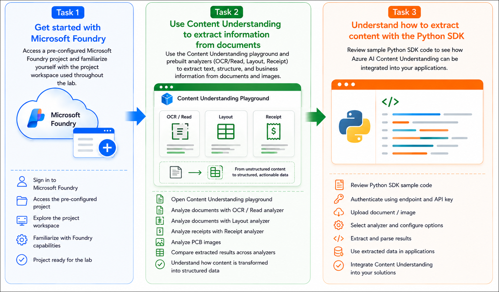
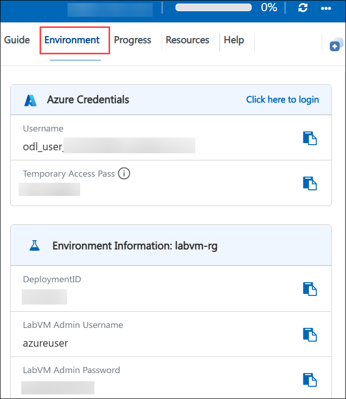
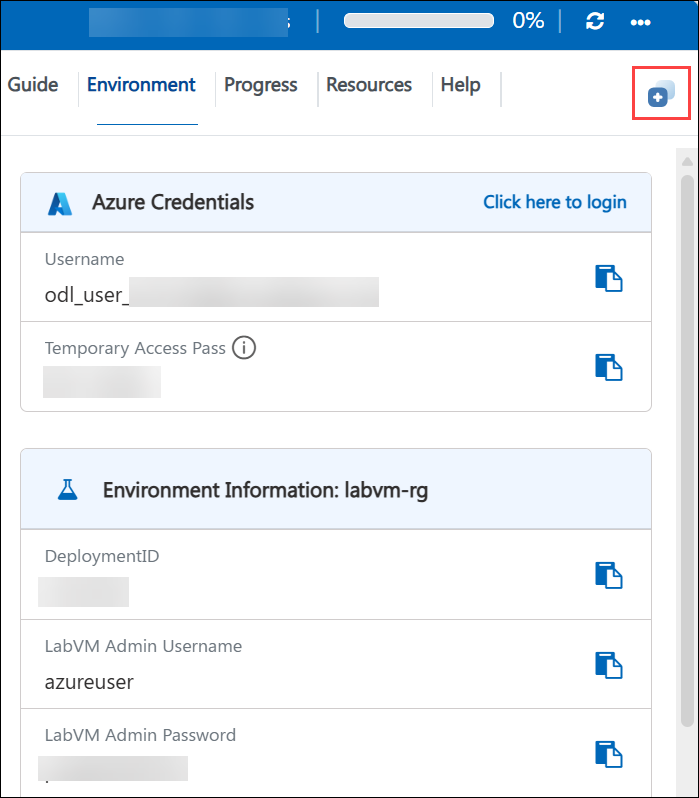

# AI-901: Microsoft Azure AI Fundamentals Workshop

Welcome to your AI-901: Microsoft Azure AI Fundamentals workshop! We're excited to guide you through hands-on learning with Azure AI services. Let’s continue by diving deeper into content moderation.

# Module 6a: Get started with information extraction in Microsoft Foundry

### Overall Estimated Timing: 45 Minutes

## Overview

In this hands-on lab, you will explore intelligent document processing capabilities in Microsoft Foundry by using Azure AI Content Understanding within a pre-configured Microsoft Foundry resource and project. You will use the Content Understanding playground to analyze documents and images with prebuilt analyzers, including **OCR/Read**, **Layout**, and **Receipt**, and compare how each analyzer extracts progressively richer information from unstructured content.

You will analyze sample documents and PCB images to understand how text, document structure, and business-specific fields are identified and transformed into structured data. Finally, you will review generated Python SDK sample code to learn how Azure AI Content Understanding can be integrated into intelligent document processing applications.

By the end of this lab, you will understand how Microsoft Foundry enables developers to transform unstructured documents and images into structured, actionable information using Azure AI Content Understanding. 

## Objectives

By the end of this lab, you will be able to use Azure AI Content Understanding in Microsoft Foundry to extract structured information from documents and images.

1. **Explore a Microsoft Foundry project**: Access a pre-configured Microsoft Foundry project and become familiar with the workspace used throughout the lab.

2. **Analyze documents using Content Understanding**: Use the Content Understanding playground to extract information from documents and images using the OCR/Read, Layout, and Receipt analyzers.

3. **Compare document analyzers**: Understand how different analyzers progressively extract text, document structure, tables, and business-specific fields from unstructured content.

4. **Process real-world documents and images**: Analyze sample documents and PCB images to observe how Azure AI Content Understanding interprets different document types.

5. **Review application integration**: Examine generated Python SDK sample code that demonstrates how applications authenticate, submit documents for analysis, and process structured results returned by Azure AI Content Understanding. 

## Pre-requisites

- Basic knowledge of Microsoft Azure and navigating the Azure portal.
- Familiarity with Microsoft Foundry and AI service concepts.
- Basic understanding of REST APIs and Python programming.
- General understanding of document processing and AI-powered information extraction.

## Architecture

In this hands-on lab, the architecture demonstrates how Azure AI Content Understanding transforms unstructured documents and images into structured, actionable information using Microsoft Foundry.

1. **Pre-configured Microsoft Foundry Project**: A Microsoft Foundry project provides the workspace for accessing Azure AI Content Understanding services and managing document analysis workflows.

2. **Content Understanding Playground**: Documents and images are uploaded to the playground, where prebuilt analyzers process content and extract meaningful information.

3. **Prebuilt Document Analyzers**: Specialized analyzers, including OCR/Read, Layout, and Receipt, extract progressively richer information such as text, document structure, tables, and business-specific fields.

4. **Structured Results Generation**: Analysis results are presented in multiple formats, including Markdown, extracted fields, tables, and structured JSON that can be consumed by applications.

5. **Application Integration**: Generated Python SDK sample code demonstrates how applications authenticate with Azure AI Content Understanding, submit documents for analysis, and process structured results programmatically. 

## Architecture Diagram

## Explanation of Components

1. **Microsoft Foundry Project**: A centralized workspace used to organize AI assets, AI services, and project configurations required for intelligent document processing solutions.

2. **Content Understanding Playground**: An interactive environment where users upload documents and images, select analyzers, execute analysis, and review extracted results before integrating them into applications.

3. **OCR/Read Analyzer**: A prebuilt analyzer that extracts printed and handwritten text from documents and images, converting unstructured visual content into machine-readable text.

4. **Layout Analyzer**: A document analysis model that identifies structural elements such as paragraphs, tables, headings, and reading order, preserving the logical organization of a document.

5. **Receipt Analyzer**: A specialized analyzer that extracts business-specific fields from receipts, such as merchant name, purchase date, totals, taxes, and other structured information.

6. **Structured Analysis Results**: The extracted information is presented in multiple formats, including Markdown, paragraphs, tables, fields, and JSON, enabling both human review and application integration.

7. **Azure AI Content Understanding Python SDK**: A client SDK that enables developers to authenticate with Azure AI Content Understanding, submit documents for asynchronous analysis, and retrieve structured results programmatically.

8. **Client Application**: An application that integrates with Azure AI Content Understanding to automate document processing workflows, extract structured business data, and consume analysis results for downstream business processes. 

## Getting Started with lab
 
Welcome to your AI-901: Microsoft Azure AI Fundamentals workshop! We've prepared a seamless environment for you to explore and learn about machine learning and AI concepts and related Microsoft Azure services. Let's begin by making the most of this experience:
 
## Accessing Your Lab Environment
 
Once you're ready to dive in, your virtual machine and **Guide** will be right at your fingertips within your web browser.
 

### Virtual Machine & Lab Guide
 
Your virtual machine is your workhorse throughout the workshop. The lab guide is your roadmap to success.

## Exploring Your Lab Resources
 
To get a better understanding of your lab resources and credentials, navigate to the **Environment** tab.
 

## Lab Guide Zoom In/Zoom Out
 
To adjust the zoom level for the environment page, click the **A↕: 100%** icon located next to the timer in the lab environment.

## Utilizing the Split Window Feature
 
For convenience, you can open the lab guide in a separate window by selecting the **Split Window** button from the Top right corner.
 

## Managing Your Virtual Machine
 
Feel free to **Start, Stop, or Restart (2)** your virtual machine as needed from the **Resources (1)** tab. Your experience is in your hands!
 

## Track Your Progress

Click on the **Progress** tab to track your progress in the lab. The percentage increases as you complete each validation and reaches 100% when all validations are successfully completed.  

On the **Progress (1)** tab, you can view your overall points and validation status, **Validations 0/1 (2)**.    

## Lab Duration Extension

1. To extend the duration of the lab, kindly click the **Hourglass** icon in the top right corner of the lab environment. 

    

    >**Note:** You will get the **Hourglass** icon when 10 minutes are remaining in the lab.

2. Click **OK** to extend your lab duration.
 
   

3. If you have not extended the duration prior to when the lab is about to end, a pop-up will appear, giving you the option to extend. Click **OK** to proceed.

## Let's Get Started with Azure Portal
 
1. On your virtual machine, click on the Azure Portal icon as shown below:
 
   .png)

2. You'll see the **Sign into Microsoft Azure** tab. Here, enter your credentials:
 
   - **Email/Username:** <inject key="AzureAdUserEmail"></inject>
 
       
 
3. Next, provide your password:
 
   - **Temporary Access Pass:** <inject key="AzureAdUserPassword"></inject>
 
     
 
4. If prompted to stay signed in, you can click **No**.

    
 
7. If a **Welcome to Microsoft Azure** pop-up window appears, simply click **Maybe later**.

    

## Support Contact
 
The CloudLabs support team is available 24/7, 365 days a year, via email and live chat to ensure seamless assistance at any time. We offer dedicated support channels explicitly tailored for both learners and instructors, ensuring that all your needs are promptly and efficiently addressed.
 
Learner Support Contacts:
 
- Email Support: cloudlabs-support@spektrasystems.com
- Live Chat Support: https://cloudlabs.ai/labs-support

Click on **Next** from the lower right corner to move on to the next page.

   .png)

## Happy Learning !!
