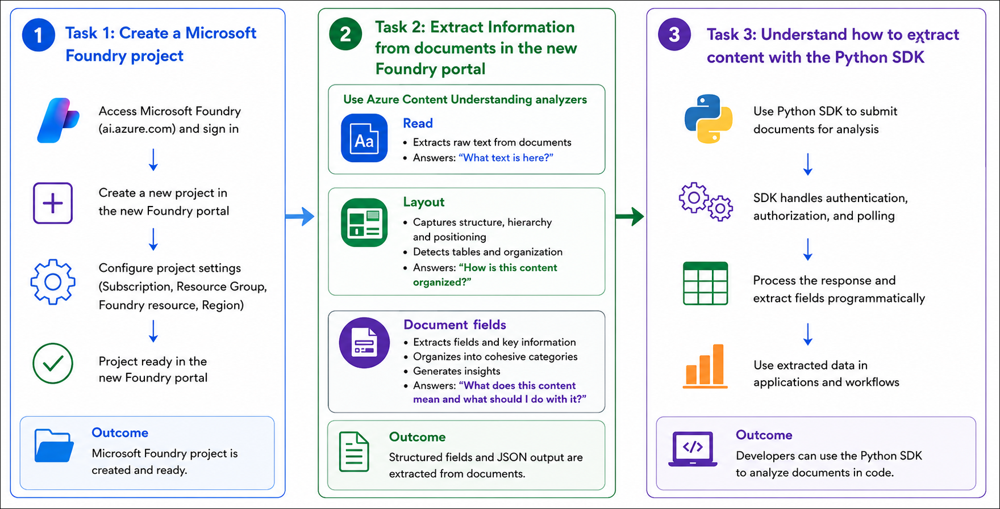

# AI-901: Microsoft Azure AI Fundamentals Workshop

Welcome to your AI-901: Microsoft Azure AI Fundamentals workshop! We're excited to guide you through hands-on learning with Azure AI services. Let’s continue by diving deeper into content moderation.

# Module 6a: Get started with information extraction in Microsoft Foundry

### Overall Estimated Timing: 45 Minutes

## Overview

In this lab, you will explore how to use **Microsoft Foundry** and **Azure AI Content Understanding** to extract structured information from documents and images. You will create a Microsoft Foundry project and use different Azure AI Content Understanding analyzers, including **OCR/Read**, **Layout**, and **Receipt**, to process and analyze sample documents within the Foundry portal.

You will compare how each analyzer extracts progressively richer information-from raw text and document structure to business-specific fields-and review the generated markdown, tables, extracted fields, and JSON output. Finally, you will examine the automatically generated Python SDK sample to understand how developers can integrate Azure AI Content Understanding into applications for intelligent document processing.

## Objectives

By the end of this lab, you will be able to:

1. **Create a Microsoft Foundry project:** Set up and configure a Microsoft Foundry project with the required Azure AI resources for Content Understanding.

2. **Use Azure AI Content Understanding analyzers:** Explore and test the OCR/Read, Layout, and Receipt analyzers in the Microsoft Foundry Content Understanding playground.

3. **Extract structured information from documents:** Analyze sample documents to extract raw text, document layout, tables, and structured business fields.

4. **Review extracted results and JSON output:** Examine markdown output, extracted fields, tables, and raw JSON responses generated by Azure AI Content Understanding.

5. **Understand Python SDK integration:** Learn how developers can use the Azure AI Content Understanding Python SDK to analyze documents programmatically and process structured analysis results.

## Pre-requisites

- Basic knowledge of Microsoft Azure and navigating the Azure portal.
- Familiarity with Microsoft Foundry and AI service concepts.
- Basic understanding of REST APIs and Python programming.
- General understanding of document processing and AI-powered information extraction.

## Architecture

This lab demonstrates how **Microsoft Foundry** and **Azure AI Content Understanding** work together to extract structured information from unstructured documents using prebuilt analyzers and developer tools. The architecture highlights how documents are processed through different analyzer capabilities to generate structured outputs for business applications.

1. **Microsoft Foundry Project:** A centralized AI workspace used to manage Azure AI resources, projects, and Content Understanding capabilities required for document analysis.

2. **Azure AI Content Understanding:** An AI-powered document analysis service that extracts text, document structure, and business-specific information from documents and images.

3. **OCR/Read Analyzer:** Extracts raw text from documents and images, answering the question, *"What text is contained in this document?"*

4. **Layout Analyzer:** Identifies document structure, paragraphs, tables, reading order, and page layout to answer the question, *"How is this document organized?"*

5. **Receipt Analyzer:** Extracts structured business information such as merchants, dates, totals, taxes, and purchased items from receipts, answering the question, *"What business information can be extracted from this document?"*

6. **Microsoft Foundry Playground:** A browser-based interface used to upload sample documents, execute analyzers, review extracted results, and inspect markdown and JSON outputs.

7. **Python SDK Integration:** Developer workflow that uses the Azure AI Content Understanding SDK to authenticate, submit documents for analysis, and retrieve structured JSON results programmatically.

8. **Structured Analysis Results:** AI-generated outputs including extracted text, document structure, tables, business fields, markdown representations, and JSON responses that can be integrated into downstream business applications and intelligent document processing workflows.

## Architecture Diagram

## Explanation of Components

1. **Microsoft Foundry Project:**
   Serves as the central workspace for developing AI solutions by managing Azure AI resources, projects, configurations, and services required for Azure AI Content Understanding.

2. **Azure AI Content Understanding:**
   An AI-powered service that analyzes documents and images to extract structured information from unstructured content using specialized prebuilt analyzers.

3. **OCR/Read Analyzer:**
   Extracts raw text from documents and images while preserving reading order, enabling applications to digitize and process textual content.

4. **Layout Analyzer:**
   Detects the structural organization of documents by identifying paragraphs, headings, tables, page layout, and reading order, making it easier to understand how information is organized.

5. **Receipt Analyzer:**
   Extracts structured business information from receipts, including merchant details, transaction dates, purchased items, taxes, totals, and other key-value fields for downstream business processing.

6. **Microsoft Foundry Playground:**
   A browser-based interface that allows users to upload sample documents, execute Content Understanding analyzers, review extracted results, compare analyzer outputs, and inspect structured JSON responses.

7. **Structured Analysis Results:**
   The AI-generated output produced by Content Understanding, including extracted text, markdown, tables, business fields, document metadata, and JSON representations that can be consumed by applications.

8. **Python SDK Integration:**
   Provides a developer-friendly interface for authenticating with Azure AI Content Understanding, submitting documents for asynchronous analysis, and processing structured results programmatically within Python applications.

9. **Azure AI Content Understanding REST API:**
   Exposes REST endpoints that allow client applications to submit documents for analysis, monitor long-running operations, and retrieve structured analysis results through standard HTTP requests.

10. **Business Applications:**
    Applications and workflows that consume the structured output from Azure AI Content Understanding to automate document processing, data extraction, search, compliance, and other intelligent business processes.

## Getting Started with lab
 
Welcome to your AI-901: Microsoft Azure AI Fundamentals workshop! We've prepared a seamless environment for you to explore and learn about machine learning and AI concepts and related Microsoft Azure services. Let's begin by making the most of this experience:
 
## Accessing Your Lab Environment
 
Once you're ready to dive in, your virtual machine and **Guide** will be right at your fingertips within your web browser.
 

### Virtual Machine & Lab Guide
 
Your virtual machine is your workhorse throughout the workshop. The lab guide is your roadmap to success.

## Exploring Your Lab Resources
 
To get a better understanding of your lab resources and credentials, navigate to the **Environment** tab.
 

## Lab Guide Zoom In/Zoom Out
 
To adjust the zoom level for the environment page, click the **A↕: 100%** icon located next to the timer in the lab environment.

## Utilizing the Split Window Feature
 
For convenience, you can open the lab guide in a separate window by selecting the **Split Window** button from the Top right corner.
 

## Managing Your Virtual Machine
 
Feel free to **Start, Stop, or Restart (2)** your virtual machine as needed from the **Resources (1)** tab. Your experience is in your hands!
 

## Track Your Progress

Click on the **Progress** tab to track your progress in the lab. The percentage increases as you complete each validation and reaches 100% when all validations are successfully completed.  

On the **Progress (1)** tab, you can view your overall points and validation status, **Validations 0/1 (2)**.    

## Lab Duration Extension

1. To extend the duration of the lab, kindly click the **Hourglass** icon in the top right corner of the lab environment. 

    

    >**Note:** You will get the **Hourglass** icon when 10 minutes are remaining in the lab.

2. Click **OK** to extend your lab duration.
 
   

3. If you have not extended the duration prior to when the lab is about to end, a pop-up will appear, giving you the option to extend. Click **OK** to proceed.

## Let's Get Started with Azure Portal
 
1. On your virtual machine, click on the Azure Portal icon as shown below:
 
   .png)

2. You'll see the **Sign into Microsoft Azure** tab. Here, enter your credentials:
 
   - **Email/Username:** <inject key="AzureAdUserEmail"></inject>
 
       
 
3. Next, provide your password:
 
   - **Temporary Access Pass:** <inject key="AzureAdUserPassword"></inject>
 
     
 
4. If prompted to stay signed in, you can click **No**.

    
 
7. If a **Welcome to Microsoft Azure** pop-up window appears, simply click **Maybe later**.

    

## Support Contact
 
The CloudLabs support team is available 24/7, 365 days a year, via email and live chat to ensure seamless assistance at any time. We offer dedicated support channels explicitly tailored for both learners and instructors, ensuring that all your needs are promptly and efficiently addressed.
 
Learner Support Contacts:
 
- Email Support: cloudlabs-support@spektrasystems.com
- Live Chat Support: https://cloudlabs.ai/labs-support

Click on **Next** from the lower right corner to move on to the next page.

   .png)

## Happy Learning !!
