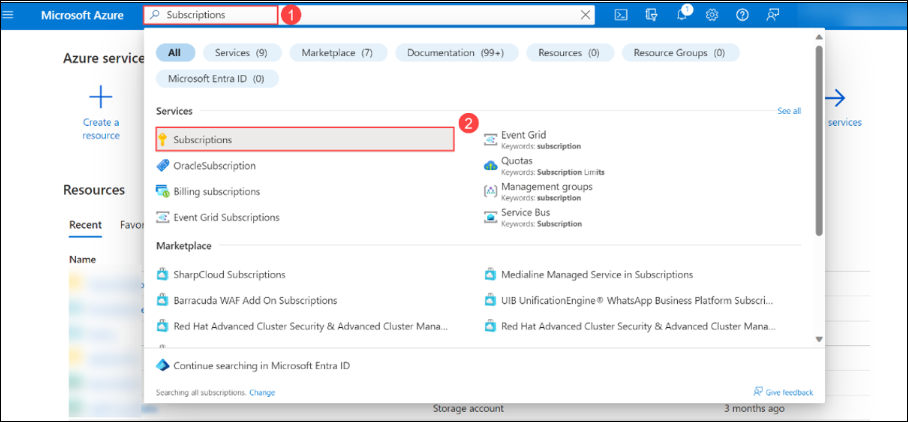
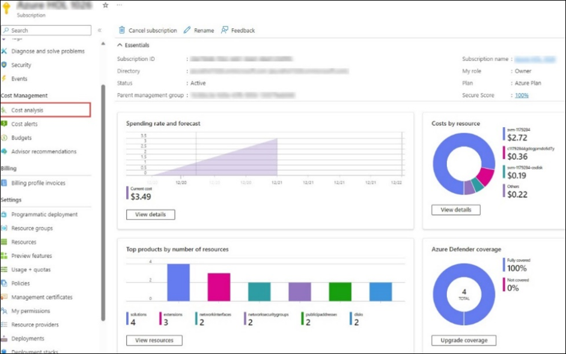
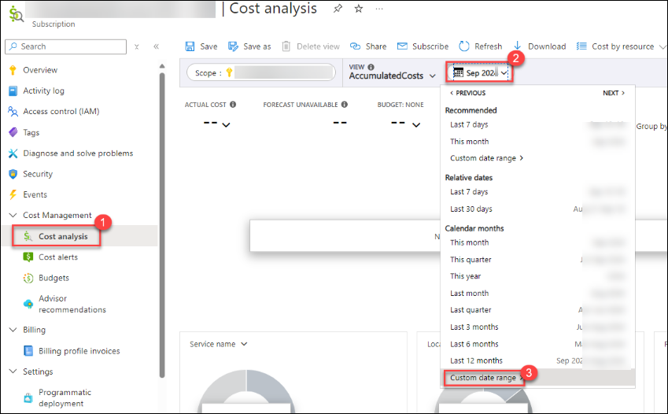
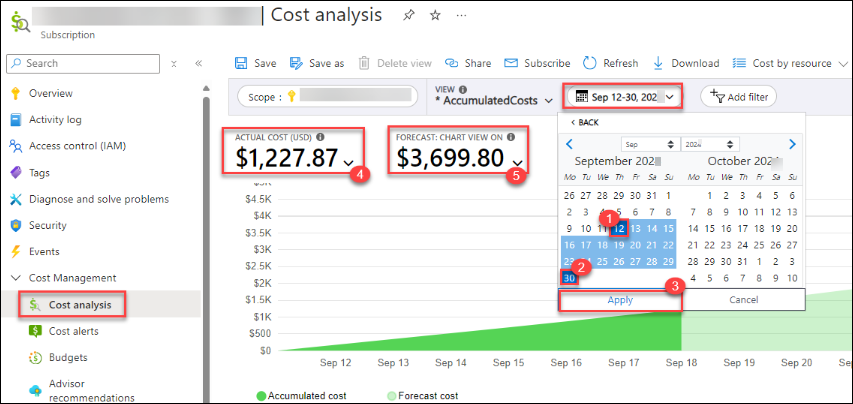

# Akkodis - Azure and Azure AI Learning Workshop

Using this environment, you can explore the full range of Azure capabilities and services, including Microsoft Foundry, Azure AI services, and many others. A detailed overview of the sandbox environment is provided below.

## About the Sandbox Environment

   | Resources | Value | Remarks |
   | --- | --- | --- |
   | Enabled Services | `Microsoft Foundry`   `Azure AI services`  | You will have access to a dediated subscription with Owner role permissions on the subscription to explore any desired resources |
   | Azure Entra ID User | Pre-created Entra ID user account | You will get one Entra ID User Account. |
   | Azure Subscription Permissions | **Owner** privilege over Azure Subscription | You will get owner access to the Azure subscription. |
   | Azure Credit | **$140USD**| Consumption limit is set on Azure spend to 140 USD. |
   | Credit Alerts | Credit Alerts are set on consumption of 25%, 50%, 75%, 85%, 90%, 95% and 100% of total Azure credits. |Make sure to check your registered email's inbox for any alert-related mails. Alerts give you a head start to keep your Azure spending in control and to plan out the remaining credits in the best way possible. |
   | Sandbox Duration | 50 Days or until Azure Consumption Credits are exhausted.  | The sandbox environment will be deleted automatically after 50 days or once the Azure credits are exhausted, whichever comes first. |

## Notes:
* The Azure credit consumption includes all the resources which you will be deploying while using the sandbox environment for your hackathon use case.
* You will have owner access on the Azure subscription, you can freely explore the features of required services and are recommended to use it only for learning purposes.
* Each sandbox environment has a fixed budget cap of USD 140. Please refrain from deploying any resources outside of the sandbox scope, as they may consume the allocated Azure credits and result in the automatic deallocation of the environment once the credit limit is reached.

## Azure OpenAI Cost Optimization:
Azure OpenAI service provides two types of deployment SKUs: Standard and PTU-based deployment. The PTU-based model, although powerful, can be quite costly, with a price of **$2 per hour**. Deploying this model would result in a daily cost of **$48**, which may not be a cost-effective option to consider. Additionally, deploying the PTU-based model would quickly exhaust credits within 2-3 days, leading to the automatic deletion of the environment. Therefore, we recommend opting for the **Standard (On-Demand)** Pricing model instead, which offers a more affordable and sustainable deployment strategy.

## Cost Monitoring:
To monitor and analyse your Azure credit spend, you can navigate to the Azure Subscription page by following the steps mentioned below.
+ From the Azure portal home page, search for **Subscriptions (1)** using the search bar and select the same from the suggestions.
  
  
  
+ Select the Cost Analysis tab from the Cost Management pane. You can access a comprehensive breakdown of your Azure spending, offering a granular view of costs associated with various services, and resources.

  

+ To get the accurate consumed cost by you, select the **Calendar (2)** from **Cost analysis (1)**  then **Custom date Range (3)**.

  

+ Now, select the custom dates.
    + **Start Date: (1)** The date when you redeemed voucher and launch the Sandbox environment.
    + **End Date: (2)** Current or future date. If you select the future date, you can also get the forecasted cost based on the current resources you deployed.
    + You can see the **ACTUAL COST (USD) (4)** and the **FORECAST: CHART VIEW ON (5)** cost.

  

## Best Practices:
+ **Resources usage:** Please stop the virtual machines, WebApps, Azure Kubernetes service, Azure Container Instance and other resources when not in use to minimize the Azure spend.
+ **Azure Cost Analysis:** Maintain a practice of regularly checking the Cost Analysis report for the assigned Azure subscription to ensure the sustainability of the environment over an extended period.
+ **Alert notifications:** Make sure to check your registered email's inbox for any alert-related emails. Alerts give you can head start to keep your Azure spending in control and to plan out the remaining credits in the best way possible.

## CloudLabs Support Contacts:
You can reach out to the support team in case you face any difficulty in using the sandbox environment, any permission, or Azure consumption-related queries.

* Sandbox user Email Support:  cloudlabs-support@spektrasystems.com
* Sandbox user Live Chat Support: https://cloudlabs.ai/ms-support

When you contact support, please provide the following information:
+  "I am a participant user of **Akkodis - Azure and Azure AI Learning Workshop**, my registered email address is `email@contoso.com`, followed by your query/issue."

Go to the next page, to check how to get the Azure Credential and use the environment.
