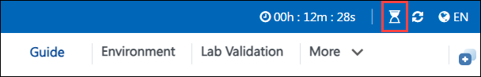

# Getting Started with Your AI-900: Microsoft Azure AI Fundamentals Workshop
 
Welcome to your AI-900: Microsoft Azure AI Fundamentals workshop! We've prepared a seamless environment for you to explore and learn about machine learning and AI concepts and related Microsoft Azure services. Let's begin by making the most of this experience:
 
## Accessing Your Lab Environment
 
Once you're ready to dive in, your virtual machine and lab guide will be right at your fingertips within your web browser.
 

### Virtual Machine & Lab Guide
 
Your virtual machine is your workhorse throughout the workshop. The lab guide is your roadmap to success.

## Exploring Your Lab Resources
 
To get a better understanding of your lab resources and credentials, navigate to the **Environment** tab.
 

## Lab Guide Zoom In/Zoom Out
 
To adjust the zoom level for the environment page, click the **A↕ : 100%** icon located next to the timer in the lab environment.

## Utilizing the Split Window Feature
 
For convenience, you can open the lab guide in a separate window by selecting the **Split Window** button from the Top right corner.
 

## Managing Your Virtual Machine
 
Feel free to start, stop, or restart your virtual machine as needed from the **Resources** tab. Your experience is in your hands!
 

## Lab Duration Extension

1. To extend the duration of the lab, kindly click the **Hourglass** icon in the top right corner of the lab environment. 

    

    >**Note:** You will get the **Hourglass** icon when 10 minutes are remaining in the lab.

2. Click **OK** to extend your lab duration.
 
   

3. If you have not extended the duration prior to when the lab is about to end, a pop-up will appear, giving you the option to extend. Click **OK** to proceed.

## Let's Get Started with Azure Portal
 
1. On your virtual machine, click on the Azure Portal icon as shown below:
 
   .png)

2. You'll see the **Sign into Microsoft Azure** tab. Here, enter your credentials:
 
   - **Email/Username:** <inject key="AzureAdUserEmail"></inject>
 
       
 
3. Next, provide your password:
 
   - **Password:** <inject key="AzureAdUserPassword"></inject>
 
     
 
4. If prompted to stay signed in, you can click **No**.

5. If **Action required** pop-up window appears, click on **Ask later**.
   
    
 
6. If prompted to stay signed in, you can click "No."

    
 
7. If a **Welcome to Microsoft Azure** pop-up window appears, simply click **Cancel**.

## Creating outlook account

1. On your virtual machine visit the Outlook sign-up page: Open your egde browser and go to the Outlook sign-up page. You can do this by visiting https://outlook.live.com/.

1. Click **Create free account**: On the Outlook sign-up page, you should see a "Create free account" or "Sign up" button. Click on it to begin the registration process.

    

1. On the create account page enter details as shown in the below picture:

    - **New email:** odl_user_<inject key="DeploymentID" enableCopy="false" />

      

1. On the create a password page enter details as shown in the below picture:

    - **Password**: <inject key="AzureAdUserPassword"></inject>

      

1. Enter your **first (1)** and **last (2)** name in the provided fields and click on **Next (3)**.

   - **First Name** : ODL
   - **Last Name** : USER

       

1. Select your **country** and **date of birth** then click on **Next**.

      

1. On **Please solve the puzzle so we know you're not a robot** page click on **Next**.

      

1. Use the arrows and rotate the animal and click on Submit.

     

1. If prompted to stay signed in, you can click **No**.

    
      
1. If prompted **Your Microsoft account brings everything together**, then click on **Ok**.
 
    

1. Select the **profile (1)** icon in the Edge toolbar and then select **Sign in to sync data (2)**.

   

1. On the Create Account page enter details as shown in the picture below:

    - **Username:** odl_user_<inject key="DeploymentID" enableCopy="false" />@outlook.com

        

1. On the create a password page enter details as shown in the picture below:

    - **Password**: <inject key="AzureAdUserPassword"></inject>

       

1. On **Use this account everywhere on your device** click on **Next**.

   

## Steps to Proceed with MFA Setup if "Ask Later" Option is Not Visible

1. At the **"More information required"** prompt, select **Next**.

1. On the **"Keep your account secure"** page, select **Next** twice.

1. **Note:** If you don’t have the Microsoft Authenticator app installed on your mobile device:

   - Open **Google Play Store** (Android) or **App Store** (iOS).
   - Search for **Microsoft Authenticator** and tap **Install**.
   - Open the **Microsoft Authenticator** app, select **Add account**, then choose **Work or school account**.

1. A **QR code** will be displayed on your computer screen.

1. In the Authenticator app, select **Scan a QR code** and scan the code displayed on your screen.

1. After scanning, click **Next** to proceed.

1. On your phone, enter the number shown on your computer screen in the Authenticator app and select **Next**.
       
1. If prompted to stay signed in, you can click "No."
 
1. If a **Welcome to Microsoft Azure** pop-up window appears, simply click "Maybe Later" to skip the tour.

## Support Contact
 
The CloudLabs support team is available 24/7, 365 days a year, via email and live chat to ensure seamless assistance at any time. We offer dedicated support channels tailored specifically for both learners and instructors, ensuring that all your needs are promptly and efficiently addressed.
 
Learner Support Contacts:
 
- Email Support: labs-support@spektrasystems.com
- Live Chat Support: https://cloudlabs.ai/labs-support

Click on Next from the lower right corner to move on to the next page.

   .png)

## Happy Learning !!

