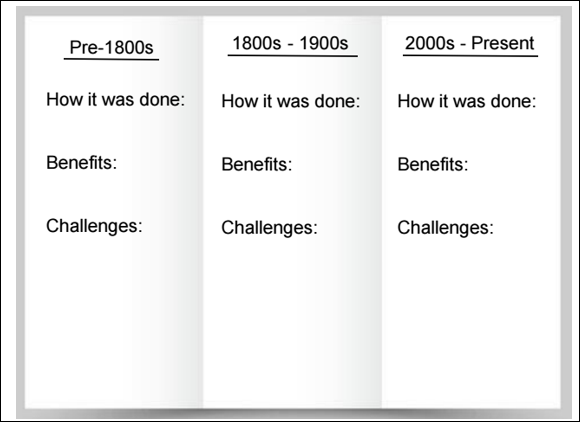

## L1 Lesson Plan: The Evolution of Agriculture

### Lesson Description:
In this unit, you'll explore how modern agriculture relies on technology, data, and artificial intelligence to feed the world more efficiently. We'll begin by looking at how farming has evolved from traditional methods to high-tech systems, and why this transformation matters. You’ll learn how humans and machines process information differently, how data is collected and analyzed on farms, and how artificial intelligence helps farmers make smarter decisions. 

As we move through each lesson, you’ll discover how to use real-world tools like sensors, spreadsheets, and even Python code to understand and solve agricultural problems. You'll also get to explore different types of machine learning, understand the difference between explainable and black box AI, and examine how data influences farm design and operations. 

At the end of the unit, you’ll apply everything you've learned by designing and building your own smart farm using Arduino technology. You’ll collect sensor data, analyze it, and make improvements to your farm system—just like real engineers and data scientists. This unit is all about hands-on learning, critical thinking, and solving real-world challenges in agriculture with modern tools.

#### Main Learning Goal:
Students will understand how farming has modernized over time using tools and technology.

#### Essential Question:
How has technology transformed agriculture over time, and what impact has it had on the industry?

#### Objectives:

• Students will be able to identify and describe key aspects of agriculture.

• Students will explain how agriculture has evolved over time, the role of technology in its advancement, and its overall impact.

• Students will understand how this unit connects to and prepares them for the final project.

#### Total Duration: 40 - 55 minutes (1 day)

Important Vocabulary:
1. Agriculture:

    a. Definition: The science, art, or practice of cultivating the soil, producing crops, and raising livestock and in varying degrees the preparation and marketing of the resulting products.

    b. Example: Animal farm, rice paddy, or vineyard.

2. Cultivate:

    a.	Definition: To prepare land and grow crops on it, or to grow a particular crop.

    b.	Example: A gardener preparing soil for tomatoes.

3. Livestock:

    a.	Definition: Animals and birds that are kept on a farm.

    b.	Example: Cows, sheep, or chickens
    .
4. Mechanization:

    a.	Definition: The process of introducing a machine to do something that used to be done by hand.

    b.	Example: A factory using robotic arms to assemble cars.

5. Automation:

    a.	Definition: The use of machines and computers that can operate without needing human control.

    b.	Example: Self-checkout stations at a grocery store.

6. Sustainability:

    a.	Definition: The quality of being able to continue over a period of time.

    b.	Example: Reusable water bottles.

7. Stakeholder:
    a. Definition: A person such as an employee, customer, or citizen who is involved with an organization, society, etc. and therefore has responsibilities towards it and an interest in its success.
    
    b.	Example: A shareholder in a company or a student in a school district.

8. Extension Office:
    a.	Definition: A place where people can get free, research-based information about farming and gardening.

    b.	Example: Every county in the U.S. has an agricultural extension office.

#### Engage (Elicit/Develop) ~ 15-25 minutes
Activity Name: What is Agriculture? (~5-10 minutes)

Activity Walkthrough: 
1.	Before discussing how agriculture has changed over time, we need to understand what agriculture is. Ask the students to discuss with their neighbor the following question, Q1: What is agriculture?

    a.	Then ask for a couple students to share what they and their neighbors discussed.

    b.	Have the students record their answers on their worksheet, SREB_U3_L1_Handout

    c.	Agriculture is defined as:
    The science, art, or practice of cultivating the soil, producing crops, and raising livestock and in varying degrees the preparation and marketing of the resulting products. [source]

1. Now that the students have a solid understanding of what agriculture is, have them turn to their neighbor again to discuss, Q2: What are some key components of agriculture?

    a. Have the students record their answers on their worksheet as notes, SREB_U3_L1_Handout

    b. Call on students to share ONE key element they discussed, taking turns to ensure a variety of responses.

    i. Some examples include:

     • Crop production

     • Livestock management

     • Soil health

     • Water management

     • Pest and disease control

### Activity Name #2: How has Agriculture Changed?  (~10-15 minutes)

Activity Walkthrough:  
1. Now that we understand what agriculture is, let’s explore how technology has transformed it into what it is today. Using farming as an example, explain how it has evolved over the past 100 years:

    • 100 years ago: Farmers relied on manual labor, simple tools, and basic knowledge of seasons and soil conditions.

    • Presently: Farmers use mechanized equipment like automated harvesters and moisture sensors to produce crops.

2. Have the students record their answers on comparison on farming techniques from 100 years to now in their SREB_U3_L1_Handout.

3. Another example of agriculture's evolution can be seen in milking practices. Watch this video to explore how technological advancements have transformed the process over time: Robotics Milkers - Discovering Farmland (1:18 mins).

4. Afterwards, ask a student to summarize the video. 

    a. This video illustrates how technology has made the milking process more efficient and less labor-intensive compared to traditional methods, ultimately boosting productivity and sales.

5. Beyond reducing labor and increasing efficiency, what other factors should be considered when using technology in agriculture? Give the students 5 – 10 minutes to answer these questions in their SREB_U3_L1_Handout.

    • Q1: What are some benefits of using machines for milking compared to milking by hand? Are there any drawbacks? 

    i. Benefits include process consistency, efficiency, and robotic milking systems also allow us to monitor the cow's health. Drawbacks can include the initial cost set up and technical malfunctions.

    • Q2: How does automation impact the timing and frequency of milking, and what benefits or challenges does this create for farmers and cows?

    i. Automation allows farmers to milk multiple times a day. This creates flexibility in the farmers' schedule but also brings challenges such as maintenance and increased time for the cows to adjust.
    
    • Q3: Do you think automated milking systems improve or worsen the welfare of cows? Why?

    i. Automated milking systems may improve the welfare of cows since it provides them with the option for the time they want to be milked.

#### Explore (Develop/Deploy) ~ 20-25 minutes
Activity: Agriculture: A History (~20-25 minutes)

Activity Walkthrough:  
1. Let’s take a deeper dive into different agricultural methods and how they’ve changed over time. Have students form pairs and choose a farming practice to research. Provide the options on the board and cross them out as groups choose their topic to ensure variety. Topics include:

    a.	Watering

    b.	Harvesting

    c.	Weeding

    d.	Plowing

    e.	Spraying

    f.	Pest control

    g.	Seed planting

    h.	Soil management

    i.	Crop protection

    j.	Storage protection

2. Ask students to research how their method was performed pre-1800s, 1800s-1900s, and 2000s-Present.

    a. Students will make a trifold, where each section is dedicated to a specific era.

    b. Students can use SREB_U3_L1_Handout, page 3, as an example.

    c. Each era must include:
    
    i. How the task was accomplished.

    ii. The impact technology has had, including benefits and challenges.

    d. Students can add any additional information or images they wish, but it must include those basic points, as shown in Figure 1.

      

      Figure 1: Example trifold [source]

3.	If there’s time, have pairs form groups of 4-6 (2-3 pairs) and have the pairs present their findings to each other.

#### Explain (Refine) ~ 5 minutes
Activity Name: Introduction to Final Project (PBL) (~5 minutes)
Activity Walkthrough:  

1. So where are we going with all of this? The teacher will provide students with the following scenario:

    • “We’ve heard of the work you did for Predictive Care Insights and would like to bring you on as consultants. Your mission is to help modernize agricultural entities in our region by integrating sensors and data-driven solutions. To accomplish this, you’ll collaborate with other local extension offices to understand the agricultural landscape and stakeholder needs for improved agricultural practices. 

    Using this information, you will need to design, build, and present a model farm/greenhouse to showcase to the extension office and agricultural stakeholders. These models will serve as a blueprint for the future of our region’s farming and greenhouse operations.”

    • Students will learn:

    i.	Industry standard AI tools and software, such as Excel and Azure.

    ii.	How to work with large data sets.

    iii. How to use sensors and microcontrollers.

2. Students will learn all these skills, so that as consultants they will be able to design, build, and present a SMART tabletop model farm/greenhouse to showcase to the extension office and agricultural stakeholders.

3. At the end, have students reflect on the lesson today and how that may apply to their final project. Students will use their worksheet, SREB_U3_L1_Handout, to answer the following final questions:

    •	Q1: What are some advantages and challenges of using sensors and AI in agriculture?

    •	Q2: What are some real-world agricultural problems that AI and technology could help solve?

    •	Q3: How can we balance sustainability with technological advancements in agriculture?
