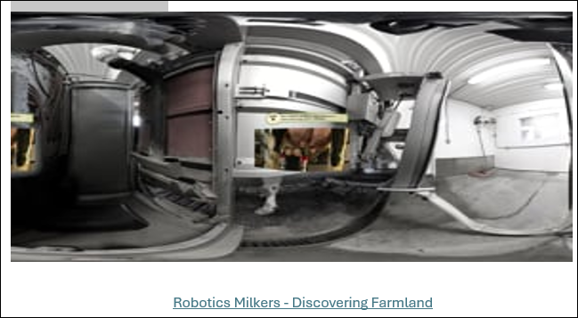
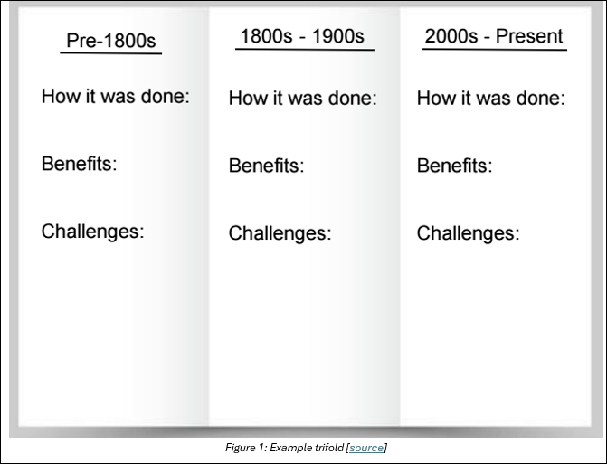

## Lesson 1: The Evolution of Agriculture

### Lesson Description:
In this unit, you'll explore how modern agriculture relies on technology, data, and artificial intelligence to feed the world more efficiently. We'll begin by looking at how farming has evolved from traditional methods to high-tech systems, and why this transformation matters. You’ll learn how humans and machines process information differently, how data is collected and analyzed on farms, and how artificial intelligence helps farmers make smarter decisions. 

As we move through each lesson, you’ll discover how to use real-world tools like sensors, spreadsheets, and even Python code to understand and solve agricultural problems. You'll also get to explore different types of machine learning, understand the difference between explainable and black box AI, and examine how data influences farm design and operations. 
At the end of the unit, you’ll apply everything you've learned by designing and building your own smart farm using Arduino technology. You’ll collect sensor data, analyze it, and make improvements to your farm system—just like real engineers and data scientists. This unit is all about hands-on learning, critical thinking, and solving real-world challenges in agriculture with modern tools.

### Main Learning Goal:

Students will understand how farming has modernized over time using tools and technology.

### Essential Question:

How has technology transformed agriculture over time, and what impact has it had on the industry?

Objectives:

• Students will be able to identify and describe key aspects of agriculture.

• Students will explain how agriculture has evolved over time, the role of technology in its advancement, and its overall impact.

• Students will understand how this unit connects to and prepares them for the final project.

### What is Agriculture?

Before discussing how agriculture has changed over time, we need to understand what agriculture is.

With your neighbor, discuss the following question and record your answer in your worksheet, SREB_U3_L1_Handout. 

•  Q1: What is agriculture? 
Agriculture is defined as: The science, art, or practice of cultivating the soil, producing crops, and raising livestock and in varying degrees the preparation and marketing of the resulting products. [source] 

Some common examples of agriculture are an animal farm, a rice paddy, or a vineyard.
Now that you have a clear understanding of agriculture, take a moment to discuss with your neighbor: 

• Q2: What are the key components of agriculture?

After your discussion, record your answer in the worksheet, SREB_U3_L1_Handout.

Some examples of key components are:

• Key Crop production 

• Livestock management 

• Soil health 

• Water management 

• Pest and disease control

#### How has Agriculture Changed?

Now that we understand what agriculture is, let us explore how technology has transformed it into what it is today. 

Using farming as an example, we can note that 100 years ago, farms relied heavily on manual labor, simple tools, and their knowledge of the season and soil conditions to grow crops. This process was much slower and required a lot of physical effort!

Today, technology has revolutionized farming. Farmers now use advanced machinery, such as automated harvesters and tools to monitor soil moisture to produce crops. 
 
Make sure that you write these key changes down in the worksheet: SREB_U3_L1_Handout.

Another example of agriculture’s evolution can be seen in cow milking practices. Let’s watch the following video to explore how technological advancements have transformed this process over time: 

As we saw in the video, technology has made the milking process more efficient and less labor-intensive compared to traditional methods, ultimately boosting productivity and sales. Continuing this topic, let’s think about some other factors that should be considered when using technology in agriculture. 

In page two of your worksheet, SREB_U3_L1_Handout, answer the following questions:

•	Q1: What are some benefits of using machines for milking compared to milking by hand? Are there any drawbacks? 

•	Q2: How does automation impact the timing and frequency of milking, and what benefits or challenges does this create for farmers and cows? 

•	Q3: Do you think automated milking systems improve or worsen the welfare of cows? Why?

#### Agriculture: A History

Let’s take a deeper dive into different agricultural methods and how they’ve changed over time. First, pair up with a classmate. Once you’ve selected your partner for this activity, choose one farming practice from the list below to research:

•	Watering 

•	Harvesting 

•	Weeding 

•	Plowing 

•	Spraying 

•	Pest control 

•	Seed planting 

•	Soil management 

•	Crop protection 

•	Storage protection

To make sure every pair has a unique topic, inform your teacher of your selection! 

You will need to create a trifold research “poster” to demonstrate your skills. You will research how your farming practice was accomplished in the pre-1800s, 1800s-1900s, and 2000s-Present. Each era must include:

• How the task (your chosen farming practice) was accomplished.

• The impact technology has had on your chosen practice, including both the benefits and the challenges.

You may include any additional information or images, but your answers must include those points. You can use your SREB_U3_L1_Handout, page 3, as an example where each section is dedicated to a specific era. Below, in Figure 1, you can also see the trifold example.

Record your findings in your worksheet:  SREB_U3_L1_Handout. Then, with your partner, join another pair or two to form a group of 4–6 students. Once you are in your group, take turns presenting your findings to each other.

#### Introduction to Final Project (PBL)

Once you’ve established your skills, imagine the following scenario:

“We’ve heard of the work you did for Predictive Care Insights and would like to bring you on as consultants. Your mission is to help modernize agricultural entities in our region by integrating sensors and data-driven solutions. To accomplish this, you’ll collaborate with other local extension offices to understand the agricultural landscape and stakeholder needs for improved agricultural practices. 

Using this information, you will need to design, build, and present a model farm/greenhouse to showcase to the extension office and agricultural stakeholders. These models will serve as a blueprint for the future of our region’s farming and greenhouse operations.” 

Fo the project you will use: 

•	Industry standard AI tools and software, such as Excel and Azure. 

•	Large data sets.

•	Sensors and microcontrollers.

You will design, build, and present a SMART tabletop model farm/greenhouse to showcase to the extension office and agricultural stakeholders.

As today’s meeting comes to an end, take a moment to reflect on today’s lesson and consider how it may apply to your final project. Answer the following questions on the last page of your worksheet, SREB_U3_L1_Handout.

•	Q1: What are some advantages and challenges of using sensors and AI in agriculture?

•	Q2: What are some real-world agricultural problems that AI and technology could help solve? 

•	Q3: How can we balance sustainability with technological advancements in agriculture?
