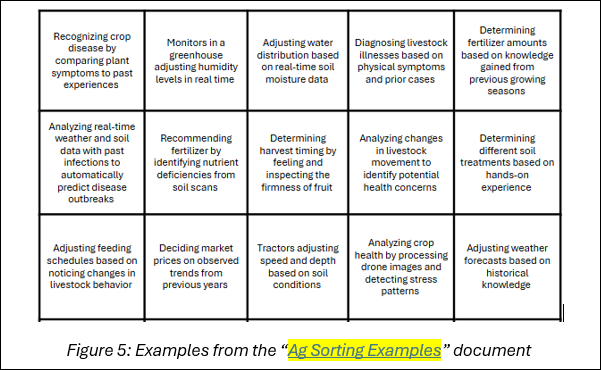

## 2L2 Lesson Plan: Human & Machine Learning

### Lesson Description:

In this lesson, students will explore how humans learn and how machines process information using algorithms. They will identify key differences between human and machine learning, including the limitations of artificial intelligence. Additionally, students will examine the role of machine learning in agriculture and engage in a debate on whether traditional or modern agriculture methods are more effective.

#### Main Learning Goal:

Students will be able to distinguish between human and machine learning and effectively articulate and defend their stance in a debate.

#### Essential Question:
How do machines learn and process information compared to humans, and are they more effective than human intelligence?

#### Standards:

•	IAI.A2.2. Explain the difference between machine learning and human learning.

#### Objectives:

•	Students will be able to distinguish between human and machine learning and explain their key differences.
•	Students will be able to describe and analyze the "Sense-Deliberate-Act" process used by machines.
•	Students will be able to recognize and categorize real-world examples of both human and machine learning.
•	Students will be able to evaluate the strengths and limitations of each learning type.
•	Students will develop critical thinking and debate skills, effectively defending their stance using evidence-based arguments.

### Total Duration: 140 – 160 minutes (3 days)

#### Important Vocabulary:
1. Learning:

    a.	Definition: The process of gaining new knowledge, skills, or behaviors through experience, practice, or observation. It is shown by changes in behavior, understanding, or brain function.

    b. Example: Learning to ride a bike by practicing multiple times

2. Machine Learning (ML):

    a. Definition: A branch of artificial intelligence (AI) focused on enabling computers and machines to imitate the way that humans learn, to perform tasks autonomously, and to improve their performance and accuracy through experience and exposure to more data.

    b. Example: A spam filter learns to identify junk emails based on previous flagged messages

3. Algorithm:

    a.	Definition: A step-by-step set of instructions that a computer follows to perform a task or solve a problem.

    b.	Example: A recipe for baking a cake, where each step must be followed in order.

4.	Data Training:

    a.	Definition: The process of feeding large amounts of labeled or structured data into a machine learning model so it can recognize patterns and make accurate predictions.

    b.	Example: Teaching an AI to recognize cats by showing it thousands of cat photos.

5.	Pattern Recognition:

    a.	Definition: The ability to detect recurring structures, trends, or characteristics in data.

    b.	Example: Noticing that traffic is always heavier at certain times of the day.

6.	Cognition:

    a.	Definition: The mental process of thinking, understanding, learning, and remembering.

    b.	Example: Solving a math problem by breaking it down into smaller steps.

7.	Intuition:

    a.	Definition: The ability to understand something immediately, without needing conscious reasoning or extensive data analysis.

    b.	Example Knowing someone is upset just by looking at their facial expression.

8.	Critical Thinking:

    a.	Definition: The ability to analyze information, assess different perspectives, and make reasoned decisions.

    b.	Example: Reading a news article and questioning whether the source is reliable.

9.	Automation:

    a.	Definition: The use of technology, machines, or AI to perform tasks with minimal human intervention.

    b.	Example: A washing machine automatically stops when the cycle is complete.

### Engage (Elicit/Develop) ~ 45-55 minutes
Activity Name: I Spy (~ 10 minutes)

#### Activity Walkthrough:  

1.	I spy with my little eye something... yellow!

2.	To kick off today’s lesson, we will start with a fun game to get students thinking about how they learn. Use the “I Spy” presentation and have the class call out and identify the objects shown on each slide. Each slide should feature a single, easily recognizable object, such as:

    •	A banana

    •	A basketball

    •	The number 2

    •	A shoe

3.	Include a few trickier slides to challenge their perception, such as shown in Figures 1 and 2:

    • A cat in a flower costume

    • An upside-down panda

         

           

4. Even with the trickier slides, students should still be able to recognize each object fairly easily. But why is that?

5. Ask a few volunteers to explain how they knew what the object was, even if it was upside down or looked unusual.

    a. Students may give vague answers, such as "I just know" or "I learned what it was when I was a child." Use this as a transition to ask the class:

6.	Do you think a computer would be able to recognize these images (as shown in Figure 3) as easily as we do? Why or why not?

    a. Have students record their answer on this worksheet, 
    **SREB_U3_L2_Handout_MachineLearningandHumanLearning.**

      

### Activity #2: Human vs Machine Learning (~ 15-20 minutes)

#### Activity Walkthrough:

1.	Humans have an incredible ability to learn quickly and apply knowledge flexibly. Unlike machines, we do not need large amounts of data to recognize patterns or make decisions. In many cases, we can see or experience something once or twice and still understands it well enough to use it in different situations.

2. For a human, learning is the process of gaining new knowledge, skills, or behaviors through experience, practice, or observation. It is shown by changes in behavior, understanding, or brain function.

  This process involves:

   - Focusing on important information

   - Organizing it into a meaningful structure

   - Connecting it to what is already known from memory. [source]

3. That is why if you see an upside-down panda, you still recognize it as a panda, even though you have probably never studied thousands of images of upside-down pandas before. This ability to generalize from limited experiences is a fundamental strength of human learning.

4. On the other hand, a computer would have a harder time identifying these images. A computer requires extensive data training to recognize patterns and make decisions. Computers only know what it has been “taught” through large datasets and pattern recognition.
5. Machine Learning (ML) is a branch of artificial intelligence (AI) focused on enabling computers and machines to imitate the way that humans learn, to perform tasks autonomously, and to improve their performance and accuracy through experience and exposure to more data. [source]
6. Although machines do not "think” like humans, they have their own cycle for “thinking.” It is called the “Sense-Deliberate-Act" cycle. In this cycle, computers:

    - Takes in information using sensors

    - Processes the data it receives

    - Acts to do something or make a decision

7.	For example, a self-driving car uses sensors to detect its surroundings. If another car suddenly pulls in front of it, the system must quickly analyze the situation and decide whether to brake, slow down, or take another action to avoid a collision.
a.	Have students record the “major strengths of human intelligence and learning” in their worksheet.
8.	Watch this video that describes How AIs, like ChatGPT, Learn (stop at 8:00 minutes). The video explains how computers are trained on massive amounts of sample data and go through multiple refinements to develop an accurate model.
9.	While watching the video, have the students identify an example of each step in the “Sense-Deliberate-Act" cycle. (In the worksheet).
10.	As shown in the video, machines rely on large, high-quality datasets to learn effectively. In the next few lessons, we will explore how data is processed and applied in real-world scenarios.
11.	For now, let’s shift our focus to how both human and machine learning are used in agriculture—and whether one is truly better than the other!

#### Activity #3: Building Your Debate (~ 20-25 minutes)

**Activity Walkthrough:**

1. With the rise of mechanization in agriculture, the industry has transitioned from depending on human intuition and expertise to using automated machines that adapt and improve through data analysis. In groups, students will investigate this transformation and develop a well-supported analysis on traditional methods and modern automation to decide whether one is superior to the other.
2. Have students form groups of 2-3 and choose an agricultural innovation to research. Each group must choose a unique topic. They will compare traditional human methods with machine learning advancements and evaluate the impact of automation.
3. Possible topics include:

    - Image analysis for disease detection

    - Weed identification

    - Yield prediction

    - Soil analysis

    - Crop monitoring

    - Greenhouse climate control

    - Any other relevant topic that students can effectively argue and support with evidence

4. Presentation Guidelines:

    a. Their presentations must include:

    i. How humans and ML systems learn to perform the task

    ii.	The strengths and weaknesses of humans and ML systems for their technology

    iii. At least 3 creditable sources to support their findings

5.	Presenting Guidelines:

    a. Their presentation must be AT LEAST 5 minutes, but NO MORE than 8 minutes.

    b.	Each student must present at least one slide

6. Students will begin their research today and then continue working on their presentations in the next class period.

#### Explore (Develop/Deploy) ~ 85-95 minutes
Activity Name: Sort It Out (~ 10 minutes)
Activity Walkthrough:

1. Before diving back into our presentations, let’s start with a quick review game!

    a. Divide the board into two sections: “Human Learning” and “Machine Learning” as shown in Figure 4.

        

    b.	Have the examples already pre-cut for easy handout, as shown in Figure 5.

        

    c.	Have the students form a line. When it is their turn, hand them an example with tape and ask them to place it under the category they believe it fits best.

    d.	Once all students have placed their example, review the choices as a class, discussing and correcting any misplacements as needed. There could be an argument to place an example on both sides.

2. Clearly, human and machine learning have distinct differences, but they also share important similarities in how they process and apply information.

#### Activity #2: Finalizing Your Debate (~ 20-25 minutes)

Activity Walkthrough:

1. Today, all groups will be finishing their presentations, and then some groups will present. The rest of the groups will present the next class period.
2. Give students time to finish and practice their presentations, while still leaving time for a couple groups to present before the end of class. As a reminder, they should:
    a. Review key points

    b. Anticipate questions

    c. Be able to support both sides of the debate with evidence

3.	Have students close their laptops before presentations to avoid distractions.

#### Activity #3: Time to Present (~ 55-60 minutes)

**Activity Walkthrough:**

1. Time to present! Since we will not have time for everyone to present today, we will start with a few volunteers. If there are none, a group will be chosen at random.

    a. Presentations will be graded by the teacher according to this rubric.

    b. The audience will follow along with each presentation with this rubric.

    c. As a reminder, presentations must be between 5 and 8 minutes and every group member must present.

    d. After each presentation, take a quick poll by a show of hands: Do you think the traditional human method, or the modern machine-based approach is better?

    i.	Invite a couple volunteers to defend their argument and allow other students to present counterarguments.

    ii.	If there is no debate, you can prompt the students with other considerations, such as money, time, resources, efficiency, ethics, etc. To deepen the discussion.

    iii.	Debates should take no longer than 5 minutes.

### Explain (Refine) ~ 10 minutes
#### Activity Name: Debate Wrap Up (~ 10 minutes)

**Activity Walkthrough:**  

1. For a final debate question, ask the class whether one approach is clearly superior to the other. Invite a few students to defend their stance.
2. If they have not mentioned the concept already, have the students consider money, time, resources, efficiency, ethics, etc. Does this affect their answer at all?

    a. Students record their answer on: “Is using either human learning or machine learning clearly superior to the other? How do money, time, resources, efficiency, ethics, etc. affect your answer?” on their worksheet.

3. To conclude, let’s reflect on everything we’ve discussed and revisit the comparison between human and machine learning:

    - Is it fair to compare human and machine learning?

    - Can a machine truly be considered "smart"?
    - Who is smarter—a human or a machine?
    - Does a machine "learn" in the same way a human does?
    - Will machines ever replace human intelligence entirely? Why or why not?

