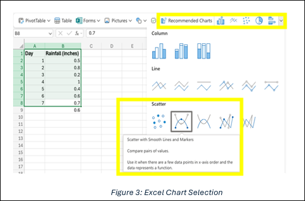

## Lesson 3: Data Collection, Analysis, and Representation Methods

### Lesson Description:

In this lesson, students will compare traditional and modern agricultural data collection methods, explore different data analysis tools, and understand various data representation techniques. Through hands-on activities, they will examine how AI and technology enhance decision-making in agriculture.  

#### Main Learning Goal:
Students will develop an understanding of how data is collected, analyzed, and represented in agriculture using traditional and modern methods.  

#### Essential Question:
How has technology improved agricultural data collection, analysis, and representation? 

#### Standards:
•	IAI.B1.2: Compare and contrast the various data storage tools and data organization.

#### Objectives:

• Compare traditional vs. modern agricultural data collection methods 

• Use data analysis tools to process and interpret farming data 

• Create graphical representations of agricultural data using digital tools

### Total Duration:  90-100 minutes (2 days)

**Important Vocabulary:**

1. **Soil Moisture Sensor:** 

    a.	Definition: A device that measures the water content in soil.

    b.	Example: Farmers use sensors to know when to water crops.

2. **Satellite Imaging:**

    a.	Definition: The use of satellites to monitor agricultural land.

    b.	Example: Helps detect dry patches in fields.

3. **AI-Powered Predictions:**

    a. Definition: AI analyzing data to forecast farming needs.

    b.Example: AI predicts rainfall for irrigation planning.

### Engage (Elicit/Develop) ~ 15 minutes

Activity Name: Understanding Data Collection Methods (~ 5 minutes)

**Activity Walkthrough:** 

1. The teacher will facilitate a peer-to-peer discussion on the following question:

    a.	Q1: How do farmers know when their crops need water?

    i.	Advanced techniques include weather forecasts, irrigation schedules, and modern technology like sensors and satellite data to monitor soil conditions and plant health.

2. The teacher will introduce the differences between traditional data collection methods versus modern data collection methods.

    a. Traditional methods:

    Farmers historically relied on simple techniques based on observation and experience. This includes visual observation for crop health, feeling the soil texture, and relying on past seasonal and weather patterns. 

    b. Modern methods: Farmers now have tools, such as the following:

    i. Soil Moisture Sensors:

    Devices that provide precise measurements of soil water content, alerting farmers when irrigation is necessary.

    ii.	Satellite Imaging:

    Satellites capture images of vast agricultural areas, offering insights into water levels, crop health, and soil conditions. This allows farmers to address specific issues without physically inspecting fields.

    iii. AI-Powered Weather Predictions:

    AI systems process historical and real-time weather data to predict rainfall and determine irrigation schedules, optimizing water usage.

### Activity #2: Research Activity (~ 10 minutes)

**Activity Walkthrough:**

1. The teacher will have students work in pairs to answer the following questions in SREB_U3_L3_Handout_DataInAg

    a. Q1: What were the traditional methods used for this process?

    i. Students should discover traditional methods other than the ones already listed on the main page.

    ii. Farmers used manual soil sampling, visual pest inspection, and historical yield records. They faced challenges such as inaccuracy and time consumption. 
 

    b.	Q2: What modern technologies are now used?

    i. Students should discover modern methods other than the ones already listed on the main page.

    ii.	Soil sensors, drones, remote sensing, AI-based image analysis, and data-driven predictive models have significantly improved efficiency. 

    c. Q3: How do the traditional and modern methods compare?

    i. Students should list comparisons specific to the methods they’ve researched.

    ii.	Modern methods are faster and more accurate, which reduces labor needed and errors compared to traditional methods.

2.	The teacher will instruct students to fill out the comparison chart on SREB_U3_L3_Handout_DataInAg

    a. Under the “Old Ways” column students will list the traditional methods and do the same for “New Tech”. An example of an entry can be seen below:

    

### Explore (Develop/Deploy) ~ 35 minutes 

#### Activity Name: Exploring Data Analysis Tools (~ 10 minutes)

**Activity Walkthrough:**

1.	The teacher will begin with a brief introduction on how farmers analyzed data in the past compared to how they analyze it today. 

    a. **In the past:**

    i. Farmers used to write everything down in notebooks.  

    ii. They would calculate things like rainfall averages or soil conditions by hand.  

    iii. For example: If they measured rainfall every day for a week, they’d have to add it all up and divide to find the average. 

    b. **Today:** 

    i. Farmers use computers and tools like Excel or Google Sheets to do the same work in seconds.

    ii.	Computers can even create graphs to show patterns in the data!

2. The teacher will guide students through the Excel exercise under the sheet named “Average Rainfall” in SREB_U3_L3_ExcelWorkbook

    a. The completed result of this exercise can be found in the first sheet of: SREB_U3_L3_ExcelWorkbookCompleted

    b. First, students will open the Excel workbook and label Column A as “Day” and Column B as “Rainfall (inches)”

    c.	Students will then input data. For Column A, students will enter numbers 1 through 7, which represent the days of the week. For Column B, students will enter the corresponding rainfall amounts: 0.5, 0.8, 0.2, 1.0, 0.4, 0.6, 0.7.

    

    **Figure 1: Rainfall Excel Data Entry**

    d. Once the data has been entered, students will calculate the average amount (as seen in Figure 2 below).

    

   **Figure 2: Average Rainfall Excel Calculation**

   e. Students will then insert a scatter chart with smooth lines and markers, as seen in Figure 3 below. The result will look like Figure 4.

       

    

#### Activity #2: Group Exploration (~15 minutes)
**Activity Walkthrough:**

1. The teacher will tell students to break into groups.  Then students will pick up one of the following datasets to explore.

    a. Soil pH Levels: How acidic or basic is the soil?  Use Table 1 below.

        

    b. Crop Yield Records: How much food is harvested each month? Use Table 2 below. 

         

    c. How much rain and sun did the crops get? Use Table 3 below.

         

2. If time allows, offer students the extended version of their dataset (100 entries) for a more realistic data experience.

3. The teacher will instruct students to use their dataset to perform a calculation by hand. 

For example, tell them to find the average soil pH across five fields.

4. The teacher will tell students to enter the same data into Excel or Google Sheets. 

    a. Students will use a formula to calculate the same result.  
    b. They will create a simple bar graph or line chart to visualize their data.
5. The teacher will ask students to compare the two results; the ones calculated by hand and the ones generated using Excel or Google Sheets. They will then answer the following questions. 

    a. Q1: Which method was faster?  
    b. Q2: Which method was easier?  
    c. Q3: How did using the computer help?  

#### Activity #3: Discussion and Worksheet (~ 10 minutes)

Activity Walkthrough:

1. The teacher will create a class discussion by asking the following questions. 

    a. Q1: What was harder doing math by hand or using the computer? 

    b. Q2: How do you think farmers use tools like these to save time and effort?  

    c. Q3: Is there ever a case where farmers may want to do the calculation manually instead of using a computer or spreadsheet? Why or why not? 

    d. Q4: What happens on farms with no internet or electricity?  

    e.	Q5: Are there times when a farmer in the field may want a quick estimate instead of opening a laptop? 

2. The teacher will ask students the following questions.

    a. Q1: Why is manual analysis harder for big datasets? 

    b. Q2: What are two cool things about using digital tools?  

    c. Q3: How can computers help farmers make better decisions?

#### Explain (Refine) ~ 10 minutes 

**Activity Name: Learning Through Peer Comparison and Revision (~10 minutes)**

**Activity Walkthrough:**

1. The teacher will have previous groups pair up with another group and share the following:

    a. Students will share their completed worksheets and spreadsheets.  

    b. They will compare their manual calculations, digital outputs, and any visual representations such as charts.

2. The teacher will ask the following questions. 

    a. Q1: Did both groups get the same results for their averages or totals?  
    b. Q2: Were there any differences in how you calculated your answers?  
    c. Q3: Did you use the same formulas in Google Sheets or Excel?  
    d. Q4: How well were your charts or graphs labeled? Are the axis titles and values easy to understand?  
    e. Q5: Which group’s results were easier to read or interpret? Why?

3. The teacher tells students to identify one improvement they can make. They will choose ONE of the following to revise. 

    a. Correct an error in your manual or spreadsheet calculation.  

    b. Improve the clarity of your chart (e.g., fix axis labels, change chart type). 
    
    c. Strengthen your explanation of the results on your worksheet. 

    i.	On your worksheet or notebook, write:  
    - “We revised ______ because ______.”  

    ii.	Examples:  

    - “We corrected our average after noticing we had skipped a value.”  

    - “We added axis labels to our chart to make the data easier to understand.” 

    - “We changed from a bar graph to a line chart to better show the trend.” 

4. Individually, students will answer the following questions in writing. 

    a. Q1: What is one thing I learned by comparing our work with another group? 
    b. Q2: What feedback helped me understand something more clearly? 
    c. Q3: How would I improve my analysis next time?

### Day 2 Engage (Elicit/Develop) ~ 15 minutes

#### Activity Name: Introduction to Data Representation (~ 5 minutes)

**Activity Walkthrough:**

1. The teacher will explain the differences between old-school charts and modern tech charts. 

    a. Old-School Example: Hand-Drawn Chart. 
    i. Let’s say a farmer wants to track how much food they harvested in three months:  
    - January: 25 tons  
    - February: 30 tons  
    - March: 28 tons 

    ii. On the board, draw a quick bar chart by hand to show this data. The bars might be uneven, the labels messy, and the lines shaky—just like how farmers might have tracked this information before computers. 

    iii. The teacher will ask: 

    Q1: Can you quickly tell which month had the best harvest?” 

    Q2: What if the numbers change? Would the farmer have to erase and redraw the chart? 

    b. Modern Tech Example: Digital Graph 
Open Google Sheets or Excel and create a digital bar graph with the same data:  

    • X-axis: January, February, March (the months).  
    • Y-axis: Crop yields in tons.  
    • Use bright, colorful bars and clear labels to make it neat and easy to read.  

### Explore (Develop/Deploy) ~ 25 minutes 
Activity Name: Creating Graphs (~ 10 minutes)

**Activity Walkthrough:**

1. The teacher will introduce the student’s task as follows:

    a. “Your farmer friend Bob is asking if you could find the average ton of crops he’s harvested every week for the past 20 weeks.”

    b. The crop yield data can be found in the second sheet of SREB_U3_L3_ExcelWorkbook

2. The teacher will instruct students to use the data to create two charts: a clustered column chart, and a line chart. The steps will be like the previous activity. Students will need to highlight the crop yields column, click on insert chart, and choose the specified chart.

    a. Students completed chart should look like the following images:

    

3. Once the students are done, the teacher will instruct them to answer the following questions in SREB_U3_L3_Handout_DataInAg

    a. **Q1: Which graph (bar or line) would make it easier for Bob to see the crop yields for a single week?** 

    - i. The bar graph makes it easier for Bob to see the crop yields for a single week because each bar represents a specific week's yield with a clear visual height.

    b. **Q2: Which graph helps Bob see the overall trend (whether the yields are going up or down)?**

    - i. The line graph helps Bob see the overall trend in crop yields over time because the connected points show whether yields are increasing, decreasing, or fluctuating.

    c. **Q3: Write a few sentences about which graph you think is more helpful for Bob and his farmer friends and why.**

    - i. The most helpful graph depends on what Bob needs. If he wants to check the yield for a specific week, the bar graph is clearer. However, if he wants to see patterns or trends over multiple weeks, the line graph is better because it visually connects the data points, making changes over time more noticeable.

4. The teacher will ask students to share their results by showing to the class their graphs and explain: 

    a. Q1: What does your data reveal about the crop yields?   

    b.	Q2: Which graph did you like better and why?   

    c.	Q3: How do you think these graphs could help farmers make decisions?

### Activity Name: Hands-On Visualization (~10 minutes)

Activity Walkthrough:

1. The teacher will ask students to create graphs using the dataset from Day 1.  

    a. Open the Data: Use the dataset from Day 1 that your group worked on (e.g., rainfall data, soil pH, or crop yields).

    b. Create your Graph: 

    • Highlight the data you want to use.  
    • Go to Insert > Chart (or similar option in Excel).  
    • Choose either a Bar Graph or a Line Chart (your choice). 
    c. Customize it: 
    • Add a title (e.g., “Rainfall Over 7 Days”). 
    • Label the axes: 

    - i. X-Axis: Days, fields, or months.

    - ii.	Y-Axis: Rainfall, pH levels, or yields.

### Explain (Refine) ~ 10 minutes 
**Activity Name: Comparison Worksheet (~10 minutes)**

**Activity Walkthrough:**

1. The teacher will start a small discussion based on the following questions. 
    a. Time Check: Q1: Which method takes longer? 
    - (e.g., Walking through fields vs. checking a sensor.) 

    b. Accuracy Check: Q2: Which method gives better results?  
    - (e.g., Guessing when plants need water vs. a sensor giving exact numbers.)

    c. Q3: Which method do you think is more exciting? Why?  

    d. Q4: How do these methods help farmers save water or grow more food?

2. The teacher will instruct students to answer the following questions in SREB_U3_L3_Handout_DataInAg:

    a. Q1: Was there a modern method that required more time and effort than its traditional method?

    - i. A student’s answer may vary based on the topic researched/method explored.

    b. Q2: How did the traditional and modern methods influence resource use, such as water and pesticides? Are there any environmental drawbacks to modern methods?

    - i. A student’s answer may vary based on the topic researched/method explored. Generally, students should explain how the modern method improved efficiency in resource use.

    c. Q3: What are some of the barriers to modern agricultural technology you listed?

    - i. A student’s answer may vary based on the topic researched/method explored. Generally, students should list any factors specific to startup costs, location, and education needed to use the technology.

    d.	Q4: Why is it important to have accurate and clear data visuals?

    - i. Students should explain that if visuals are unclear or inaccurate, they could lead to misunderstandings, poor planning, and even potential losses.

