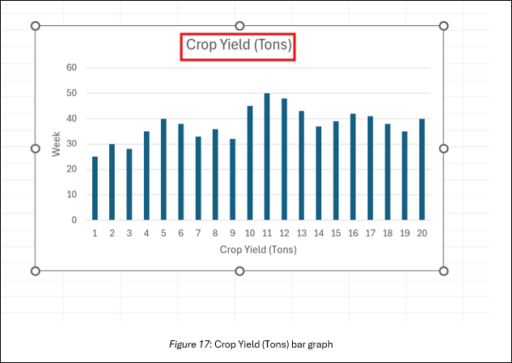

## Lesson 3: Data Collection, Analysis, and Representation Methods
#### Lesson Description:
In this lesson, students will compare traditional and modern agricultural data collection methods, explore different data analysis tools, and understand various data representation techniques. Through hands-on activities, they will examine how AI and technology enhance decision-making in agriculture.  

#### Main Learning Goal:
Students will develop an understanding of how data is collected, analyzed, and represented in agriculture using traditional and modern methods.  

#### Essential Question:
How has technology improved agricultural data collection, analysis, and representation? 

#### Standards:
•	IAI.B1.2: Compare and contrast the various data storage tools and data organization.

Objectives:

•	Students will compare traditional vs. modern agricultural data collection methods.

•	Students will use data analysis tools to process and interpret farming data.

•	Students will create graphical representations of agricultural data using digital tools.

#### Day 1: Understanding Data Collection Methods

Before we start our lesson today, turn to your neighbor and discuss the following question: Q1: How do farmers know when their crops need water? 

Try to think about how technology might play a role in this process.

Traditional vs. Modern Agricultural Data Collection Methods

In the past, farmers relied heavily on their own observations and experiences to tend to their crops. But with technological advancements, the way farmers gather and analyze data has changed dramatically.
For instance, some of the traditional methods a farmer may have used to know when their crops needed water are:

•	Visual observation of crop health, such as spotting wilting leaves or changes in color. Please refer to Figure 1 below.

•	Feeling the soil texture with their hands to check for dryness. Review Figure 2 below for reference.

•	Relying on seasonal and weather patterns passed down through generations to predict water needs. Check out Figure 3 below.

These methods were practical and required a deep connection with the land but often lacked precision.

Modern methods have revolutionized agriculture by introducing tools like:

• **Soil Moisture Sensors**: Devices that provide precise measurements of soil water content, alerting farmers when irrigation is necessary. Look at Figure 4 below.

•	**Satellite Imaging**: Satellites capture images of vast agricultural areas, offering insights into water levels, crop health, and soil conditions. This allows farmers to address specific issues without physically inspecting fields. See Figure 5 below.

•	**AI-Powered Weather Predictions**: AI systems process historical and real-time weather data to predict rainfall and determine irrigation schedules, optimizing water usage. Refer to Figure 6 below.

### Research Activity
Now that we’ve got a solid understanding of traditional versus modern methods, let’s deepen our knowledge with some research! You and your partner will work together to explore a specific farming method, focusing on how data collection has evolved over time.

Once you’re teamed up, select a topic below:

•	**Soil Testing**: How do farmers check if soil is healthy? 

•	**Pest Detection**: How do farmers figure out if bugs are harming their crops? 

•	**Crop Yield Estimation**: How do farmers predict how much food they’ll grow?

For your topic, you and your partner will be answering the following questions in the provided handout SREB_U3_L3_Handout_DataInAg:

1.	**Q1:  What were the traditional methods used for this process? You may want to think about any challenges that farmers faced.**

2.	**Q2: What modern technologies are now used?**

3.	**Q3: How do the traditional and modern methods compare?**

After answering the questions above, organize your findings in the following comparison chart on the provided handout SREB_U3_L3_Handout_DataInAg. 

Under "Old Ways”, you’ll want to list the traditional methods, and their equivalent modern method in the “New Tech”. For example, some listings for pest control may look like:

### Exploring Data Analysis Tools
We’re going to learn how farmers analyze data to make smart decisions. We’ll look at how things were done in the past and how modern tools, like computers and AI, make things faster and easier. Let’s make it fun and simple—because data can be really cool!
Let’s start with a quick look at how farmers analyze data: 

1. How Did Farmers Do It in the Past? 

    - Farmers used to write everything down in notebooks. 

    - They would calculate things like rainfall averages or soil conditions by hand.

    - For example: If they measured rainfall every day for a week, they’d have to add it all up and divide to find the average. 

2. How Do Farmers Do It Today? 

    - Today, farmers use computers and tools like Excel or Google Sheets to do the same work in seconds. 

    - Computers can even create graphs to show patterns in the data!

Let’s perform a refresher on Excel by calculating average rainfall and visualizing that data in a graph!

In your **SREB_U3_L3_ExcelWorkbook**, open the first sheet named “Average Rainfall”. 

Here we will first input some data as if we are farmers. In Column A, label the first cell as “Day”. In Column B, label the first cell as “Rainfall (inches)”. Under your header in Column A, enter numbers 1 through 7. This will represent the days of the week. Now, under your header in Column B, enter the corresponding rainfall amounts: 0.5, 0.8, 0.2, 1.0, 0.4, 0.6, 0.7. At this point, your sheet should resemble Figure 7 below: 

Now, let’s calculate the average! In the empty cell below the data (e.g., cell B9), you’ll go ahead and type the following formula: =AVERAGE(B2:B8). This formula tells Excel to calculate the average of the numbers in cells B2 through B8. Like in Figure 8 below.

Press Enter, and the average rainfall will now appear in that cell, as shown in Figure 9 below.

### Group Exploration
Now it’s your turn to be data detectives! Let’s break into groups and analyze some farming data. 

**Step 1: Pick a Dataset** 

As a group, choose one dataset to explore: 

• **Soil pH Levels**: How acidic or basic is the soil? Use Table 1 below.

• **Crop Yield Records**: How much food is harvested each month? Use Table 2 below.

### Step 2: Manual Analysis

• Use the numbers from your dataset to calculate something by hand: 

For example, find the average soil pH across five fields. 

•	Write down your results on paper. It might take a bit of work, but you’ve got this! 

**Step 3**: **Digital Analysis** 

•	Enter the same data into Excel or Google Sheets. 

•	Use a formula to calculate the same result. 

•	Create a simple bar graph or line chart to visualize your data. 

**Step 4: Compare Results:** 

•	**Q1: Which method was faster?** 

•	**Q2: Which method was easier?** 

•	**Q3: How did using the computer help?**

### Discussion and Worksheet

Let’s talk about what you discovered: 
We will have a class discussion. please, participate and respond to the following questions: 

•	Q1: What was harder doing math by hand or using the computer? 

•	Q2: How do you think farmers use tools like these to save time and effort? 

•	Q3: Is there ever a case where farmers may want to do the calculation manually instead of using a computer or spreadsheet? Why or why not? 

•	Q4: What happens on farms with no internet or electricity? 

•	Q5: Are there times when a farmer in the field may want a quick estimate instead of opening a laptop? 

Now let’s answer these questions together—make sure to write down your answers.

•	Q1: Why is manual analysis harder for big datasets? 

•	Q2: What are two cool things about using digital tools? 

•	Q3: How can computers help farmers make better decisions?

### Learning Through Peer Comparison and Revision

Follow these steps:

Step 1: Partner Comparison 

•	Join another group. 

•	Share your completed worksheets and spreadsheets. 

•	Compare your manual calculations, digital outputs, and any visual representations such as charts. 

### Step 2: Collaborative Review 

•	Discuss the following: 

o	Q1: Did both groups get the same results for their averages or totals? 

o	Q2: Were there any differences in how you calculated your answers? 

o	Q3: Did you use the same formulas in Google Sheets or Excel? 

o	Q4; How well were your charts or graphs labeled? Are the axis titles and values easy to understand? 

o	Q5: Which group’s results were easier to read or interpret? Why? 

#### Step 3: Make a Revision 

•	Each group should identify at least one improvement they can make. Choose one of the following to revise: 

o	Correct an error in your manual or spreadsheet calculation. 

o	Improve the clarity of your chart (e.g., fix axis labels, change chart type). 

o	Strengthen your explanation of the results on your worksheet.
 
•	On your worksheet or notebook, write: 

o	“We revised ______ because ______.” 

•	Examples: 

o	“We corrected our average after noticing we had skipped a value.” 

o	“We added axis labels to our chart to make the data easier to understand.” 

o	“We changed from a bar graph to a line chart to better show the trend.” 

#### Step 4: Reflection 
•	Individually, answer the following in writing: 

o	Q1: What is one thing I learned by comparing our work with another group? 

o	Q2: What feedback helped me understand something more clearly? 

o	Q3: How would I improve my analysis next time?

### Day 2: Introduction to Data Representation

Let’s review the differences between a hand-drawn chart and a digital graph.

### Old-School Example: Hand-Drawn Chart 

Let’s say a farmer wants to track how much food they harvested in three months: 

•	January: 25 tons

•	February: 30 tons 

•	March: 28 tons 

If you draw a quick bar chart by hand, the bars might be uneven, the labels messy, and the lines shaky—just like how farmers might have recorded this information before computers.

Think about the following questions and share your thoughts with the class:

•	Q1: Can you quickly tell which month had the best harvest? 

•	Q2: What if the numbers change? Would the farmer have to erase and redraw the chart? 

#### Modern Tech Example: Digital Graph 

Now let’s see how farmers do it today using modern tools. By using Google Sheets or Excel and we can create a digital bar graph with the same data: 

•	X-axis: January, February, March (the months). 

•	Y-axis: Crop yields in tons. 

•	We can use bright, colorful bars and clear labels to make it neat and easy to read. 

#### Creating Graphs

Now that our Excel skills have been brushed up, it’s time to put them to work! 

Here below in Table 4 is the data we’ll use for the main activity—it shows how many tons of crops a farmer harvested each week over a 20-week period. Your farmer friend Bob is asking if you can help him find the average amount of crops he’s harvested per week during that time. He was even kind enough to provide the data on the sheet named “Crop Yields” in SREB_U3_L3_ExcelWorkbook.

Hint: You will only need to highlight one column for these charts.

Let’s begin, we will follow these steps:
Step 1: Enter the Data 

•	Open Excel. 

•	In Column A, type "Week" as the header, and below it, enter the numbers 1 through 20. 

•	In Column B, type "Crop Yield (Tons)" as the header, and below it, enter the crop yield numbers from the table above. 

#### Step 2: Create a Bar Graph 

• Highlight all the data in Column A and Column B. 

• Go to the Insert menu and choose Chart (or in Excel, select Bar Chart). Refer to Figure 10 below. 

  

•	Select More Column Charts. Refer to Figure 11 below.

  

•	Select Bar from the left Menu and then select the chart below. Refer to Figure 12 below.

  

•	A bar graph will appear, showing the crop yield for each week. Refer to Figure 13 below.  

  

    

  

•	Click on the horizontal axis title and type: “Week”
•	Click on the vertical axis title and type: “Crop Yield (Tons)”. Refer to Figure 16 below.

  

•	You can also change the title of the chart by simply clicking on the title and giving it another title. Refer to Figure 17, and Figure 18 below.

  

    

### Step 3: Create a Line Graph

•	Highlight the same data in Column A and Column B.

•	Go to the Insert menu and select Chart (or in Excel, choose Line Chart). Refer to Figure 19 below.

  

•	A line graph will appear, showing the trend of crop yields over the 20 weeks. Refer to Figure 20 below.

  

• Customize your graph: Change the line color or style to make it unique.  

**Step 4**: Compare the Graphs. Now that you have two graphs, take a closer look: 

•	Q1: Which graph makes it easier to see the crop yields for a single week? 

•	Q2: Which graph helps you see the overall trend (whether the yields are going up or down)? 

•	Q3: Write a few sentences about which graph you think is more helpful for farmers and why. 
 
**Step 5**: Share Your Results. Show your graphs to the class and explain: 

•	Q1: What does your data reveal about the crop yields? 

•	Q2: Which graph did you like better and why?

•	Q3: How do you think these graphs could help farmers make decisions?

Good job - Bob is extremely grateful for the work you’ve done! He does, however, have some follow-up questions. You may answer the following in your SREB_U3_L3_Handout_DataInAg

1.	Q1: Which graph (bar or line) would make it easier for Bob to see the crop yields for a single week?

2.	Q2: Which graph helps Bob see the overall trend (whether the yields are going up or down)?

3.	Q3: Write a few sentences about which graph you think is more helpful for Bob and his farmer friends and why.

#### Hands-On Visualization

Now it’s your turn to create graphs! Let’s make data come to life with Google Sheets or Excel.

Use the dataset from Day 1 that your group worked on (e.g., rainfall data, soil pH, or crop yields).

As you may recall, to create a graph with our data, we must first tell Excel what data to use. We can do so by highlighting the data in Column A and Column B (including the headers “Day” and “Rainfall (inches)” and excluding the calculated average cell). Refer to Figure 21 below.

  

You should be able to see your chart now, as shown below in Figure 23.

  

Now that we have created the charts, let's compare the graphs. 

• On a piece of paper, try drawing the same graph by hand. 

• Compare your hand-drawn graph to the digital version, and answer to the following questions: 

o Q1: Which one looks better? 

o	Q2: Which one is easier to understand?
Comparison Worksheet

Let’s take a moment to reflect on the topics we’ve gone over today. 

You’ll answer some simple questions based on your research: 

•	**Time Check:**

Q1: Which method takes longer? 

(e.g., Walking through fields vs. checking a sensor.) 

•	**Accuracy Check:**

Q2: Which method gives better results?

(e.g., Guessing when plants need water vs. a sensor giving exact numbers.) 

•	**What’s Fun or Cool?**

Q3: Which method do you think is more exciting? Why? 

•	**Farmer Superpower:** 

Q4: How do these methods help farmers save water or grow more food?

Now, individually, answer the following questions on the provided handout **SREB_U3_L3_Handout_DataInAg**.

1.	Q1: Was there a modern method that required more time and effort than its traditional method? You may want to think about initial start-up costs and learning curves.

2.	Q2: How did the traditional and modern methods influence resource use, such as water and pesticides? Are there any environmental drawbacks to modern methods?

3.	Q3: What are some of the barriers to modern agricultural technology you listed? You may want to think about what specific factors (cost, location, education) may affect incorporating these tools.

4.	Q4: Why is it important to have accurate and clear data visuals?
