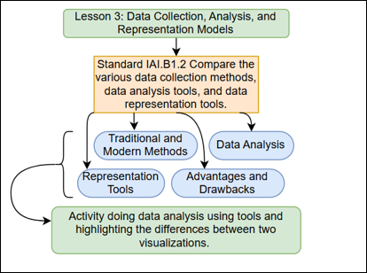

## Lesson 3: Data Collection, Analysis, and Representation Methods Teacher Page

### Module Name: Data Collection, Analysis, and Representation Methods

#### Conceptual Model:

Conceptual Model for SREB Unit 3 Lesson 3: Data Collection, Analysis, and Representation Methods

#### Standards:

•	IAI.B1.2: Compare and contrast the various data storage tools and data organization.

#### Objectives:
•	Students will compare traditional vs. modern agricultural data collection methods.

•	Students will use data analysis tools to process and interpret farming data. 

•	Students will create graphical representations of agricultural data using digital tools.

#### Storyline

In this lesson, students will compare traditional and modern agricultural data collection methods, explore different data analysis tools, and understand various data representation techniques. Through hands-on activities, they will examine how AI and technology enhance decision-making in agriculture.   

#### Main Learning Goal

Students will develop an understanding of how data is collected, analyzed, and represented in agriculture using traditional and modern methods.   

#### Focus Question

How has technology improved agricultural data collection, analysis, and representation?  

### Tables

