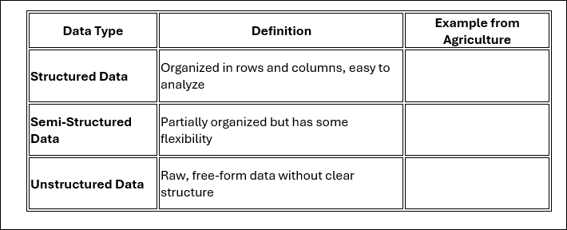
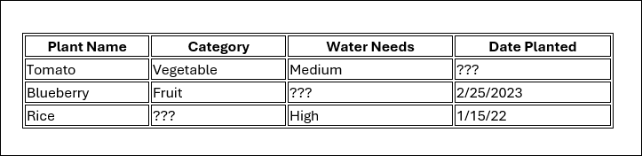

## Data Storage and Organization in Agriculture

Farmers collect data to track crop health, soil conditions, weather patterns, and irrigation needs. But how is this data stored and organized for easy access and analysis? In this lesson, you will explore traditional vs. modern data storage methods, understand different types of data, and learn why structured data is essential for AI applications in agriculture.

### Traditional vs. Modern Data Storage

Farmers have always collected data, but the way they store and use it has evolved over time.

1. How did farmers traditionally store agricultural data?
________________________________________

2. What modern tools do farmers use today to store and organize data?
________________________________________

3. What problems might occur if farmers rely only on handwritten records instead of digital storage?
________________________________________

4. How can cloud storage or databases help farmers manage large amounts of agricultural data?

#### Understanding Data Types

Data comes in different formats, each serving a different purpose. Fill in the table below with examples for each type of data used in agriculture.

5. Why do AI systems prefer structured data over unstructured data?

________________________________________
6. How can semi-structured and unstructured data still be useful in agriculture?
________________________________________

________________________________________

#### Sorting and Filtering Agricultural Data

Farmers analyze data to make better decisions about crop management, irrigation, and soil health. Sorting and filtering help them quickly find patterns and focus on key information.

7. How can sorting data (e.g., by crop type or water needs) help farmers make better decisions?
________________________________________

8. If a farmer has a large dataset of different crops, how could filtering be used to focus only on crops that require high water usage?

#### Cleaning and Organizing Data for AI Applications

Before data can be used effectively, it needs to be cleaned and structured. Look at the dataset below. Identify and correct any errors:

9. What errors do you notice in the table above?
________________________________________

10. How would you fix these errors to ensure the dataset is accurate?

________________________________________
11. Why is it important to clean and correct errors in datasets before using them in AI applications?
________________________________________

________________________________________

#### Final Reflection

12. How does organizing data improve agricultural decision-making?
________________________________________

13. What are two benefits of modern data storage over traditional methods?
________________________________________

14. How can AI and machine learning use structured agricultural data to improve farming practices?
