## Lesson 4: Data Storage and Organization
### Lesson Description:
In this lesson, students will explore how farmers store and organize agricultural data for better decision-making. They will compare traditional vs. modern data storage methods, learn about data types, practice sorting and filtering in Google Sheets, and understand how structured data helps in AI applications. Hands-on activities will allow students to create and clean datasets.  

### Main Learning Goal:
Students will understand how agricultural data is collected, stored, and organized using modern tools like spreadsheets and databases.    

### Essential Question:
How does data organization improve agricultural decision-making?  

### Standards:
•	IAI.B1.4 Describe the various data storage tools and data organization methods related to generated lists and 2D arrays.

### Objectives:
•	Compare traditional vs. modern agricultural data storage methods  
•	Organize data into structured formats for better decision-making  
•	Perform sorting, filtering, and data cleaning in Google Sheets  
•	Export datasets into AI-ready formats

### Welcome to the World of Data!

Did you know that farmers collect tons of information every day to make sure their crops are healthy, to maintain rich soil, and to run their farms smoothly? Now, imagine if all that data was just scribbled in different notebooks or scattered around — what a mess! That’s why farmers need a more efficient way to organize all of that information and make smart decisions for their farms. Today, we’ll explore how they do it, and guess what? You’ll get to create your very own dataset, too!

### How Do Farmer’s Store Data?
Before we dive into the lesson, let’s start with a big question: Where do you think farmers store their data? You might guess they use notebooks, computers, even just keep it in their heads

Farmers generally use two main methods to store their data:

•	Old School (Traditional Methods): In the past, farmers recorded all their information in logs or notebooks, jotting down details like the amount of rainfall, observations of what their crops looked like, or their crop watering schedules/times.

•	Modern Methods: With today’s technology, farmers now use tools such as Google Sheets, databases, and cloud storage to keep everything organized. These tools help farmers quickly spot patterns and more informed decisions.

### So why organize data?

Think of data like your homework. If you toss all your assignments into a messy pile, it would be difficult to locate a specific assignment. But if you organize them into folders, finding what you need becomes a breeze! 

In the same way, farmers organize their data so that they can:

•	Keep track of what works best for their crops.

•	Plan when to water or harvest their crops.

•	Share their observations or findings with other farmers or scientists.

### Creating a Sample Dataset
Understanding the Data Types in the Dataset
In a dataset, different types of data are used to reflect the real-world variety farmers deal with when organizing agricultural information. Here’s a breakdown of the different data types found in the dataset, and why each of them is important.

1.	Names (Textual Data – Structured Data): 

    - This is structured data because it is neatly categorized and stored in a single column. Farmers use names to identify and categorize different plants or crops for better management
    .
    - Example: Plant Name: Tomato, Blueberry, Lettuce

2.	Categories (Categorical Data – Structured Data):

    - Categorical data groups plants into meaningful categories, making it easy to organize and analyze. Farmers use this data to group similar crops, plan for seasonal demands, or apply specific farming techniques.

    - Example: Category: Vegetable, Fruit, Grain, Herb

3. Dates (Time Data – Structured Data):

    - Dates provide a timeline for when a crop was planted, helping farmers track growth stages and plan harvests.

    - Example: Date Planted: 03/15/2023, 04/01/2023

4.	Numbers (Numerical Data – Structured Data):

    - Although these are written as words, they represent numerical concepts (e.g., Low = 1, Medium = 2, High = 3). Farmers use this data to estimate water requirements and plan irrigation schedules efficiently.

    - 
    Example: Water Needs: Low, Medium, High
5.	Color & Shape (Descriptive Text – Semi-Structured Data):

    - Semi-structured data provides detailed descriptions that are easy to interpret but not ideal for numerical analysis. This helps farmers visually identify plants or track specific traits like ripeness or health.

    - Example: Color & Shape: Round, red; Yellow and curved

6.	Notes (Free-Form Text – Semi-Structured Data):

    - Semi-structured data adds context or additional information, making it useful for analysis or problem-solving. Farmers might use notes to document special care instructions or unique challenges for specific crops.

    - Example: Notes: “Requires regular pruning to avoid overgrowth”; “Grows best in acidic soil”
    
7.	Best Growing Time (Time Period – Semi-Structured Data):

    - Semi-structured data indicating the ideal seasons for planting or growing specific crops. Farmers use this to create seasonal planting calendars and rotate crops effectively.

    - Example: Best Growing Time: Summer, Spring/Fall

### Why Understanding Data Types is Important

As you can see, being able to understand the different data types and their uses is necessary for farmers, as it makes it easier to organize their information in order to understand and analyze it. AI applications also benefit from it, as AI relies on structured data to make predictions and recommendations, and semi-structured data can help provide extra context to (fill in) but often requires preprocessing to be useful for AI models. 
Imagine if Netflix were to only use semi-structured data like “People like funny shows.” It wouldn’t work as well as structured data like “This show has a 4.8 rating and was watched 100,000 times last week.” Similarly, organized agricultural data is key to making smart decisions.

Let’s Set Up Our Datasets!

Now that we’ve learned about different ways farmers store data, let’s put that knowledge into practice and organize data like a farmer!

Imagine you’re tracking plants in your South Carolina neighborhood. We’ll set up a small dataset together!

Table 1: Sample Dataset: Plants in South Carolina

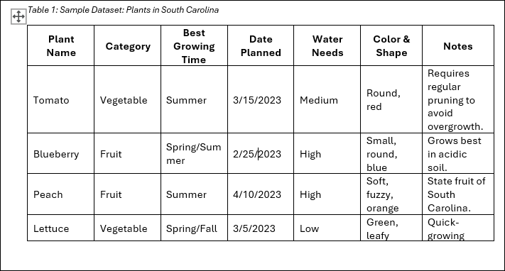

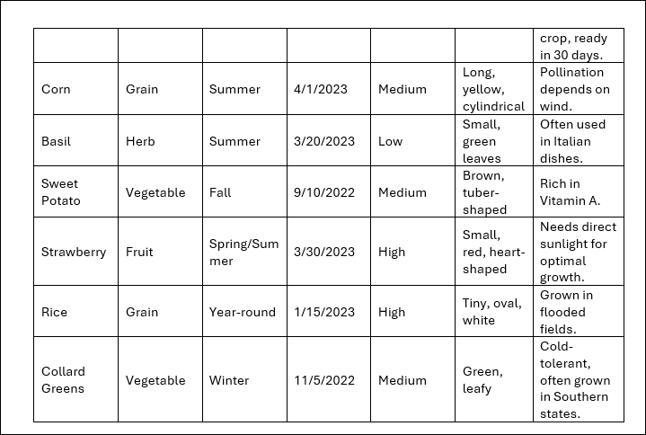

1.	To set up your plant dataset in Google Sheets, start by opening Google Drive, clicking + New, and selecting Google Sheets. Name your file “Plant Dataset – South Carolina.” 

2.	Next, add the dataset either by copying and pasting the data directly or entering it manually. To set up your header columns, in the first row type the following: Plant Name, Category, Best Growing Time, Date Planted, Water Needs, Color & Shape, Notes. Once the headers are in place, begin filling in the rows with the sample data.

3.	To style your spreadsheet, you can bold the headers for readability, resize the columns to fit the data, and apply colors to distinguish the different categories (e.g., highlight Vegetables in green and Fruits in yellow).

Congratulations, you have set up your first dataset! Now it’s time to save your work. Your finished dataset should look something like this, shown in Figure 1:

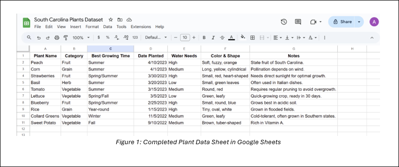

### Sorting and Filtering Data
Now that your dataset is set up, you can start organizing the information for better understanding and analysis of the data. Sorting and filtering can be helpful when trying to locate specific details within your data. We will now go over how to create a filter on all columns and perform sorting in Google Sheets.

Sorting Data Using Filters in Google Sheets

1. To start, open your Google Sheets file with the dataset. Ensure that all the column headers are in the first row. Select the entire dataset by highlighting the entire dataset, including the headers and all rows of data. Then, go to the menu and click Data > Create a Filter. Small filter icons (▼) will appear in each column header, shown in Figures 2 and 3.

    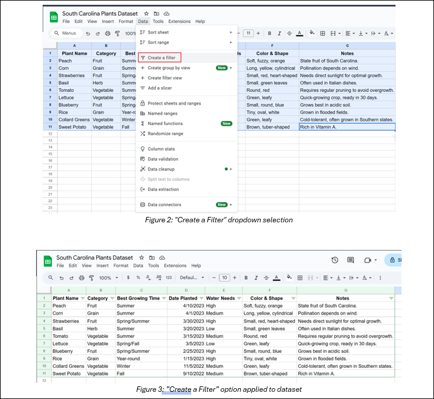

2. Now we will sort the data by a specific column. Click the filter icon (▼) in the [Header Name] column header (e.g., Plant Name, Best Growing Time, Water Needs, etc.), then select Sort A → Z to organize the items in alphabetical order. Alternatively, select Sort Z → A for reverse alphabetical order, shown in Figure 4.

    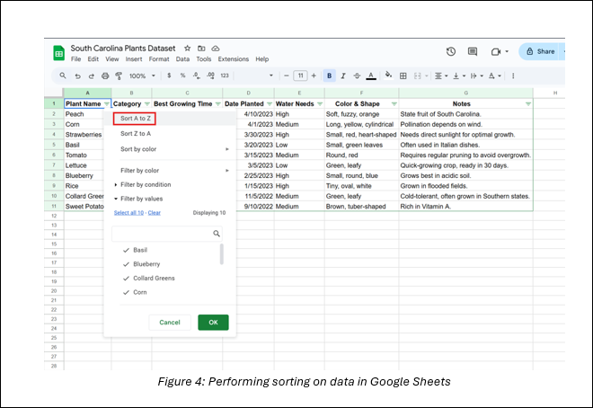

3. Next, we will combine sorting across multiple columns. First, select the dataset by opening the dataset in Google Sheets. Highlight every row and column of your data set including the header row (e.g., Plant Name, Category, etc.).

4. Then, access the “Sort Range” option by going to the top menu, selecting Data > Sort range. Click Advanced range sorting options to open the sorting dialog box, shown in Figure 5.

    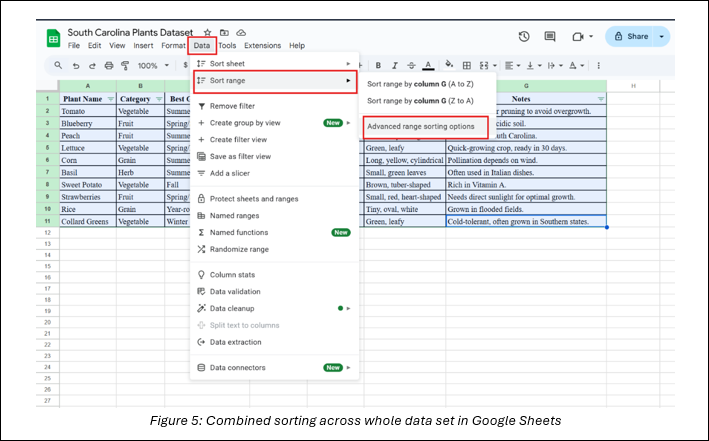

5. In the dialog box, check the option Data has header row (so the headers are not included in the sort), shown in Figure 6.  

    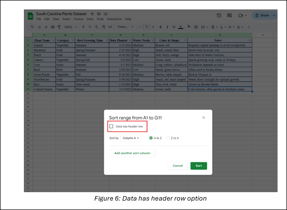

6. In the "Sort by" dropdown menu, select Category. Choose A → Z to sort categories alphabetically (e.g., Herb, Fruit, Grain, Vegetable).  

7. To add a second sort rule, click Add another sort column in the dialog box. Let’s do one for the “Plant Name” column, shown in Figure 7.

    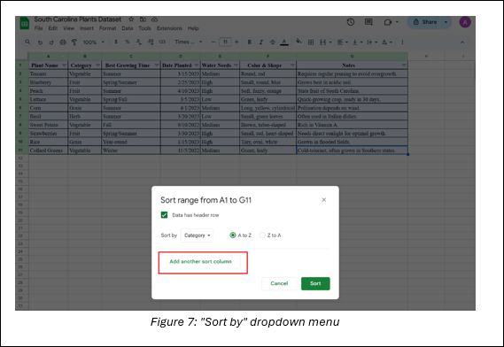

8. In the new dropdown menu, select Plant Name. Choose A → Z to alphabetize plant names within each category, shown in Figure 8.    

    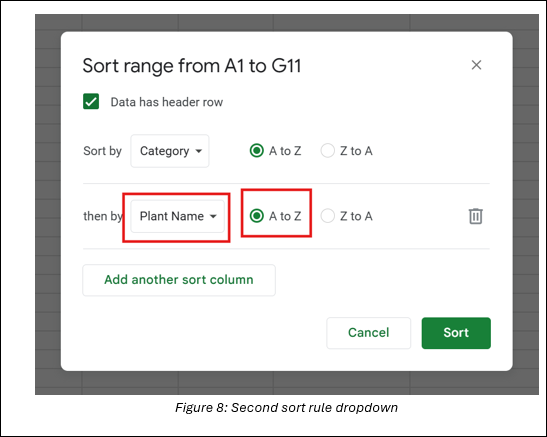

9. To apply sorting, click Sort to apply both sorting rules to your dataset. Now, the dataset will be sorted, shown in Figure 9:

    - Categories will be grouped alphabetically: Fruit, Grain, Herb, Vegetable.

    - Plant Names will be alphabetized within each category.

     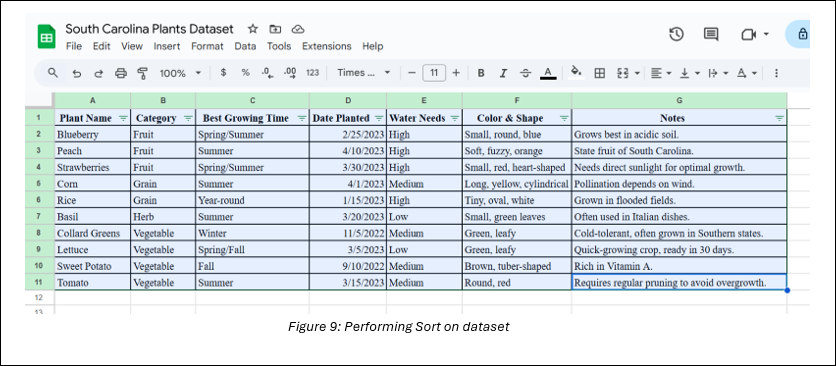    

### Filtering the Data
Now that filters are enabled, let’s explore how to filter specific data.

1.	To filter by category, Click the filter icon (▼) in the Category column header, then uncheck Select All to clear all options, as shown in Figure 10.

    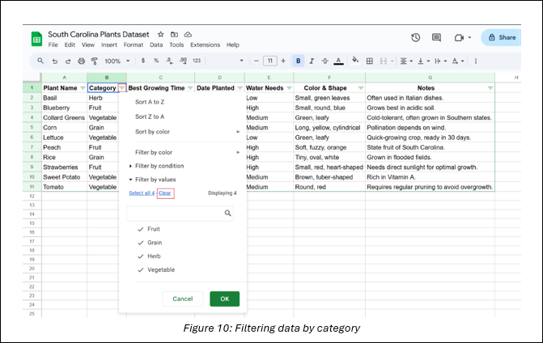

2. Check only Vegetable to view rows with vegetables in the dataset, shown in Figure 11.

    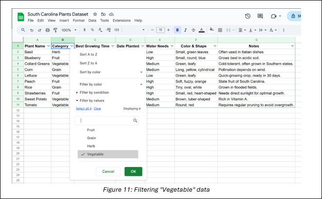

3. Click OK to apply the filter. You’ll now see only vegetables in your dataset, shown in Figure 12.    

    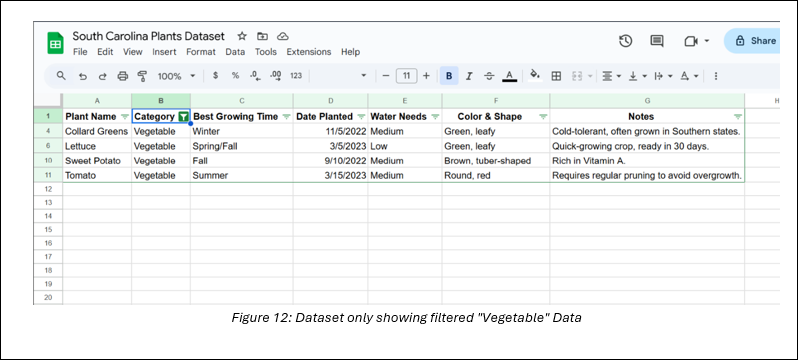

4. Click the filter icon (▼) in the column and Click on Select all and Click OK. This way, you can see all of the data. You can do the same for the other columns (e.g., Plant Names, Water Needs, etc.), shown in Figure 13.    

    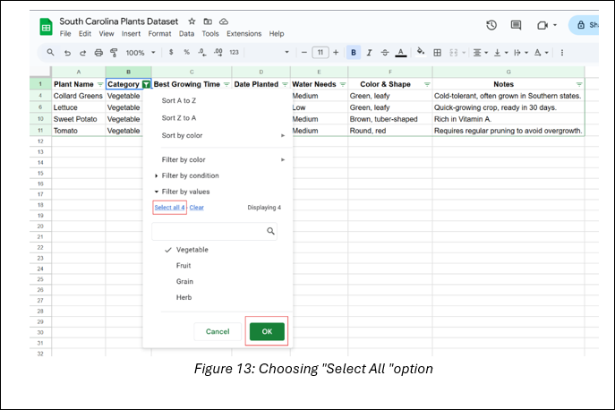

5. Filters can also be combined to narrow down results further. Let’s apply a filter on the Category column (e.g., select Vegetable), shown in Figure 14.    

    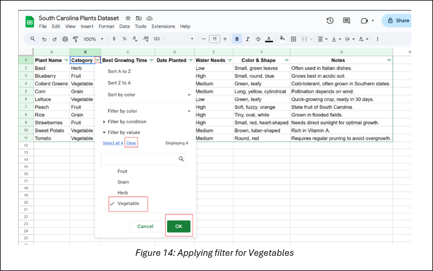

6. Apply another filter on Water Needs (e.g., select Medium).      

    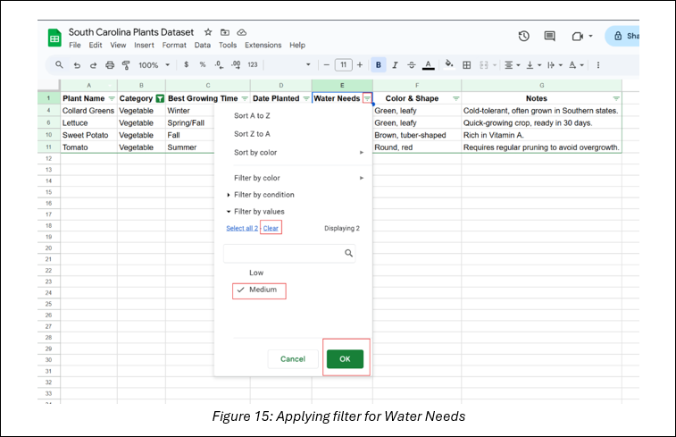

This will show only vegetables that require medium water needs.

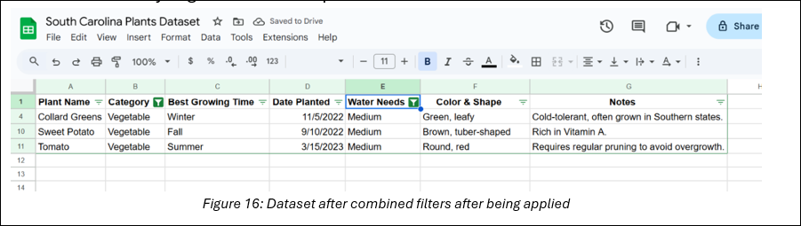

7. To clear or remove a specific filter, Click the filter icon (▼) in the column and Click on Select all and Click OK.  To remove all filters, go to Data > Remove Filter.

### Using Formulas in Google Sheets
Here’s how you can use the COUNTIF and AVERAGE formulas step by step in your dataset.  

#### Formula: COUNTIF (range, criteria)

The purpose of the COUNTIF function is to count the number of specific entries in a column, for example, you could use it count all rows where the Category is “Vegetable.”
Now, let's apply the function to use in our dataset. 

First, ensure that the dataset is properly set up with headers (e.g., "Plant Name," "Category," etc.).  Select a cell for the formula by clicking on an empty cell where you want the result to appear (e.g., H1). Then, enter the formula by typing =COUNTIF (B2:B11, "Vegetable"). 

•	B2:B11: This specifies the range of the Category column (cells B2 through B11). 

•	"Vegetable": This is the criteria for what to count.

Once you have typed in the formula, press Enter. The cell will now display the number of rows where the Category is "Vegetable."  

Here is what your sheet should look like:

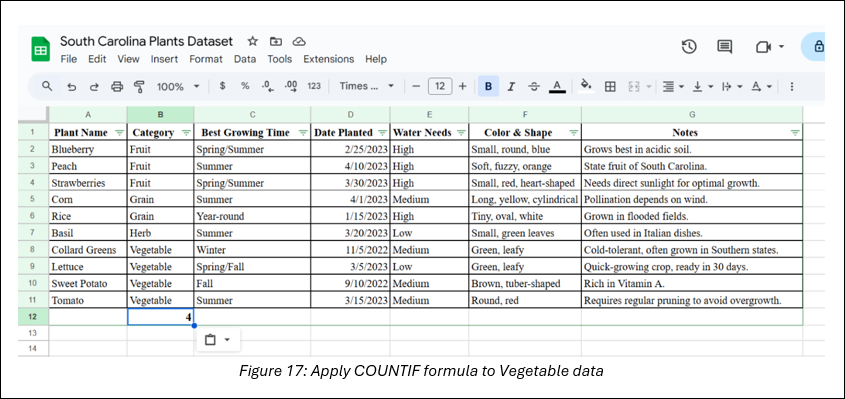

#### Formula: AVERAGE (range)  
The AVERAGE function is used to calculate the average value in a numerical column. We can see this, for example, to Find the average water requirement by converting Low, Medium, High to numerical values (Low = 1, Medium = 2, High = 3).  

Start by converting the “Water Needs” column to numbers by inserting a new column (e.g., Column H) and labeling it Water Needs (Numeric).  

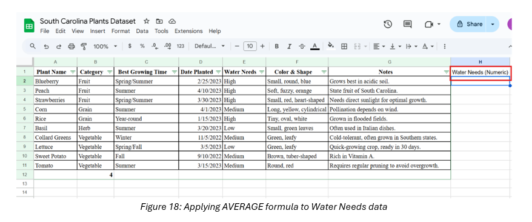

Use the following conversion:

•	Low = 1 

•	Medium = 2 

•	High = 3

Then, enter the conversion manually or use a formula. 

In cell H2, type **=IF (E2="Low", 1, IF(E2="Medium", 2, IF(E2="High", 3, 0)))**, and press Enter.

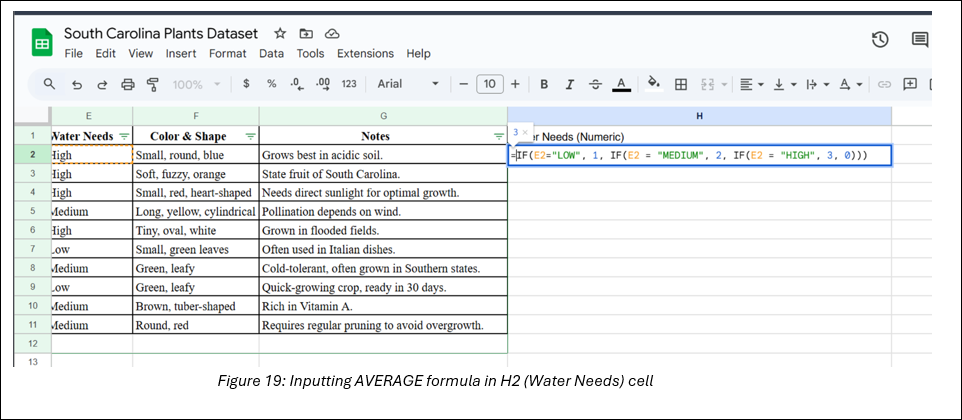

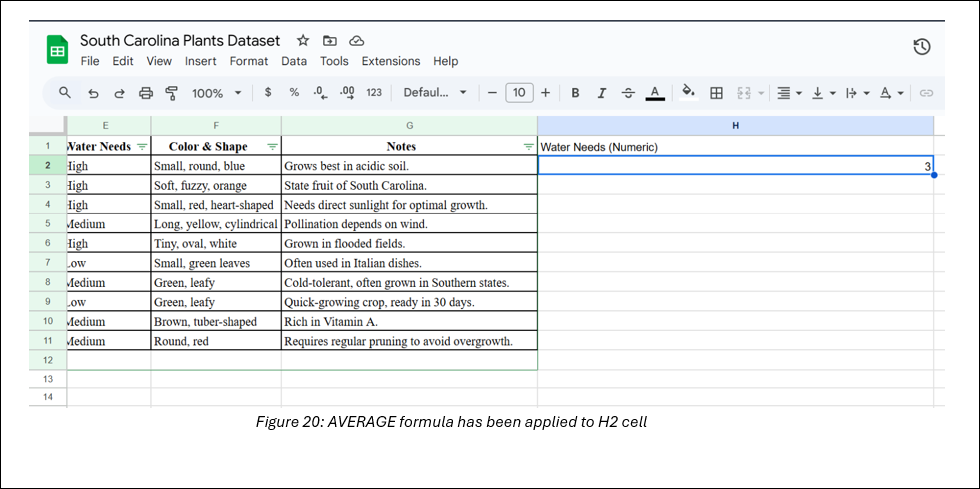

Drag the formula down to apply it to all the rows in the column.

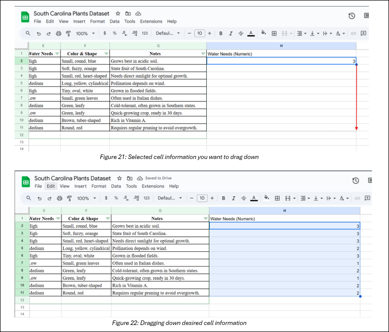

Now, you may select an empty cell where you want the average to appear. Let’s try it out with cell I1. In this cell, type the formula =AVERAGE (H2:H11) and press Enter.

• **H2:H11**: This specifies the range of the new numerical column for Water Needs.

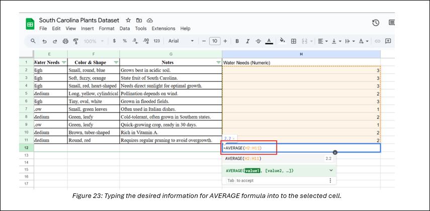

Once you’ve set up your formula, press Enter. The cell will now display the average water requirement.

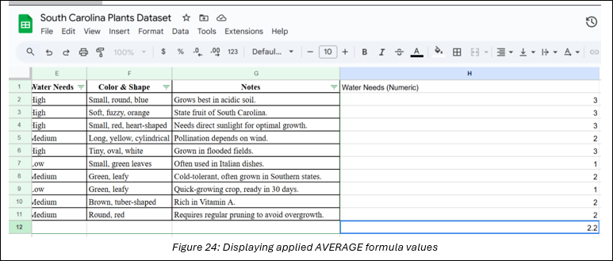

If the converted numerical values for the water needs are **2, 3, 1, etc.**, the result will be the average of those numbers.

So why should we use these formulas?

The **COUNTIF** function helps farmers or students quickly analyze how many plants fall into a specific category (e.g., Vegetables, Fruits). 

The **AVERAGE** function provides insights into trends, such as the average water requirement for crops, helping plan irrigation schedules.
Pic caption example

Now that we have finally completed the analysis of our datasets, we can export the sheet as a CSV file. Doing this prepares the dataset for use in AI systems or external analysis tools. To do so, go to **File > Download > Comma-separated values (.csv)**. Then, save the file on your computer.

#### Real-World Example

• Farmers can send their data to experts or systems that predict crop growth trends using AI.

   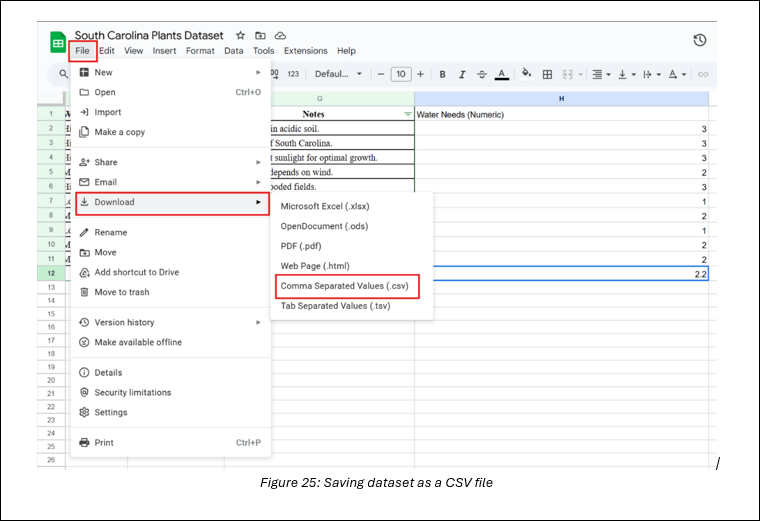

To add some style to your sheet, you can add images! Click on the cell in the **Image** column where you want the pictures. Then, go to **Insert > Image > Image in Cell**.   

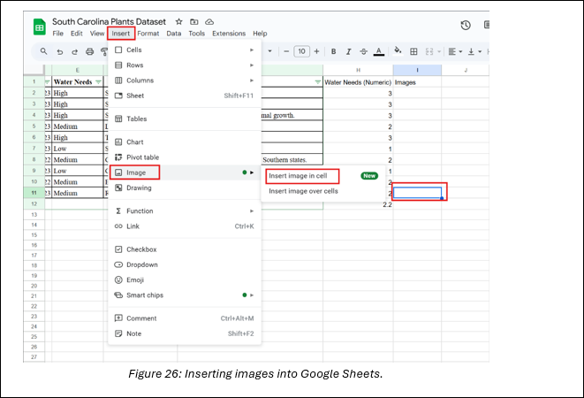

Then, choose an image from your computer and upload it.

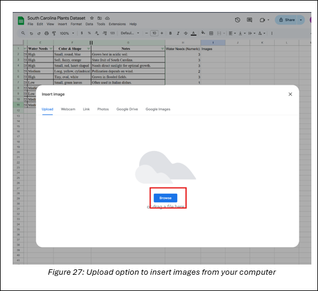

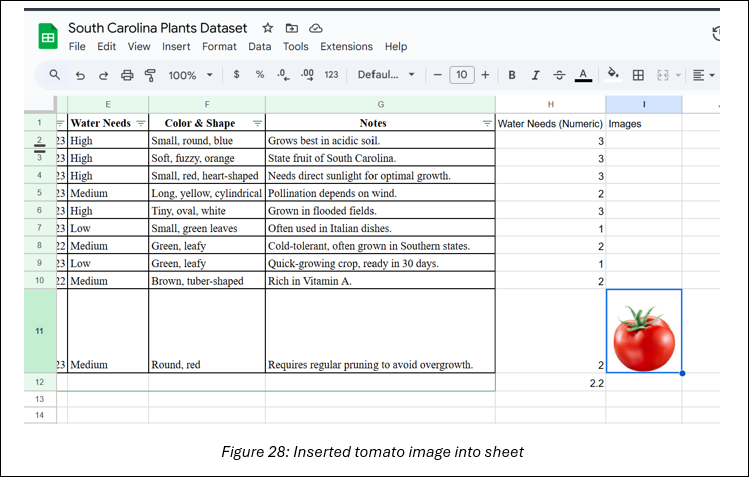

### Data Types
We are going to explore three main types of data and understand why they matter. By the end of this lesson, you’ll learn how to clean your dataset and transform it into a file that computers—and even AI—can use to make decisions. 

#### What Are Data Types?

Think about data as different kinds of "clues" farmers and scientists use to solve problems. The three main types of data:

•	Structured Data (The Neat Detective’s Notebook): Data that’s neatly organized in rows and columns, like a table in Google Sheets. Think about crop names, planting dates, and water needs from the datasets we worked with in the previous lesson—or even your class attendance list. This type of data is easy for computers to read and analyze, making it highly useful. It’s like solving a puzzle with clear instructions.

•	Semi-Structured Data (The “Almost There” File): Data that’s partially organized but still a little messy. For example, a CSV file missing some rows of information, or a JSON file from a weather app showing temperatures and rainfall. While it does provide basic information, you will need to clean it up before it can be fully understood and processed by AI.

•	Unstructured Data (The Wild Clues): Data that doesn’t fit neatly into rows and columns. It’s more like a pile of raw clues. This could be something like a photo of a plant or a video of farming techniques or even free-text notes like “The tomato plant is wilting.” While harder to process, AI can use unstructured data, like images, to diagnose problems or make predictions.  

### Hands-On Examples
Let’s go through some examples to get a better idea of how to use these data types. In groups, examine the examples and discuss the provided questions for each example.

#### Example 1: Structured Data in Action

Imagine you’re tracking crops in a Google Sheet. Here’s what structured data looks like:

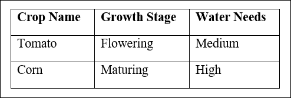

**Discussion Question**: Q1: Why is this type of data so easy to read and analyze?

**Example 2: Semi-Structured Data**

Here’s a messy CSV file that needs cleaning:

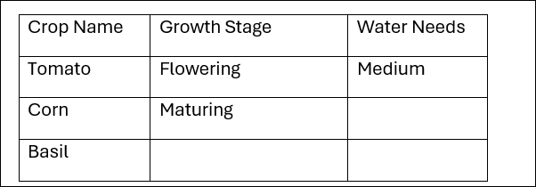

**Discussion Question**: Q1: What problems might arise if AI tries to use this data as-is?

**Example 3: Unstructured Data**

A farmer takes a photo of a tomato plant and writes:

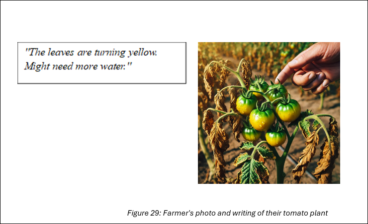

**Discussion Question**: Q1: How could AI use this image and note to help the farmer?

### Cleaning and Organizing Data

In this activity, you’ll work with unstructured data (messy and free-form data) and learn how to organize it into a structured dataset. We’ll then explore and analyze the data to uncover useful insights, just like farmers or data scientists do.

#### Scenario: Unorganized Farmer’s Journal

Imagine you’re a farmer who has been keeping notes in a journal about crops, weather, and field conditions. The notes aren’t neatly organized—they’re just written randomly.

Here’s the Messy Dataset. The farmer provided us with this unorganized data. It’s all over the place!

•	Tomato, flowering stage, needs pruning, Field A, 3 days since last watered, sunny

•	Corn, mature, high water, Field B, no rain for 2 weeks

•	Lettuce, young, cool weather, Field C, grows fast, planted on 03/01/2023

•	Blueberry, ripening, acidic soil, Field D, water high, 04/10/2023

•	Basil, seeding, prefers greenhouses, mild weather, planted 03/20/2023

•	Rice, , high water, Field E, flooded field, needs daily watering

•	Peppers, flowering stage, warm weather, Field F, medium water, planted 02/28/2023

•	Apple, fruiting, sunny, orchard, high water, , "Apple trees can live for 100 years!"

•	Strawberries, ripening, red fruit, Field G, , sunny, "Strawberries aren't really berries!"

#### Step 1: Identify Patterns
Let’s start by figuring out what we already know.

Here are the common pieces of information hidden in this mess:

•	Crop Name: What is the plant?
Example: Tomato, Corn, Lettuce.

•	Growth Stage: What stage is the plant in?

Example: Flowering, Ripening.

•	Weather Conditions: What kind of weather does it prefer?

Example: Sunny, Cool, Flooded.

•	Field Location: Where is it growing?
Example: Field A, Field B, Greenhouse.

•	Water Needs: How much water does it require?

Example: High, Medium, Low.

•	Date Planted: When was it planted?
Example: 03/01/2023, Unknown if missing.

•	Notes: Any extra information.

Example: "Needs pruning," "Apple trees can live for 100 years!"

#### Step 2: Identify Patterns

Some of the data is incomplete. For example:

•	Rice doesn’t have a growth stage or planting date.

•	Strawberries is missing a water needs value.

Here’s how we fix this:

•	Option 1: Guess based on the context.
Example: If rice grows in flooded fields, its water needs are likely "High."

• Option 2: Add "Unknown" as a placeholder so we know it’s missing.

  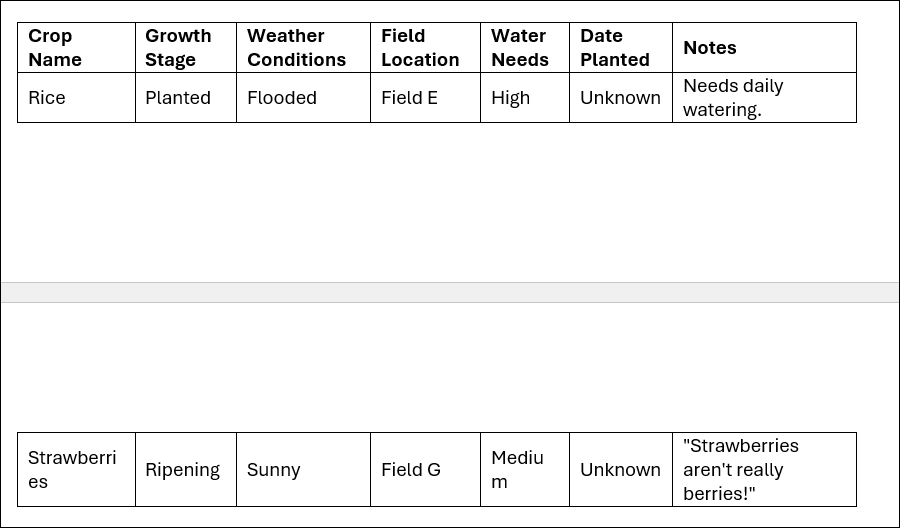

#### Step 3: Standardize Formats
Messy datasets often have inconsistent formats. For example:

•	"sunny" vs. "Sunny"

•	"high water" vs. "High"

To clean it up:

•	**Capitalize First Letters**: Always use "Sunny" instead of "sunny."

• **Use Consistent Terms**: Replace "high water" with "High."

  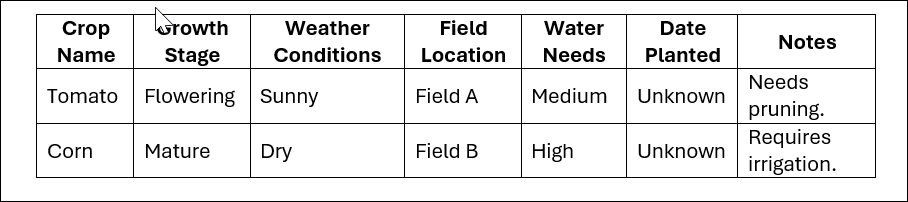

#### Step 4: Remove Duplicates

Check if any rows have the exact same data. If so, keep only one of them. In our dataset, there are no duplicates, so we’re good to go.

#### Step 5: Add Images
Adding images makes our dataset more fun and interactive. To add Images:

1. Right-click the cell in the Image column.

2. Select Insert Image > Insert Image in Cell.

3. Upload a photo or paste an image URL.
Here’s an example of what the dataset looks like after adding images:

   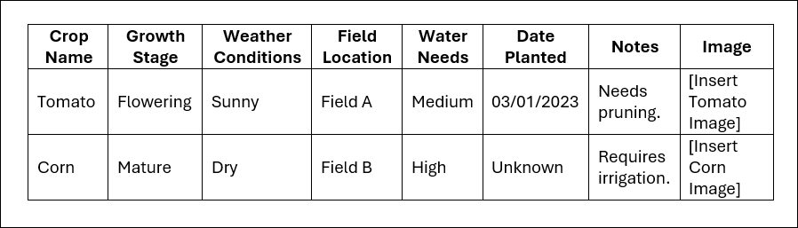

#### Step 6: Organize Data into Columns
Now that we’ve cleaned up the data, organize it into columns:

1. Open **Google Sheets**.
2. Add headers: Crop Name, Growth Stage, Weather Conditions, Field Location, Water Needs, Date Planted, Notes, Image.
3. Enter the cleaned data row by row.

   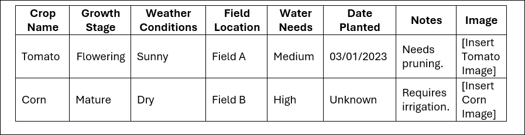

#### Final Cleaned Dataset

Here’s the final structured dataset with all the messy data cleaned, missing values addressed, and standardized formats. The dataset includes an Image column where students can add visuals for each crop. 

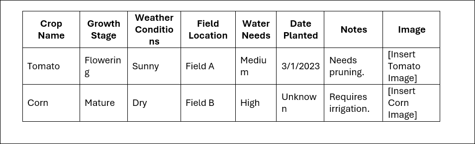

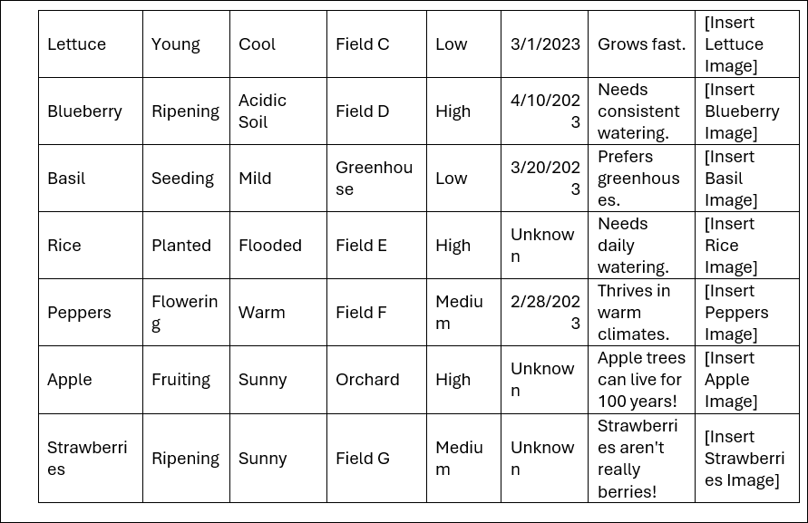

What’s Special About This Dataset?

1. Clean and Organized:

    - Every column now has consistent entries.

    - Missing values are marked as "Unknown" so they can be revisited later.

2. Enhanced Visuals:

    - The Image column makes the dataset more engaging and realistic.

3. Ready for AI and Analysis:

    - This dataset is structured and exportable as a .CSV file, making it ready for AI tools or spreadsheets.

Now that we have cleaned up the dataset:

1.	Click **File > Download > Comma-Separated Values (.csv).**

2.	Save it as **Cleaned_Farm_Data.csv.**

### Reflection

Today, we explored the three main data types, applying what we learned to transform unstructured data into a structured data set to analyze and gain insights on important data, like farmers and scientists do, helping highlight the importance of data organization for improved understanding and decision-making in agriculture. 

Consider the following questions, preparing to discuss them as a class:

1.	Q1: What did you learn about cleaning messy data today?

2.	Q2: Why is it important to fix missing and inconsistent information?

### Explaining Tabular Data

We have learned about all these other data types, but there is one more data type that is essential for organizing and analyzing information—tabular data. 

Tabular data is organized in a table format with rows and columns. Each column represents a specific category or feature (e.g., Crop Name, Growth Stage), and each row represents a single data entry or object (e.g., one crop).

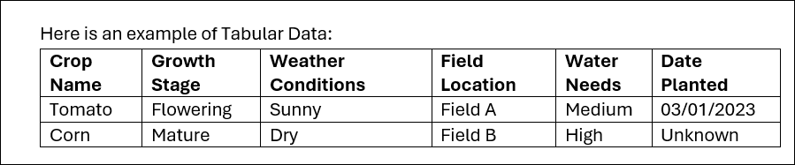

Each row in tabular data represents a single data object—a unique entry containing all the relevant details for that item. Think of a row as a "story" about one specific item. Take Row 1, for example:

- Row 1 (Tomato): This data object describes a tomato.

    - It’s in the flowering stage.

    - It prefers sunny weather.

    - It’s located in Field A.

    - It needs medium water.

Each row is self-contained, meaning you can look at one row and get a complete picture of that object.

**Difference Between Tabular Data and String Data**

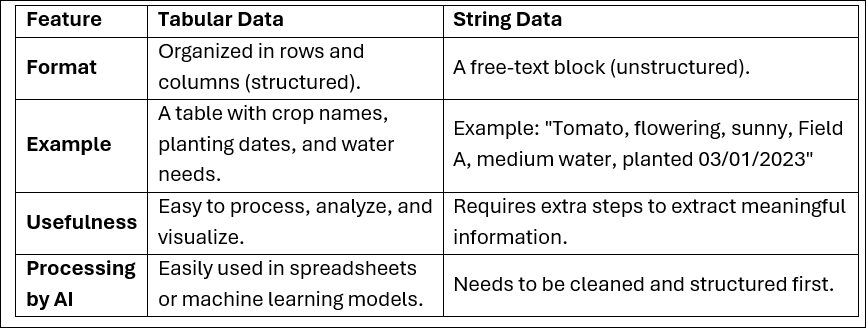

So, why is Tabular Data better for AI than other data types?

1.	**Structure:** AI tools can easily interpret columns as features and rows as individual objects. For example, AI can predict water needs based on Growth Stage and Weather Conditions

2.	**Clarity:** Tabular data makes it easy to filter, sort, and analyze.

3.	**Efficiency:** Tabular format minimizes manual work compared to processing free-text (string) data.

### Garden Detectives – What’s Growing Around Us?
Become a Data Detective!  

Hey detectives! It’s time to step into the role of an agricultural scientist. Your mission: collect and organize real-world data about plants, fruits, and vegetables, just like farmers do. But here’s the twist—you’ll include images to make your dataset even more exciting and informative! Let’s get started!  

**Where will you look?** You’ll gather your data from one of these places:

1. **Home Kitchen:** Look at the fruits, vegetables, or grains in your kitchen. Examples: bananas, carrots, rice.

2. **School Cafeteria:** Observe what’s being served for lunch. Think salads, fruits, cooked veggies, bread.

3. **Grocery Store (Real or Pretend):** Imagine walking through the produce aisle and spotting items like tomatoes or apples.

4. **Online Research:** Search Google or agricultural websites for crops you don’t see daily. Examples: exotic fruits or specialty grains.

**What will you record?** You’ll collect data for 9 categories, including images to make your dataset visually engaging. Here’s what to look for:  

1.	**Plant/Food Name:** What’s it called? (e.g., Tomato, Banana).
2.	**Category:** Is it a Vegetable, Fruit, Grain, or Herb?
3.	**Color & Shape:** Describe it. Is it yellow and curved like a banana? Round and red like a tomato?
4.	**Where It’s Found:** Does it grow on a tree, underground, on a farm, or in a greenhouse?
5.	**Weather Suitability:** What’s the best season for growing it? (e.g., Summer, Winter, Year-round).
6.	**Water Requirement:** Does it need Low, Medium, or High water? Guess if you’re not sure!
7.	**Favorite or Not?:** Is this one of your favorite foods? Yes or No.
8.	**Fun Fact:** Add something cool or surprising about the plant. Example: “Carrots used to be purple!”
9.	**Image:** Take a picture, draw it, or find an image online that represents the plant.

**How will you record the data?** You’ll organize everything into a table in **Google Sheets** or on a pre-designed worksheet. Here’s an example of what your table should look like:

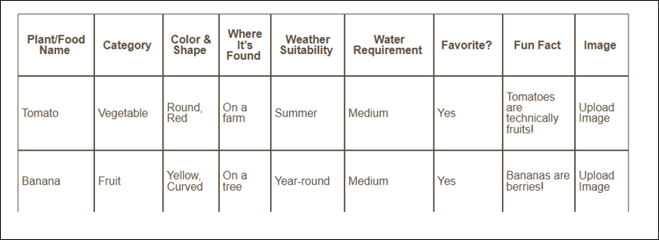

**What should you do next?** Once you have gathered and organized all of your information in Google Sheets, take some time to collect additional data, aiming to add at least 5-10 entries to your table.

### Group Sharing & Discussion 
Now that your datasets are ready, it’s time to share what you’ve discovered with your classmates!

We will go around the class, each person sharing something interesting about a plant from their dataset. For example, you might mention that bananas are technically berries, or that tomatoes are actually classified as fruits rather than vegetables.

After sharing, we will continue with a class discussion on the importance of organizing data. **Consider the following questions as a class:**

1.	**Q1: What challenges might farmers face with messy data?**
2.	Q2: **How does having a structured dataset make a farmer’s job easier?**

#### Final Discussion and Handout

Today, we explored how to organize and analyze data in Google Sheets, discussed the different types and methods of data in real-world applications, and highlighted the importance of data organization for farmers. To wrap up, take a moment to reflect on what you learned and consider how structured data can make a meaningful impact. 

**Please consider the following question and write down your answe**r. 

1.	**Q1: What’s one thing you learned today about collecting or organizing data?**

Now that we have developed a better understanding of the lesson, please complete and respond to the following handout.**SREB_U3_L4_Handout**.
