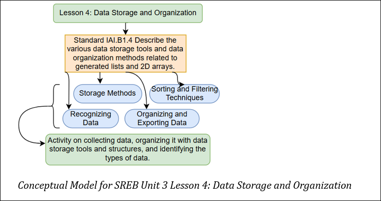

## Lesson 4: Data Storage and Organization Teacher Page
### Module Name: Data Storage and Organization
#### Conceptual Model:

#### Standards:

- IAI.B1.4 Describe the various data storage tools and data organization methods related to generated lists and 2D arrays. 

#### Objectives:

- Compute traditional vs. Modern agricultural data storage methods

- Organize data into structured formats for better decision-making 

- Perform sorting, filtering, and data cleaning in Google Sheets 

- Export datasets into AI-ready formats

### Storyline
In this lesson, students will explore how farmers store and organize agricultural data for better decision-making. They will compare traditional vs. modern data storage methods, learn about data types, practice sorting and filtering in Google Sheets, and understand how structured data helps in AI applications. Hands-on activities will allow students to create and clean datasets.     

### Main Learning Goal

Students will understand how agricultural data is collected, stored, and organized using modern tools like spreadsheets and databases.

### Focus Question
How does data organization improve agricultural decision-making?  

### Tables
