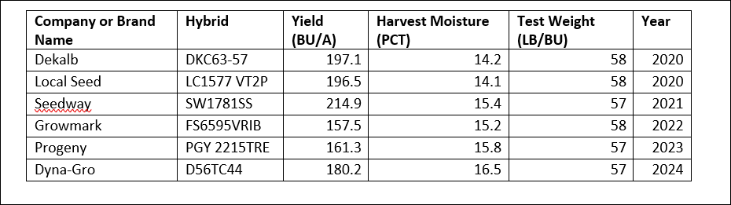

## Let’s Talk Agribusiness 
To get ready for your presentations to the extension office and stakeholders, it's important to understand how data and AI are transforming agriculture.

Agribusiness refers to the industries dealing with agricultural produce and services required in farming.
Let's put your knowledge to the test and see how you can apply what you've learned to real-world agricultural challenges!

**Use the guide to help you break down and make sense of real-world data:**

What are some technologies available that are beneficial to agriculture? How are they beneficial? Consider the hardware and software that we’ve learned about so far.

After reading the article and watching the video by Clemson University, discuss these questions with you classmates:

1.	What kind of data do you think soil moisture sensors collect, and how might that data be organized or analyzed?

2.	What benefits can analyzing soil moisture data provide to farmers, both financially and operationally?

Now, let’s dive into some data! Below is a snapshot from Clemson University’s dataset, which tracks different corn hybrids grown in South Carolina. Let’s analyze the trends and see what insights we can uncover!

What data type are each of the columns?

•	Company or Brand Name:

•	Hybrid:

•	Yield (BU/A):

•	Harvest Moisture (PCT):

•	Test Weight (LB/BU):

•	Year:

If we wanted to analyze the results, we’d need to perform operations on the data. **Try calculating the average yield** yourself. Show your work.

Average yield = 

Manually calculating data can be time-consuming, but tools like Excel make it much easier! With simple formulas, you can quickly analyze large datasets and gain insights with just a few clicks.

**Useful Excel Functions to Know:**

1.	**SUM():** Used to add together a range of numbers
2.	**AVERAGE():** Used to calculate the mean value of a range of numbers
3.	**MAX():** Identifies the highest value in a range of numbers
4.	**MIN():** Identifies the lowest value in a range of numbers
5.	**Minus operator (-):** Subtracts two numbers

After analyzing the data, discuss these questions with a partner: 

1.	How does using software like Excel help solve specific problems in agribusiness, such as analyzing and interpreting crop data? 
2.	How might other columns in the dataset, such as Harvest Moisture (PCT) or Test Weight (LB/BU), be used to provide additional insights for farmers or agribusinesses? 
3.	What are some potential challenges or limitations of relying solely on data like this for decision-making in agribusiness? How could these be addressed?

Now that you’ve explored how AI and data shape agriculture, it’s time to think critically about their impact:

Why is it important to understand how data types and tools interact when solving specific problems in agriculture?

In what ways do you think learning these skills can be applied to other industries beyond agribusiness?