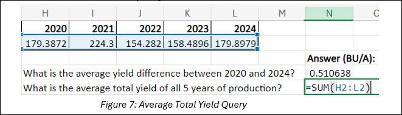
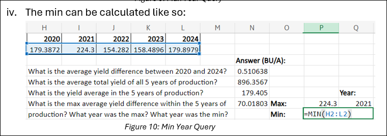
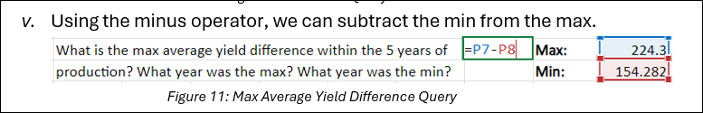

## L5 Lesson Plan: Analyzing Agribusiness Data
### Lesson Description:
In this lesson, students will explore how data collection and analysis are applied to solve real-world problems in agriculture. Using Excel as a tool, they will analyze corn hybrid performance data from South Carolina and reflect on how these insights can inform decision-making and drive improvements in agribusiness operations. Through hands-on activities, students will learn to calculate averages, identify trends, and use their findings to address domain-specific challenges in the agricultural industry. 

### Main Learning Goal:
Students will understand how technology, including hardware like sensors and software like Excel, is used in agribusiness to collect, analyze, and interpret data, enabling informed decision-making to solve industry-specific challenges.

### Essential Question:
How can technology, such as sensors and software like Excel, be used to analyze data and improve decision-making in agribusiness?  

### Standards:
•	IAI.B2.3 Compare the properties of a data set that could be used to explore a real-world (domain-specific) scenario or support a claim.

### Objectives:
•	Students will learn how sensors and other hardware are used to collect agricultural data and understand their importance in agribusiness.

•	Students will learn how to use Excel functions to analyze agricultural data effectively.

•	Students will utilize Azure to analyze visual data using Computer Vision

•	Students will learn how to interpret data analysis results and use them to make informed decisions in agribusiness.

### Total Duration: 50 minutes (1 days)

#### Important Vocabulary:

1.	Agribusiness

    a.	Definition: The group of industries dealing with agricultural produce and services required in farming.

    b.	Example: A company that produces and sells tractors, fertilizers, and irrigation systems is part of the agribusiness sector

2.	Sensors

    a.	Definition: A device which detects or measures a physical property and records, indicates, or otherwise responds to it.

    b.	Example: Soil moisture sensors monitor water levels in the soil and send data to an irrigation system to prevent overwatering

3.	Buschel

    a.	Definition: Any of various units of dry capacity.

    b.	Example: A farmer harvested 500 bushels of wheat from their field this season

#### Useful Excel Functions to Know:

1.	**SUM():** Used to add together a range of numbers
2.	**AVERAGE():** Used to calculate the mean value of a range of numbers
3.	**MAX():** Identifies the highest value in a range of numbers
4.	**MIN():** Identifies the lowest value in a range of numbers
5.	**Minus operator (-):** Subtracts two numbers

### Engage (Elicit/Develop) ~ 15 minutes
#### Activity Name: Collecting Data in Agribusiness (~15 minutes)

**Activity Walkthrough:**

1.	The teacher will facilitate a classroom discussion based off the following question. Students should jot their answers down in SREB_U3_L5_Handout.

a. Q1: What are some technologies available that are beneficial to agriculture? How are they beneficial?  
Consider the hardware and software that we’ve learned about so far: 

i.	Hardware: Circuits, sensors, microcontrollers, motors 

ii.	Software: Excel, machine learning, AI
Technologies like sensors and microcontrollers help farmers automate irrigation and monitor soil conditions. Motors power automated equipment, reducing labor intensive work. On the software side, Excel allows farmers to track data. AI and Machine learning can be used to analyze farming trends, predict crop yields, and possibly detect plant diseases early.

2.	The teacher will direct students to read an article on how sensors can be used to collect data.

    a.	You can follow the link provided here: Clemson research finds using soil moisture sensors can increase farmer’s net income.

    b.	This link provides an overview of a Clemson University study in South Carolina that explores the use of soil moisture sensors to optimize irrigation practices and improve profitability in agribusiness. Give the students 5 minutes to read the article on their own.

3. After reading the article, play this 4-minute video, also by Clemson University, that relates to the article: Irrigation. (Stop at 4:05)

4. The teacher will facilitate a classroom discussion based off the following questions. Students should jot their answers down in SREB_U3_L5_Handout.

    a.	**Q1: What kind of data do you think soil moisture sensors collect, and how might that data be organized or analyzed?**

    Soil moisture sensors collect data on water levels in the soil. This data can then be analyzed for irrigation needs.

    b.	**Q2: What benefits can analyzing soil moisture data provide to farmers, both financially and operationally?**

    Analyzing soil moisture data helps farmers reduce water costs, provide the right amount of water, and ultimately improve crop health/yield.

    c.	This example highlights how data collection tools like soil moisture sensors play a critical role in agribusiness. However, analyzing the data is what transforms raw information into actionable insights. By using various software, we can organize, process, and interpret agricultural data to make informed business decisions. 

### Explore (Develop/Deploy) ~ 30 minutes 
#### Activity Name: Using Excel to Analyze Corn Data (~30 minutes)
**Activity Walkthrough:** 
1.	We’ll be analyzing data on corn hybrids grown in South Carolina, which can be accessed using SREB_U3_L5_ClemsonData.

    a.	The dataset presents statewide averages for corn hybrid performance across various companies from 2020 to 2024. For ease of analysis, the data was compiled from five datasets, and the original datasets are also available here. Additionally, Clemson University provides similar data for other crops grown in South Carolina, including cotton, peanuts, and soybeans, which can be explored here.

2. In Figure 1 below, you can see the different columns for this data set: **Company or Brand Name, Hybrid, Yield (BU/A), Harvest Moisture (PCT), and Test Weight (LB/BU).**

   

    a.	Based off the columns and their values, the teacher will instruct the students to fill in the data type for each column in SREB_U3_L5_Handout.
    
    b.	Q1: What is the data type for each column?  

    - Company or Brand Name: Name of the company or brand producing the corn 

    - Hybrid: Type of corn hybrid being grown  

    - Yield (BU/A): Amount of agricultural production harvested measured by bushels per acre (BU/A) (bushels are defined as 56lbs for corn)  

    - Harvest Moisture (PCT): Moisture level of the corn at time of harvest, represented as a percentage (PCT) 

    - Test Weight (LB/BU): Weight of corn grain per bushel. Indicates the quality of the grain, and higher test weight is generally preferred.

    c.	Q2: If we wanted to analyze the results, we’d need to perform operations on the data. Try calculating the average yield yourself. 

    - 184.58 BU/A

3. The teacher will now walk students through calculating the average corn yield in Excel.

    a.	Open SREB_U3_L5_ClemsonData.

    b.	Let’s first get an average for the yield of corn produced each year, using 2020 as an example.

    i.	In the cell under 2020 (**cell H2**), begin typing **“=AVERAGE(“**

    ii.	Then select the first cell in the **Yield** column for the year 2020 (**cell C2**). This will select this cell as the start of the list of numbers to average.

         

    iii. Scroll down to the last cell in the Yield column for the year 2020 and hold “CTRL+SHIFT” before clicking the last cell (cell C48). This will select all the numbers between the first cell and the last cell to average. Note how it averages the cells C2 through C48.

          

    iv.	Hit “Enter” and the average of the yield of corn in 2020 will be calculated!

    v.	Repeat this with all the years. You should see the following result:

         

4. The teacher will now instruct the students to calculate the following questions on their own using SREB_U3_L5_ClemsonData.

    a. Q1: What is the average yield difference between 2020 and 2024?

    i. This can be found using the minus (-) operator

    ii. Start by writing “=” then select the first value, type “-”, then select the second value

    iii. It should result in a query like this: 

         

    iv.	Then hit “Enter” to calculate the result

    v.	 Answer: 0.510638 

    b.	**Q2: What is the average total yield of all 5 years of production?** 

    i.	This can be found using the **SUMMING** the average yields per year

    ii.	It should result in a query like this: 

     

    iii.	Hit “Enter” to calculate the result

    iv.	Answer: 896.3567

    c. **Q3: What is the yield average in the 5 years of production?**

    i.	**Notice this question isn’t asking for an average of averages**. That means we should take an average of ALL the values for yield instead of the average of the average yields per year.

    ii.	As before, start by typing **“=AVERAGE(“** and selecting the first value in the Yield column

    iii.	Now execute **“CTRL+SHIFT+DOWN”**. This will select all the values in the column until the data ends.

    iv.	It should result in a query like this:      

                                

    v.	Hit “Enter” to calculate the result

    vi.	Answer: 179.405 

    d. **Q4: What is the max average yield difference within the 5 years of production? What year was the max? What year was the minimum?** 

    i.	We want to be subtracting the max average yield from the minimum average yield within the five years

    ii.	This can be found using the **MAX, MIN, and minus (-)** functions.

    iii. The max can be calculated like so:     

                                                                  
    iv. The min can be calculated like so:                                                                      
         

    v. Using the minus operator, we can subtract the min from the max.                                          
      

    vi. Hit “Enter” to calculate the result

    vii. Answer: Minimum: 2023, Maximum: 2021

    e. This should be the final answer:

          
 
5. Following the analysis, the teacher may guide students through answering the following questions in SREB_U3_L5_Handout.

    a. Q1: How does using software like Excel help solve specific problems in agribusiness, such as analyzing and interpreting crop data?  

    Software like Excel can help farmers organize and analyze their crop data by tracking trends in yield, soil conditions, and any input costs. 

    b.	Q2: How might other columns in the dataset, such as Harvest Moisture (PCT) or Test Weight (LB/BU), be used to provide additional insights for farmers or agribusinesses? 

    Harvest Moisture (PCT) can help determine the best time to harvest, preventing spoilage, while Test Weight (LB/BU) can help with grain quality and market value. 

    c.	Q3: What are some potential challenges or limitations of relying solely on data like this for decision-making in agribusiness? How could these be addressed? 

    Insights from data can be limited if external factors such as weather, pests, and soil variability are not accounted for or are volatile. To address this, farmers may combine data analysis with field observations and expert advice to make well-rounded decisions.

### Explain (Refine) ~ 5 minutes
#### Activity Name: Technology’s Impact on Agribusiness (~5 minutes)

**Activity Walkthrough:** 

1.	The teacher will facilitate a classroom reflection on the following questions. Students should answer these questions in **SREB_U3_L5_Handout**.

    a.	Q1: Why is it important to understand how data types and tools interact when solving specific problems in agriculture?

    Without understanding how these tools work together, farmers may be missing out on key insights that can lead to inefficient workflows or crop loss.

    b.	Q2: In what ways do you think learning these skills can be applied to other industries beyond agribusiness? 

    These skills can be applied to several fields such as healthcare, manufacturing, and finance. While these fields may be vastly different, they all have the need for data collection, analysis, and decision-making strategies.

    
