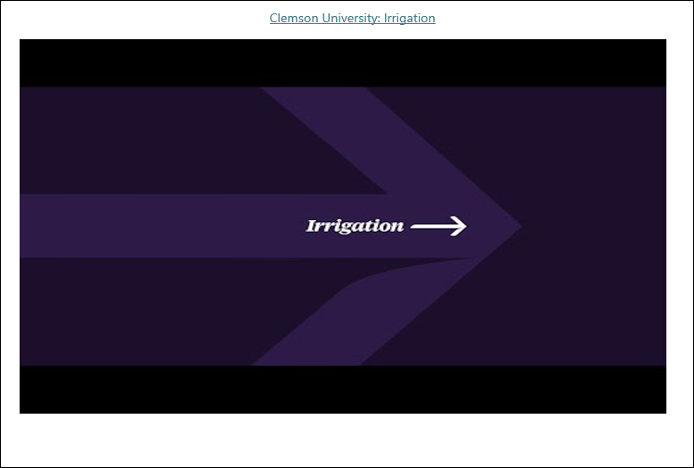
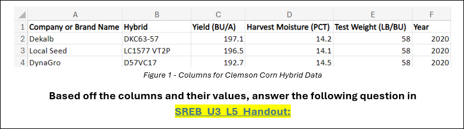
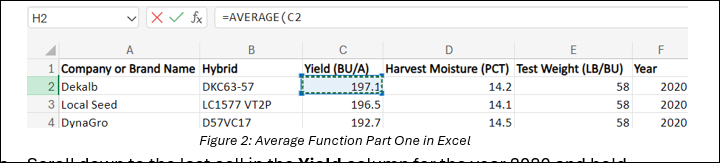
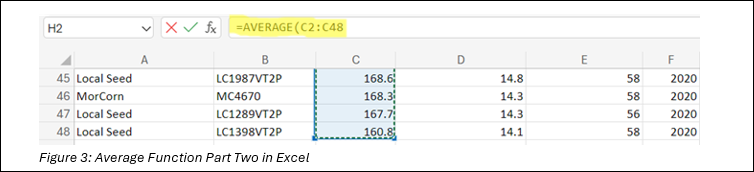
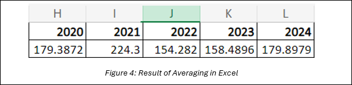
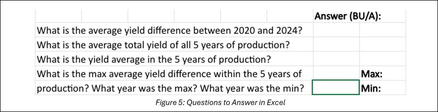

## Lesson 5: Data in the Real World
### Lesson Description:
In this lesson, students will explore how data collection and analysis are applied to solve real-world problems in agriculture. Using Excel as a tool, they will analyze corn hybrid performance data from South Carolina and reflect on how these insights can inform decision-making and drive improvements in agribusiness operations. Through hands-on activities, students will learn to calculate averages, identify trends, and use their findings to address domain-specific challenges in the agricultural industry.  

### Main Learning Goal:
Students will understand how technology, including hardware like sensors and software like Excel, is used in agribusiness to collect, analyze, and interpret data, enabling informed decision-making to solve industry-specific challenges.

### Essential Question:
How can technology, such as sensors and software like Excel, be used to analyze data and improve decision-making in agribusiness?   

### Standards:
•	IAI.B2.3 Compare the properties of a data set that could be used to explore a real-world (domain-specific) scenario or support a claim.

### Objectives:
•	Students will learn how sensors and other hardware are used to collect agricultural data and understand their importance in agribusiness. 
•	Students will learn how to use Excel functions to analyze agricultural data effectively. 
•	Students will utilize Azure to analyze visual data using Computer Vision.
•	Students will learn how to interpret data analysis results and use them to make informed decisions in agribusiness.

### Collecting Data in Agribusiness 

We’ve explored various data collection methods and analysis tools, but how do they apply to solving real-world problems? 
Specifically, how can we use data to effectively manage or improve agricultural businesses? 

In SREB_U3_L5_Handout, answer the following questions with your class:

1. **What are some technologies available that are beneficial to agriculture? How are they beneficial?** 

    Consider the hardware and software that we’ve learned about so far.

- Hardware: Circuits, sensors, microcontrollers, motors

- Software: Excel, machine learning, AI

Now let’s focus on sensors and how they collect useful data. 

**On your own, read the following article:**  [Clemson research finds using soil moisture sensors can increase farmer’s net income](https://news.clemson.edu/clemson-research-finds-using-soil-moisture-sensors-can-increase-farmers-net-income/)

It explains how researchers in South Carolina used soil moisture sensors to help farmers improve irrigation and boost their profits. You’ll have 5 minutes to read.

Next, we’ll watch a short video that connects to the article: 

 

After reading the article and watching the video by Clemson University, answer these questions in **SREB_U3_L5_Handout**:

- What kind of data do you think soil moisture sensors collect, and how might that data be organized or analyzed?

- What benefits can analyzing soil moisture data provide to farmers, both financially and operationally?

This example highlights how data collection tools like soil moisture sensors play a critical role in agribusiness. However, analyzing the data is what transforms raw information into actionable insights. By using various software, we can organize, process, and interpret agricultural data to make informed business decisions. 

Let’s put this into practice by analyzing corn hybrid performance data to see how similar techniques can guide decision-making in agriculture!

#### Using Excel to Analyze Hybrid Corn Data
We’ll be analyzing data on corn hybrids grown in South Carolina. The dataset presents statewide averages for corn hybrid performance across various companies from 2020 to 2024.

In Figure 1 below, you can see the different columns for this data set: **Company or Brand Name, Hybrid, Yield (BU/A), Harvest Moisture (PCT), and Test Weight (LB/BU)**.

 

- **What is the data type for each column?**

    - Company or Brand Name:

    - Hybrid:

    - Yield (BU/A):

    - Harvest Moisture (PCT):

    - Test Weight (LB/BU):

    - Year:

If we wanted to analyze the results, we’d need to perform operations on the data. Try calculating the average yield yourself. Show your work in **SREB_U3_L5_Handout**:

- **Average yield =**

Manually calculating data can be time-consuming, but tools like Excel make it much easier! With simple formulas, you can quickly analyze large datasets and gain insights with just a few clicks.

Before we analyze the data, some useful excel functions to know are:

1.	SUM(): Used to add together a range of numbers
2.	AVERAGE(): Used to calculate the mean value of a range of numbers
3.	MAX(): Identifies the highest value in a range of numbers
4.	MIN(): Identifies the lowest value in a range of numbers
5.	Minus operator (-): Subtracts two numbers

We will be using Excel functions, such as SUM, AVERAGE, MIN, and MAX, to analyze corn yield and discuss how these statistics can be used to make business decisions. Follow along the first part of this analysis with your teacher!

1.	Open SREB_U3_L5_ClemsonData.
2.	Let’s first get an average for the yield of corn produced each year, using 2020 as an example.

    a. In the cell under 2020 (cell H2), begin typing **“=AVERAGE(“**

    b. Then select the first cell in the **Yield** column for the year 2020 (**cell C2**). This will select this cell as the start of the list of numbers to average.        

          

    c. Scroll down to the last cell in the **Yield** column for the year 2020 and hold **“CTRL+SHIFT”** before clicking the last cell (**cell C48**). This will select all the numbers between the first cell and the last cell to average. Note how it averages the cells C2 through C48.         

            

     d.	Hit “Enter” and the average of the yield of corn in 2020 will be calculated!

    e.	Repeat this with all the years. You should see the following result:

         
                                     
3. Next, you will be working independently on answering the questions **shown in Figure 5 below. This is your time to show off your Excel skills, so please do not use a calculator!**

    

    a.	What is the average yield difference between 2020 and 2024?

    b.	What is the average total yield of all 5 years of production?

    c.	What is the yield average in the 5 years of production?

    d.	What is the max average yield difference within the 5 years of production? What year was the max? What year was the minimum?

Once your class has analyzed the data, answer these questions with a partner in **SREB_U3_L5_Handout**:

1.	How does using software like Excel help solve specific problems in agribusiness, such as analyzing and interpreting crop data?

2.	How might other columns in the dataset, such as Harvest Moisture (PCT) or Test Weight (LB/BU), be used to provide additional insights for farmers or agribusinesses?

3.	What are some potential challenges or limitations of relying solely on data like this for decision-making in agribusiness? How could these be addressed?

Excel is a powerful tool for organizing and analyzing data to make informed decisions, as we’ve seen through our work with corn hybrid performance!

Technology’s Impact on Agribusiness
Now that we understand how hardware and software can be used to harness data, please discuss the following questions with your class in **SREB_U3_L5_Handout**:

1.	**Why is it important to understand how data types and tools interact when solving specific problems in agriculture?**

2.	**In what ways do you think learning these skills can be applied to other industries beyond agribusiness?**
