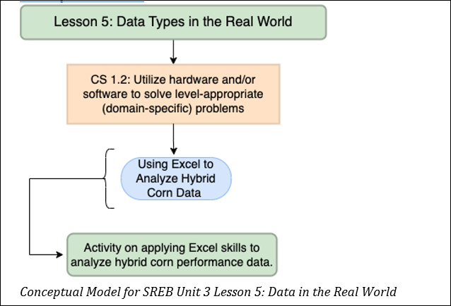

## Lesson 5: Data in the Real-World Teacher Page
### Module Name: Data in the Real-World
#### Conceptual Model:

### Standards:

•	IAI.B2.3 Compare the properties of a data set that could be used to explore a real-world (domain-specific) scenario or support a claim.

### Objectives:

•	Students will learn how sensors and other hardware are used to collect agricultural data and understand their importance in agribusiness.

•	Students will learn how to use Excel functions to analyze agricultural data effectively.  

•	Students will utilize Azure to analyze visual data using Computer Vision. 

•	Students will learn how to interpret data analysis results and use them to make informed decisions in agribusiness.

### Storyline

In this lesson, students will explore how data collection and analysis are applied to solve real-world problems in agriculture. Using Excel as a tool, they will analyze corn hybrid performance data from South Carolina and reflect on how these insights can inform decision-making and drive improvements in agribusiness operations. Through hands-on activities, students will learn to calculate averages, identify trends, and use their findings to address domain-specific challenges in the agricultural industry.   

#### Main Learning Goal

Students will understand how technology, including hardware like sensors and software like Excel, is used in agribusiness to collect, analyze, and interpret data, enabling informed decision-making to solve industry-specific challenges.

### Focus Question

How can technology, such as sensors and software like Excel, be used to analyze data and improve decision-making in agribusiness?    

### Tables
