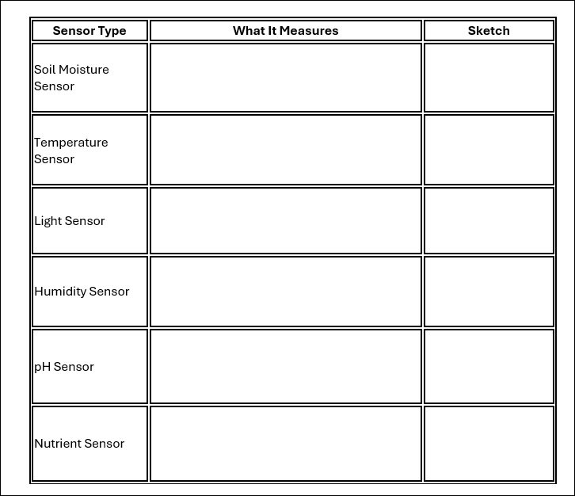

## How is AI Integrated with Microcontrollers and Sensors in Agriculture?

#### 1. Understanding Agricultural Sensors
 
Match each sensor below to its description. Then, sketch a small icon or image of what it might look like.

#### 2. I-P-O Flow Diagram

Use the space below to draw and label the Input → Processing → Output cycle for a simple smart farming system (e.g., irrigation or crop monitoring). Be sure to include:

- Sensor(s) collecting data

- Microcontroller processing that data

- Action/Output triggered based on decisions

#### 3. Real-World Application Sketch

Choose one real-world AI system discussed in class (e.g., smart irrigation, drone monitoring, automated greenhouse). In the box below:

- Sketch the system and label the hardware
- Show the I-P-O flow
- Identify one benefit and one challenge of using this technology

**My Chosen AI System:** ________________________________

**Sketch & Label Here**:

**Benefit:** _______________________________________________

**Challenge**: ____________________________________________

4. Choose one component (sensor, microcontroller, or motor). Why do you think it is the most important part of an AI agricultural system? Explain your thinking.

