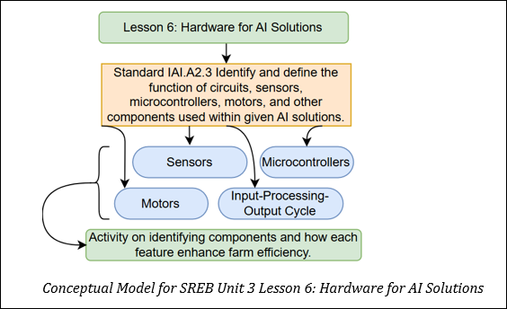

## Lesson 6: Hardware for AI Solutions Teacher Page
### Module Name: Hardware for AI Solutions
#### Conceptual Model:

### Standards:
- 2.1 Identify and define the function of circuits, sensors, microcontrollers, motors and other components used within a given AI solution.

### Objectives:
- Describe the role of environmental sensors, circuits, and microcontrollers in agriculture. 
- Use the I-P-O cycle to map how an AI system processes agricultural data. 
- Collaborate to analyze and diagram real-world AI applications in farming. 
- Apply concepts from previous lessons (data input, analysis, and visualization) to understand how hardware enables automation.

### Storyline
In this lesson, students will explore how sensors, microcontrollers, and circuits work together to power AI-based systems in agriculture. Using real-world technology examples and engaging group activities, students will deepen their understanding of how environmental data is collected, processed, and turned into automated actions. This lesson connects directly to previous lessons focused on data collection, data types, and representation, and prepares students for hands-on coding and data analysis in later lessons.  

### Main Learning Goal

Students will identify the function of circuits, sensors, microcontrollers, and motors in AI-powered agricultural systems and demonstrate how these components function together through the input-processing-output cycle. 

### Focus Question

How do circuits, sensors and microcontrollers work together in AI systems to collect and act on real-time agricultural data?

### Tables