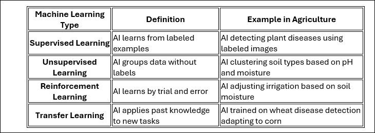

## Machine Learning in Agriculture
Machine Learning (ML) helps farmers make better decisions by analyzing data, identifying patterns, and optimizing resources. In this lesson, you will explore four types of ML and how they improve agricultural processes.
________________________________________
### Types of Machine Learning

Machine Learning is not one-size-fits-all—different AI tasks require different approaches.

1. How is Supervised Learning similar to how humans learn with a teacher?________________________________________

2. Why might farmers use Unsupervised Learning instead of Supervised Learning?

3. How does Reinforcement Learning help AI improve over time?

________________________________________

4. Why is Transfer Learning useful for detecting diseases in different crops?

________________________________________

### Machine Learning in Action

AI is transforming agriculture through real-world applications. Read the following examples and answer the questions.

#### Example 1: AI Detecting Plant Diseases

AI is trained on thousands of images of healthy and diseased plants. It learns to identify disease symptoms and predicts whether new plant images show signs of disease.

5. What type of Machine Learning is being used in this case? Why?

#### Example 2: AI Grouping Soil by Quality
AI analyzes soil samples without any labels and automatically organizes them into groups based on pH, moisture, and nutrients.

6. What type of Machine Learning is being used in this case? Why?
_______________________________________

#### Example 3: AI Optimizing Irrigation
AI controls an irrigation system, adjusting water levels based on past results. If crops are overwatered, the AI reduces water use. If crops are dry, it increases watering.

7. What type of Machine Learning is being used in this case? Why?

________________________________________

#### Example 4: AI Detecting Diseases in New Crops
An AI model trained to detect wheat diseases is quickly adapted to identify diseases in corn, using its previous knowledge.

8. What type of Machine Learning is being used in this case? Why?

_______________________________________

### Final Reflection

9. How does Machine Learning help farmers make better decisions?______________________________________

10. Which type of Machine Learning do you think is most useful in farming? Why?
________________________________________
