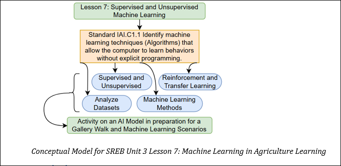

## Lesson 7: Machine Learning in Agriculture Learning Teacher Page
### Module Name: Machine Learning in Agriculture Learning
### Conceptual Model:

### Standards:

- Understand the different types of Machine Learning and their applications in agriculture.   

- Analyze how AI processes farming data to optimize resources and improve efficiency.   

- Apply Machine Learning principles to real-world farming challenges.

### Objectives:

•	Define and differentiate between Supervised, Unsupervised, Reinforcement, and Transfer Learning.   

•	Explain how AI processes agricultural data for decision-making.   

•	Analyze datasets to determine which ML approach best fits a given farming problem.   

•	Justify the use of different Machine Learning methods in real-world agricultural scenarios.

### Storyline

This lesson introduces students to Machine Learning (ML) and its role in agriculture. Students will explore the differences between Supervised, Unsupervised, Reinforcement, and Transfer Learning, analyze real-world AI applications in farming, and work with datasets to understand how AI improves agricultural decision-making.    

### Main Learning Goal

Students will understand the four types of Machine Learning and apply them to agricultural challenges by analyzing real-world AI farming applications.       

### Focus Question

How does Machine Learning improve decision-making in agriculture?

### Tables