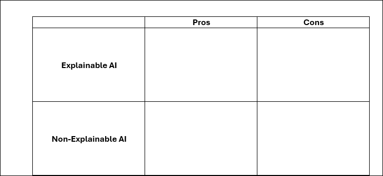
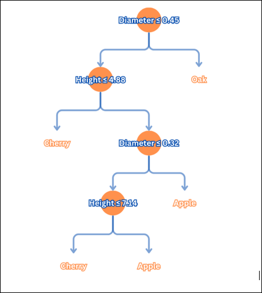
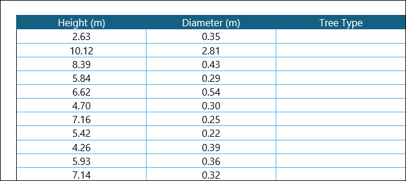
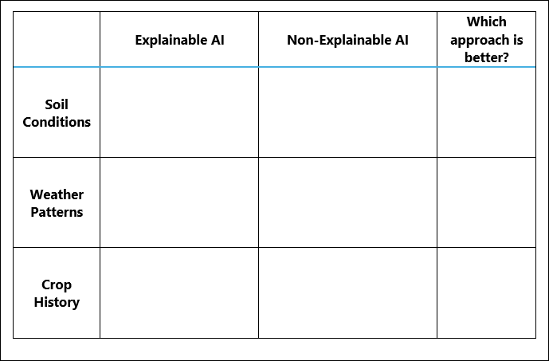

## AI in a Box 
We’ve explored different types of machine learning, but here’s the real challenge—can you explain them? When making decisions that impact industries like agriculture, medicine, or finance, it’s not enough for AI to just "work"—stakeholders need to trust the process.

As we dive into today’s activity, you’ll explore explainable vs. non-explainable AI, test your knowledge with decision trees, and experiment with neural networks.

**Why do you think transparency and trust are important?**

Write down three things you learned from the “Explainable AI explained!” video.

1.	 

2.	 

3.	 
 

Now that you understand how a decision tree works, apply your knowledge by using the decision tree and dataset below to classify different types of trees.

The Neural Network Playground lets you build your own neural network and explore how different factors impact its outcomes in real time.

### Main variables you can modify:

- Problem type: Classification or regression problem

- Data: The dataset used to train the model, influencing what patterns the neural network learns

- Features: The input variables that the model uses to make predictions

- **# of hidden layers**: The number of layers between the input and output that help the network learn complex patterns

- **# of neurons per layer**: The number of processing units in each hidden layer, which affect the model’s ability to capture details in the data

#### Additional advanced settings:

- Learning rate: Controls how quickly the model updates its weights during training - a higher rate learns faster but may be unstable, while a lower rate is more precise but slower

- Activation function: Determines how neurons process inputs and pass signals through the network

- Regularization: Helps prevent overfitting by adding constraints to the model

- Noise: Introduces random variations in data during training to make the model more robust against small fluctuations

- Batch size: The number of training samples the model processes before updating its weights, balancing speed and accuracy

### Key outputs to observe:

- **Test loss**: Measures how well the trained model performs on unseen data - lower is better but will never be (and shouldn’t ever be) 0.

- **Training loss**: Indicates how well the model is learning during training - a decreasing loss suggests improvement

- **# of epochs**: The number of times the entire dataset is passed through the network - more epochs mean more learning, but too many can lead to overfitting

For the AI Farmer’s Dilemma, take notes on the key factors that influence decision-making and the impact of each AI approach.

Building on what you've learned today and how you'll apply this knowledge in your presentation to stakeholders, consider the following question:

How does the choice between explainable and non-explainable AI impact trust and decision-making in real-world applications?

