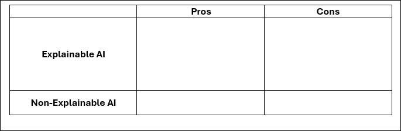
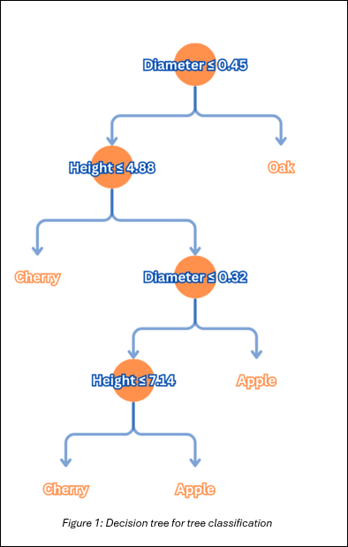
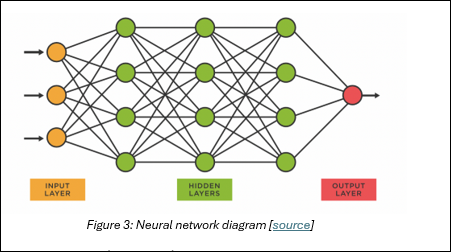
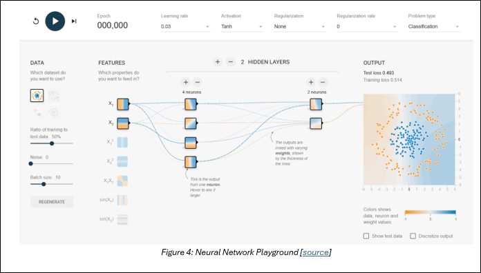
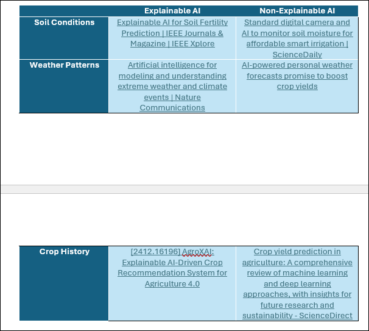

## Lesson 8: Explainable vs Non-Explainable AI
### Lesson Description:
In this lesson, students will explore the fundamental differences between explainable AI (XAI) and non-explainable AI (Black Box AI), identifying real-world examples and analyzing their strengths and weaknesses. Through hands-on activities, students will see examples of how each AI functions, helping them understand the importance of transparency, trust, accuracy, and regulatory compliance in AI systems. By the end of the lesson, students will evaluate the trade-offs of each approach and justify when one might be preferable over the other, particularly in fields like agriculture.  

### Main Learning Goal:
Students will be able to explain the key differences between explainable and non-explainable AI, assess their advantages and limitations, and determine their appropriate applications based on factors such as accuracy, transparency, and ethical considerations.  

### Essential Question:
What makes AI explainable or non-explainable, and how do these two approaches compare in terms of decision-making, trust, and real-world applications?  

### Standards:

•	IAI.A2.1 Articulate the impact that computing devices and AI have in real-world settings (e.g., traffic lights, medical devices, facial recognition).

### Objectives:

- Students will be able to define and differentiate explainable and non-explainable AI

- Students will be able to identify examples of both types of AI

- Students will explore and analyze how decision trees and neural networks function

- Students will evaluate the importance of transparency, trust, and regulatory 
compliance in AI decision-making

- Students will be able to justify the selection of explainable AI, 
non-explainable AI, or a hybrid approach based on specific use cases

Now You See Me, Now You Don’t
Let’s kick off the lesson with a quick demonstration.

#### Part 1: 

The numbers 1 – 5 will be written on the board. However, during this process, you will have your eyes closed and your head down on your desk. Once all five numbers have been written, try to recall the exact order the numbers were written. 

Having a hard time trying to figure it out? That makes sense–you weren’t able to see the process!

#### Part 2: 
Now, the numbers 1 – 5 will once again be written on the board, BUT this time you will be allowed to watch. Once all five numbers are written, try recalling the order again. 

Much easier, right? Of course! This time, you were able to see how they were written.

**But what does this have to do with AI?**

This simple activity mirrors the difference between Explainable AI (XAI) and Non-Explainable AI (also known as black box AI).

In the first round, you had no insight into the process. This is similar to non-explainable AI, where users can see the input and output but have no understanding of how the AI made its decision.

In the second round, students could observe the process — just like explainable AI, which provides transparency, helping users understand how decisions are made.

Now, think about real-world AI applications:

- Imagine being diagnosed in a hospital but not knowing how the AI reached its conclusion. Would you trust that diagnosis?

- What if a bank denied your loan, but couldn’t explain why?

These are the challenges businesses, industries, and policymakers face when balancing AI accuracy with transparency and trust.  

Before we dive into more details, let’s watch a video to get a quick overview of Explainable and Non-Explainable AI:  [Explainable AI explained! | #1 Introduction](https://www.youtube.com/watch?v=OZJ1IgSgP9E)

Now, answer the following question in your provided **SREB_U3_L8_Handout_AIinaBox handout**:

1.	Why do you think transparency and trust are important?

2.	Write down three things you learned from the “Explainable AI explained!” video.

Once you’ve written down your answers, take a moment to think about some pros and cons of Explainable and Non-Explainable. Using the **SREB_U3_L8_Handout_AIinaBox handout**, jot down you answers in the table below:

### Explainable AI (XAI)
Now that we have a general understanding of explainable and non-explainable AI, let’s take a closer look, starting with explainable AI.  

Explainable AI is a set of processes and methods that allows human users to comprehend and trust the results and output created by machine learning algorithms. [source]

For example, if an AI system rejects your loan application at the bank, the bank is legally required to provide an explanation and why the AI system came to that conclusion.

Explainable AI is crucial for several reasons:

1.	Trust and Transparency – Builds trust in AI systems by providing insight on how decisions are made
2.	Regulatory Compliance – Many industries (e.g. healthcare, finance) require explanations on AI decision to meet legal and ethical standards
3.	Mitigate Bias – Helps prevent biased or unethical decisions
4.	Continuous Model Evaluation – Easier to identify mistakes, biases, or inconsistencies

Although, while explainable AI has many benefits, it also comes with trade-offs:

1.	Limited Complexity – XAI models may struggle with highly complex tasks that require a “black box” approach, such as deep learning
2.	More development time – Making AI explainable can be challenging, requiring extra time and resources
3.	Potential security risks – More transparency can make AI models vulnerable to exploiting or hacking
Some examples of Explainable AI models include decision trees, linear regression, or logistic regression. For today’s lesson, we’ll focus on decision trees, as they are one of the most intuitive and widely used explainable models.

Let’s watch this video to help explain how a decision tree works: [Visual Guide to Decision Trees](https://www.youtube.com/watch?v=zs6yHVtxyv8)

Now that we understand how decision trees function, let’s put that knowledge into action!

Using the **SREB_U3_L8_Handout_AIinaBox** and the provided sample data set worksheet, you must use the following decision tree model to classify the trees oak, cherry, or apple based on their characteristics. Once you have recorded your classifications in your handouts, discuss your answers with the class.

Now, let’s explore non-explainable AI, where decisions are made, but we don’t always know how.

### Non-Explainable AI (Black Box AI)

Non-explainable AI (black box AI) is an AI system whose internal workings are a mystery to its users. Users can see the system’s inputs and outputs, but they can’t see what happens within the AI tool to produce those outputs. [source]

Hence why it’s often called “Black Box AI” because much like a sealed black box, the internal process remains hidden.

As an example, imagine a company is using an AI resume screener for hiring employees.  You can see the input, the resumes, and the outputs, whether candidates are selected or rejected. However, you don’t know exactly how the model assesses the resumes.

Despite the lack of transparency, black box AI is widely used, because it can handle complex tasks with high efficiency. Some reasons you may want your model to be unexplainable are:

1.	When high accuracy is critical
2.	When data complexity is too high for explainable AI
3.	When real-time decision-making is required

The biggest drawback to non-explainable AI is the lack of transparency. This creates concerns in areas such as bias, ethics, and trust – which is why researchers have been focused on producing more explainable AI methods.

Some examples of non-explainable AI are neural networks, random forests, and large language models. For today’s lesson, we’ll focus on neural networks, the foundation of many modern AI applications.

Let’s watch this video to get a quick overview of neural networks [Neural Networks Explained in 5 minutes](https://www.youtube.com/watch?v=jmmW0F0biz0)

### Neural Network Activity
Let’s practice going through how the AI processes inputs to generate outputs using the provided neural network demo!

You will be able:

- Choose the problem type (classification or regression)

- Select the features used in the model

- Add or subtract hidden layers and neurons

- View how many iterations (epochs) it takes reduce the training and test loss

As you go through this activity, observe why the decision-making process can be so complex. Then, discuss with the class why these systems are so powerful but difficult to interpret.

By exploring both explainable and non-explainable AI, we can gain a deeper understanding of when transparency matters and when complexity is necessary in real-world AI applications. Now it is time to apply it to being a farmer!

### The AI Farmer’s Dilemma
Imagine you’re a farmer trying to maximize your crop yield and profitability.

You will consider three factors: soil conditions, weather patterns, and crop history.

For each factor, you will be given two articles — one producing prediction using Explainable AI and the other with Non-Explainable AI.

In groups of 3 – 4, you will analyze and compare the two AI approaches for each factor, evaluating their effectiveness based on the provided [Explainable vs Non-Explainable AI Evaluation Rubric](https://uflorida-my.sharepoint.com/:w:/g/personal/ng_nguyen_ufl_edu/EeGKZBQBdMBHowUiYSnxveYBOlO4b8-U37swas664mHMZg?e=CVNYF3). As you work with your groups, you will decide which AI approach is the best choice for each factor to maximize your crop yield and justify your reasoning. Record your notes in the corresponding table in the **SREB_U3_L8_Handout_AIinaBox handout**.

Once you have finished, each group will present your findings to the class.

### Exit Pass
As we close the lesson, let’s reflect on what we’ve learned today.

Consider the following question:

1.	**How does the choice between explainable and non-explainable AI impact trust and decision-making in real-world applications?** 
