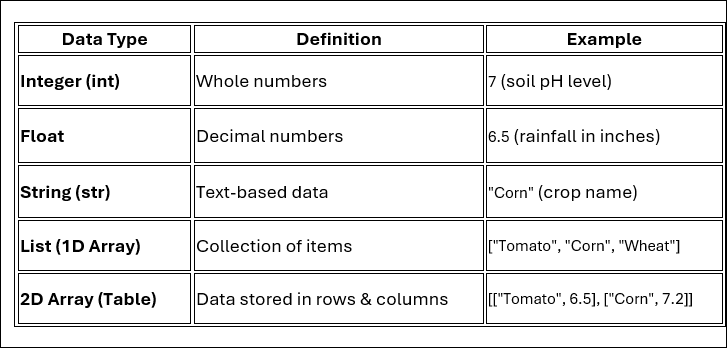

## Data Types in Python Programs

In this lesson, you will explore how Python stores and manages different types of data. You will learn about variables, data types (integers, floats, strings), lists, and 2D arrays and apply them to analyze real-world agricultural data from a CSV file.
________________________________________

### Understanding Data Types

Python uses different data types to store and process information efficiently.

1. Why is it important to store numbers as integers or floats instead of strings?

2. How is a list different from a 2D array?

________________________________________

### Working with Agricultural Data in Python

Python allows us to **store, analyze, and manipulate** agricultural data.

#### Example 1: Using Variables

crop = "Tomato"
soil_pH = 6.5
rainfall = 12.0

3. What type of data is stored in crop, soil_pH, and rainfall?

________________________________________

________________________________________
 

### Example 2: Creating a List

crops = ["Tomato", "Corn", "Wheat"]

4. How would you add "Rice" to this list?

### Example 3: Storing Data in a 2D Array

farm_data = [
    ["Tomato", 6.5, 12.0],
    ["Corn", 7.2, 10.5]
]

5. What information is stored in farm_data?

6. How would you add a new crop, "Wheat", with a soil pH of 6.8 and rainfall of 11.0?

### Using Python to Process CSV Data

Farmers often store data in spreadsheets (CSV files). Python can read and analyze this data.

#### Example 4: Reading a CSV File
import csv

with open("agriculture_data.csv", newline="") as csvfile:

  datareader = csv.reader(csvfile)

  for row in datareader:

  print(row)

5. **What does this code do?**

________________________________________

#### Example 5: Filtering Data

for row in datareader:

if float(row[1]) > 6.5:  # Soil pH greater than 6.5

print(row)

8. What is the purpose of this filtering condition?

### Final Reflection

9. How can Python help farmers analyze large amounts of agricultural data?

________________________________________

10. What is one real-world example where Python could be used in agriculture?
