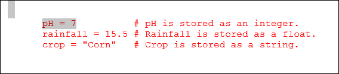
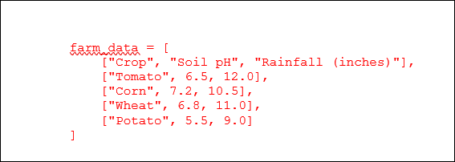
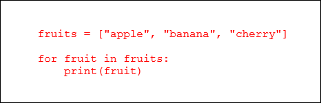
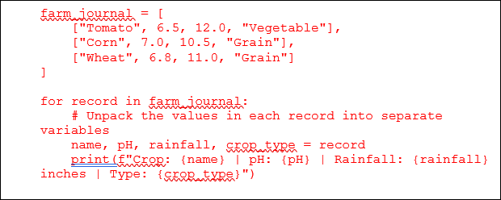
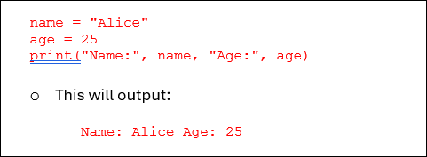

## L9 Lesson Plan: Data Types in Programs
### Lesson Description:
In this lesson, we are starting with the very basics of Python programming. We will learn about fundamental building blocks like variables, data types (integers, floats, strings), lists, and 2D arrays. Then, we will see how these ideas help us manage and analyze real-world agricultural data from a CSV file.

### Main Learning Goal:
Students will be able to learn basic Python programming to organize and analyze agricultural data using lists and arrays. This will equip them with the skills necessary to manage both small programs and larger data tasks effectively.

### Essential Question:

How can Python and different data types help store and analyze agricultural data efficiently?  

### Standards:

•	IAI.B3.1 Analyze the use of appropriate data types (e.g., lists, arrays, and 2D arrays) in simple programs.  

### Objectives:

- Learn fundamental Python programming concepts.  

- Understand basic data types and their role in storing and computing data.  

- See how lists and 2D arrays (tables) store structured data.  

- Work with CSV files to import, analyze, and store agricultural data.

- Discover how these Python data structures can support AI and help make decisions in agriculture.

### Total Duration: 1-0 minutes (2 days)

#### Important Vocabulary:

1.	Variable: 

    a.	Definition: A storage container for a value in Python.

    b.	Example: crop = "Tomato"

2.	Data Type:

    a.	Definition: The kind of data stored in a program (e.g., Integer, String, Float).

    b.	Example: Integer (5), String ("Corn"), Float (6.5)

3.	List (1D Array):

    a.	Definition: An ordered collection of items stored in Python. 

    b.	Example: ["Tomato", "Wheat", "Corn"]

4.	2D Array (Table):

    a.	Definition: A structured format where data is stored in rows & columns.

    b.	Example: [["Tomato", 6.5], ["Corn", 7.2]]

5.	Quantitative Data:

    a.	Definition: Measurable numerical data used for analysis.

    b.	Example: Soil pH, Rainfall (in inches).

6.	Qualitative Data:
    
    a.	Definition: Descriptive data that provides context but is not numerical.

    b.	Example: "Crop is healthy,” “Pest damage observed”.

7.	Primary Data:

    a.	Definition: Data collected firsthand for a specific purpose.

    b.	Example: Soil samples from a farm.

8.	Secondary Data:

    a.	Definition: Data collected by someone else but used for research. 

    b.	Example: Historical weather reports.

### Engage (Elicit/Develop) ~ 65 minutes

#### Activity #1: Introduction to Python & Data Types (~ 10 minutes)

**Activity Walkthrough:**

In this activity, students will explore how farmers track crop data using journals and spreadsheets. They’ll discuss data types and how programming organizes them. The teacher will explain coding as a recipe and introduce variables as "boxes" for different data types.

1. The teacher will begin with a class discussion.  

    a. Ask the class: Q1: How do farmers track and store information about their crops?

    **Possible Answers:** 

    - A handwritten journal with notes about soil, weather, and crop health.  

    - A spreadsheet that shows crop names, soil pH, and temperature.

    b. Use the Think-Pair-Share strategy to have students discuss the following.

    i.	Discuss what types of information we see (numbers, words, lists) and think about which information is easier for a computer to process. 

    - This discussion helps us see why programming is useful: it organizes data just like a farmer’s records.

2. The teacher will introduce key concepts before writing any code.

    a.	Describe what is happening behind the scenes in a computer program. Explain the following:

    i.	Coding as a recipe: 

    - Imagine coding is like writing a recipe. Every line of code is an instruction that the computer follows to get the final dish—or, in our case, to manage data. 

    ii.	Storing information: 

    - We store data in “boxes” called variables. Each box can only hold one type of data, and that’s where data types come in.

#### Activity #2: Anaconda and Jupyter Notebooks (~ 20 minutes)

**Activity Walkthrough:** 

In this activity, students will learn how Anaconda simplifies setup for Python programming and how Jupyter Notebooks allow them to write and run Python code. They will understand the difference between code and markdown cells and how to format text using titles, bold text, and lists.

1.	The teacher explains Q1: Why is learning Anaconda and Jupyter Notebooks important? Considering the following.

    a.	Anaconda:

    i.	Anaconda is a powerful Python distribution that comes bundled with many tools for data science and machine learning.

    ii.	It simplifies environment management and dependency installation, allowing you to focus on coding rather than setup issues.  

    b.	Jupyter Notebooks: 

    i.	Jupyter Notebooks provide an interactive way to write and run Python code.  

    ii.	They are especially beginner-friendly because you can write code in small chunks and see the results immediately.

    c.	Explain overall benefits: 

    i.	These tools help streamline your learning process by managing environments and dependencies seamlessly, so you can concentrate on learning and applying Python to real-world problems. 

    ii.	Provide this video Installing Jupyter Notebooks/Anaconda | Python for Beginners, which demonstrates how to download Anaconda, launch Jupyter Notebooks, and explore its layout. 

2. The teacher explains Q2: What are Jupyter Notebook cells?  

    a.	Definition: Jupyter Notebooks are built from cells, which are the individual blocks you use to create your notebook. 

    b.	Code cells: Use these cells to write and execute Python code. When you run a code cell, the code is sent to the kernel (the engine behind the notebook) and the output is displayed below the cell. 

    c.	Markdown cells: Use these cells to add formatted text, instructions, explanations, and even images. Markdown cells allow you to write documentation and notes alongside your code. 

3. Explain the switching between code and markdown cells. 

    a. Using the toolbar: 

    i. Click on a cell and then select "Code" or "Markdown" from the toolbar. 

    b.	Using keyboard shortcuts: 

    i.	Press **M** to change a cell to a Markdown cell.  

    ii.	Press **Y** to change a cell back to a Code cell. 

4. Let students explore the markdown formatting.

    a. Students will use a new cell, and try out these markdown features: 

    i. Add a Title:

 	 #Title

    ii.	Bold Text: 

    ** bold ** 

    iii. Ordered List: 
    1. First item   

    2. Second item 

    iv.	Run the cell with SHIFT + ENTER to see the formatted result.

#### Activity #3: Kernels: The Engine of Jupyter Notebooks (~ 15 minutes) 

**Activity Walkthrough:** 

In this activity, students will explore key Python concepts using Anaconda and Jupyter Notebooks. They will learn about kernels, restart the kernel, and understand variables, data types (integers, floats, strings), lists, and 2D arrays to organize data. The activity also covers Python syntax basics, including comments and indentation, helping students practice coding in an interactive environment.

1.	The teacher will explain the following.

    a. Q1: What is a Kernel?  

    A kernel is the computational engine that runs your code in a Jupyter Notebook. When you open a notebook, the kernel starts an interactive Python session. 

    b.	Restarting the Kernel. 

    If you need to clear all variables or reset your environment, you can restart the kernel: 

    i.	Using the Toolbar: Go to Kernel > Restart. 
    
    ii.	Using a Shortcut: Press ESC then 0 twice (0 + 0). 

    Restarting the kernel stops all running code and clears the memory, which can be useful when you want a fresh start without closing your notebook interface. 

2.	The teacher will give a detailed explanation of the following coding concepts.

    a. **Variables:**

    Think of a variable as a box with a label. Whatever you put in the box is stored for later use.

    i. Example Code:

      - crop = "Tomato"

        - Here, the box is named crop, and it holds the text "Tomato". Since it is text, we call it a string.

    b.	**Data Types:**

    Data types tell us what kind of information we are dealing with:

    i.	Integers: These are whole numbers (e.g., 7).

    ii.	Floats: These are numbers with decimals (e.g., 15.5).

    iii.	Strings: These are sequences of characters (e.g., "Corn").

    iv.	Example code:

    

    v.	What is happening here:

    - The equals sign (=) assigns the value on the right to the variable on the left.

    - We also use comments (starting with #) to explain what each line does. These comments are not read by Python—they are just for us!

    c.	 **Lists (1D Arrays):**

    i. **Q2: What is a list?**

    A list is like a row of boxes where each box can hold an item. The order matters, and we can access items by their position.

    ii.	Example code:

    `crops = ["Tomato", "Wheat", "Corn"]`

    iii. Understanding this code:

    - The square brackets `[ ]` tell Python that we are creating a list.

    - Items inside the list are separated by commas.

    - We can get the first crop by writing `crops[0]` (remember, counting starts at 0).

    d.	**2D Arrays (Lists of Lists)**

    i.	**Q3: What is a 2D Array?**

    Imagine a table or a spreadsheet where data is neatly arranged in rows and columns. A 2D array in Python is a way to represent this kind of structured data. It is a list that contains other lists, where each inner list represents one row of data.

    ii.	**Example code with a small dataset:**

    

    iii. **Breaking it down:**

    - **farm_data as a List of Lists:**

        - The variable farm_data is a list, and each element inside this list is itself another list. 

        - Think of farm_data as a table where every inner list corresponds to one row.

    - **Header row:**

        The first inner list `["Crop", "Soil pH", "Rainfall (inches)"]` serves as a header. It tells you what type of data is in each column:

        - Column 1: Crop names

        - Column 2: Soil pH values

        - Column 3: Rainfall amounts

    - **Data rows:**

      Each subsequent inner list contains data for one crop. For example:

    - The row `["Tomato", 6.5, 12.0]` represents:

        a.	Crop: Tomato

        b.	Soil pH: 6.5

        c.	Rainfall: 12.0 inches

    - Similarly, the rows for "Corn," "Wheat," and "Potato" include their respective pH values and rainfall measurements.

    - **Analogy with a spreadsheet:**

        Just like in a spreadsheet where each row shows related data (for example, a crop's name, its soil pH, and the amount of rainfall it receives), a 2D array organizes data into rows and columns. This format makes it easier to manage, access, and manipulate large sets of related data.

    iv. **Benefits of using 2D Array:**

    By organizing your data in a 2D array like this, you can easily perform operations such as iterating through rows to display information, calculating averages for numerical columns, or even sorting the data based on one of the fields. This approach is particularly useful when dealing with real-world data, such as agricultural datasets.

    e.	**Python Syntax Basics**

    i. **Comments:**

    Comments start with a # and help us understand the code.

    `# This is a comment. Python ignores this line.`

    ii.	**Indentation:**

    In Python, spaces at the beginning of a line show which code belongs together. For example, in loops or functions, everything indented is part of that block.

3. The teacher will explain the following points about Loops.

    a.	**Definition of Loops:**

    Loops in Python are like machines that perform the same set of actions over and over again—without you having to write the same code repeatedly. They let us automate repetitive tasks, which is especially useful when we work with lists or tables (2D arrays) of data.

    b.	**Q4: Why do we use loops?**

    Imagine you have a list of crops in your farm journal, and you want to print the details for each one. Instead of writing a separate print statement for each crop, you can use a loop to go through every item automatically. This not only saves time but also makes your code cleaner and easier to manage.

    c.	**The basics of the For Loop.**

    Here is a simple example of a for loop that goes through a list of fruits and prints each one:

    

    d. **What is happening here?**

    i. **List creation:**

    - The list fruits contains three items: `"apple", "banana", and "cherry"`.

    ii.	**Looping through the list:** 

    The line `for fruit in fruits:` tells Python to take each item from the `fruits` list one at a time. The variable `fruit` temporarily holds the current item.

    iii. **Action inside the loop:**

    The indented line `print(fruit)` is executed for each item in the list, so it prints out each fruit one by one.

    e. **Applying Loops to the Farm Journal.**

    Let’s say your farm journal is stored as a 2D array, where each inner list holds data about a crop:

    

    f.	**Breaking it down:**

    - The 2D array:

        `farm_journal` is a list where each element (row) is itself a list containing data for one crop.

    - The loop:

        The loop `for record in farm_journal:` goes through each row in the journal.

    - Unpacking:

        The line `name, pH, rainfall, crop_type = record` assigns each part of the record to a variable, making it easier to work with the data.

    - Printing:

        The formatted print statement displays each crop’s details in a clear, organized way.

4. The teacher will explain the **print() Function** in Python.

    a.	Definition:

    The `print()` function is one of the most commonly used functions in Python. Its primary purpose is to display information to the console, which helps you see the output of your code or debug your programs.

    b. Key points about `print():`

    - **Displaying output:**

        When you use `print()`, Python sends the information you provide to the screen (or console). This is essential for showing results, messages, or debugging information.

    - **Syntax:**

        You simply write `print()` followed by the value or values you want to display inside the parentheses. For example:

        `print("Hello, world!")`

    - This code will display:

        `Hello, world!`
    

    - **Printing multiple values:**

        You can print more than one item by separating them with commas. Python will automatically insert spaces between the items:

        

      
