## Lesson 9: Data Types in Programs
### Lesson Description:
In this lesson, we are starting with the very basics of Python programming. We will learn about fundamental building blocks like variables, data types (integers, floats, strings), lists, and 2D arrays. Then, we will see how these ideas help us manage and analyze real-world agricultural data from a CSV file.

### Main Learning Goal:
Students will be able to learn basic Python programming to organize and analyze agricultural data using lists and arrays. This will equip them with the skills necessary to manage both small programs and larger data tasks effectively.

### Essential Question:
How can Python and different data types help store and analyze agricultural data efficiently? 

### Standards:
•	IAI.B3.1 Analyze the use of appropriate data types (e.g., lists, arrays, and 2D arrays) in simple programs.  

### Objectives:

•	Learn fundamental Python programming concepts. 

•	Understand basic data types and their role in storing and computing data. 

•	See how lists and 2D arrays (tables) store structured data. 

•	Work with CSV files to import, analyze, and store agricultural data. 

•	Discover how these Python data structures can support AI and help make decisions in agriculture.

### Working with Agricultural Data in Python

#### Importing & Mapping a CSV File in Python

We will work with a CSV file named **SREB_U3_L9_Agriculture_Data.csv** that contains 20 rows of data, like this:

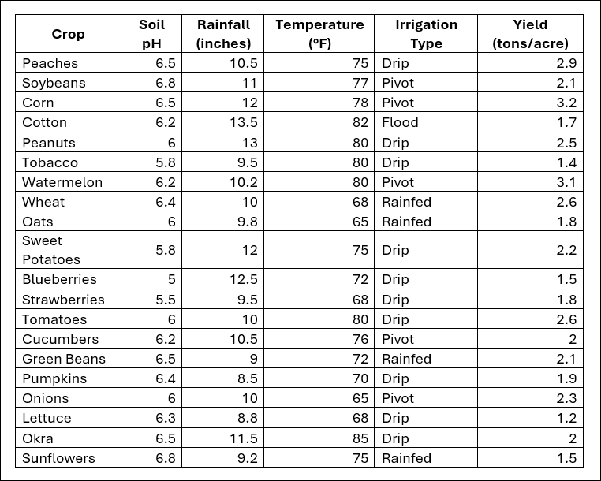

Each row represents a different crop, including:

- Crop: Name of the crop (string)
- Soil pH: Soil acidity or alkalinity (float)
- Rainfall (inches): Annual rainfall in inches (float)
- Temperature (°F): Average temperature in Fahrenheit (integer)
- Irrigation Type: Method of watering the crop (string)
- Yield (tons/acre): Crop yield in tons per acre (float)

### Step 1: Loading the CSV File 

Goal: Open the CSV file and see each row to understand the raw data.

a.	Code example: 

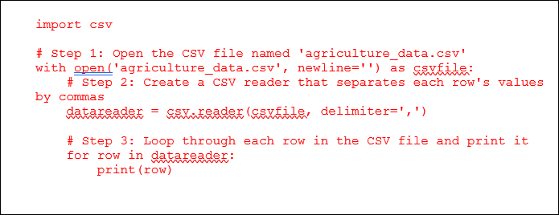

1.	**Detailed explanation:**

    a.	`import csv`

    i.	We load the CSV module, which provides tools to work with CSV files.

    b.	`with open('agriculture_data.csv', newline='')` as `csvfile`:

    i.	This opens the file. The with statement ensures it is automatically closed when we are done.

    ii.	`newline=''` ensures that the line breaks are handled correctly.

    c.	`datareader = csv.reader(csvfile, delimiter=',')`

    i.	This creates an object that reads each line, splitting values by commas.

    d.	`for row in datareader:`

    i.	We loop through every row in the file. Each row is a list of values.

    e.	`print(row)`

    i.	We print each row so you can see exactly how the data is structured in Python lists.

2.	**Exercise:**

a. Run this code. Notice that the first row printed is the header (column names), and the subsequent rows are the actual data.

#### Step 2: Mapping CSV Data to Python Data Types 

Goal: Convert the text values from the CSV into the correct Python data types (floats, integers, and strings).

a.	Code example: 

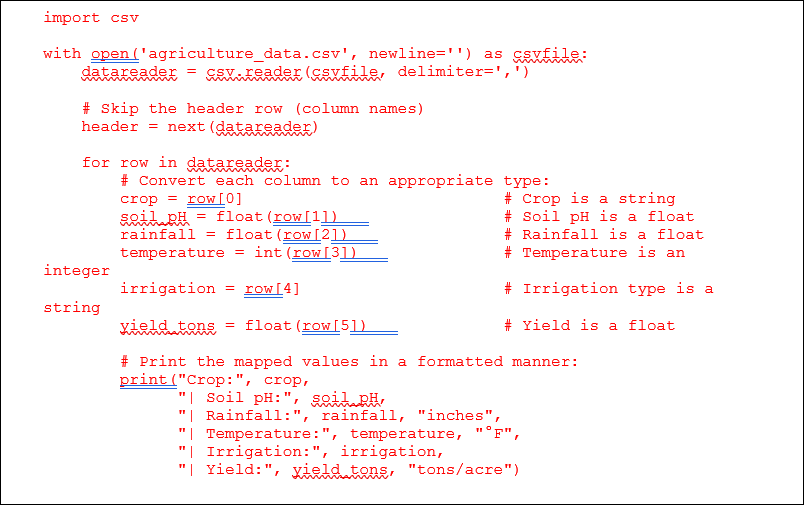

1.	**Detailed explanation:**

    a.	`header = next(datareader)`

    i.	Reads the first row, which contains the headers, and moves past it so our loop processes only the data rows.

    b. **Mapping each column:**

    i.	`crop = row[0]:` The first element is the crop name, which remains a string.

    ii.	`soil_pH = float(row[1]):` The second element is the soil pH, converted to a float so we can do numerical comparisons.

    iii. `rainfall = float(row[2]):` The third element is rainfall in inches, also a float.

    iv. `temperature = int(row[3]):` The fourth element is the temperature in °F, which we convert to an integer.

    v. `irrigation = row[4]:` The fifth element is the irrigation type, which remains text.

    vi.	`yield_tons = float(row[5]):` The sixth element is yield in tons/acre, a float for numerical operations.

    c. **Formatted print:**

    i. We use `print()` to verify that each value is properly converted. Notice how we label each piece of data for clarity.

2.	**Exercise:**

a. Add a condition to only print crops that use a specific irrigation type, like `“Drip”`:

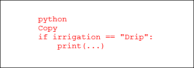

### Step 3: Filtering & Sorting Data 

Goal: Use conditions to display only certain records, such as crops with a soil pH greater than 6.5 or rainfall above 10 inches.

a.	Code example: 

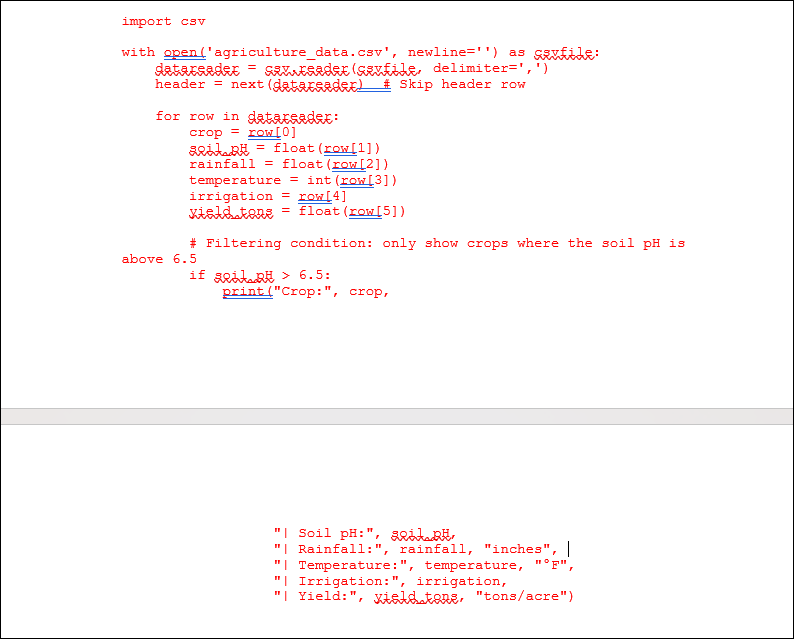

1. **Detailed explanation:**

    a. Filtering with if statements:

    i.	The line `if soil_pH > 6.5`: ensures that only rows meeting that condition are printed.

    ii.	You could also filter by rainfall (e.g., `rainfall > 10`) or by irrigation type (`irrigation == "Pivot"`).

    b.	**Selective output:**

     i. This helps you focus on crops that match certain criteria, such as a higher soil pH, more rainfall, or a specific irrigation method.

2. **Exercise:**

a.	Combine multiple conditions. For example, only print crops that have a soil pH above 6.5 and use `“Drip”` irrigation:

`if soil_pH > 6.5 and irrigation == "Drip":`

`print(...)`
 
### Step 4: Sorting the Data

Goal: Sort the dataset based on a specific column—for example, arranging the crops in order of increasing rainfall. This will help you see the data in an organized order.

a.	Code example:

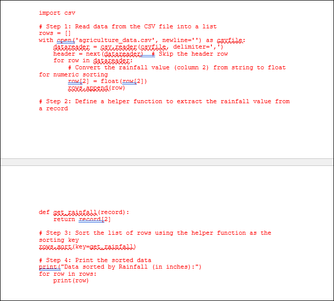

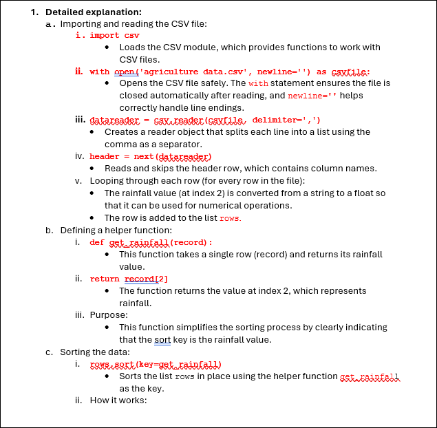

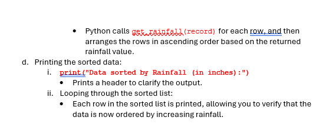

### Filter and Sort "Drip" Irrigation Crops by Yield

#### Objective:

Using our agricultural dataset, your task is to:

•	Filter: Select only the rows where the "Irrigation Type" is .

•	Sort: Order these filtered rows in descending order based on the "Yield (tons/acre)".

•	Display: Print out the crop name and its yield.
 
1.	**Building Block 1: Reading and Converting the Data**

    a.	**Instructions:**

    i.	Open the CSV file.

    ii.	Convert the yield column to a float (so you can sort numerically).

    iii.	Append each row to a list.

    b.	**Hint:**

    i.	Use the csv module and remember to skip the header row.

    c.	**Example starter code:**

    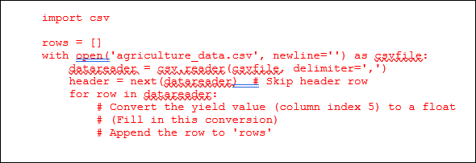

2.	**Building Block 2: Filtering for "Drip" Irrigation**

    a.	Instructions:

    i.	Create a new list that includes only rows where the irrigation type (column index 4) equals `"Drip"`.

    b.	Hint:

    i.	Loop through your rows list and use an if statement to check the irrigation type.

    c.	Example:

    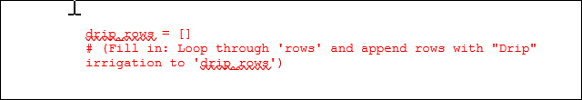

3.	**Building Block 3: Sorting by Yield (Descending)**

    a.	**Instructions:**

    i.	Sort the `drip_rows` list so that the crop with the highest yield comes first.
ii.	Define a helper function that returns the yield (column index 5) from a record.

    b.	**Hint:**

    i.	Use the `sort()` method with the helper function as the key and `reverse=True`.

    c.	Example:

    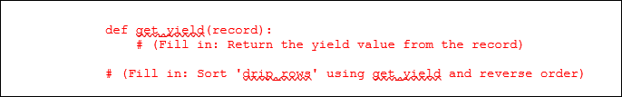

4.	**Building Block 4: Displaying the Results**

    a.	**Instructions:**

    i. Loop through your sorted list and print the crop name (column index 0) and yield (column index 5).

    b. **Hint:**

    i.	Format your output for clarity.

    c.	Example:

    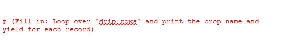    

### Summary of Hints:

1.	Reading the CSV:

- Use the `csv` module.
- Convert yield (column 5) to a float.

2.	Filtering:
- Use an `if` statement to check if `row[4]` is `"Drip"`.

3.	Sorting:
- Define a helper function to return yield from a row.
- Sort with `reverse=True` to get descending order.

4.	Printing:
- Loop through your final list and display the crop name and yield.

Complete the missing parts and run your code. This activity will test your ability to apply filtering and sorting techniques using the concepts we covered. Enjoy coding and exploring the data!

After running your code. Please, complete the lesson **SREB_U3_L9_Handout**.  

