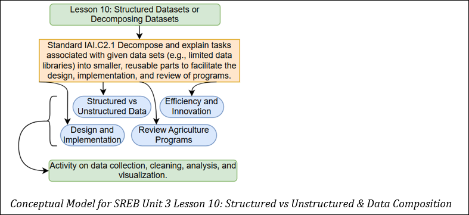

## Lesson 10: Structured vs Unstructured Data & Data Decomposition Teacher Page
### Module Name: Structured vs Unstrcutured Data & Data Decomposition
#### Conceptual Model:

### Standards:

- IAI.C2.1 Decompose and explain tasks associated with given data sets (e.g., limited data libraries) into smaller, reusable parts to facilitate the design, implementation, and review of programs. 

### Objectives:

- Students will be able to describe the differences between structured and unstructured data  

- Students will understand the importance of both structured and unstructured data in improving efficiency and innovation in agriculture  

- Students will analyze how data influences the design, implementation, and review of agricultural programs
Storyline

In this lesson, students will explore structured vs. unstructured data, their roles in agriculture, and how they are processed into valuable insights. They will also examine how data influences the design, implementation, and review of agricultural programs, driving smarter strategies and more efficient resource management.    

### Main Learning Goal
Students will break down the tasks associated with working with data in agriculture and the impact it has on design, implementation and review of programs.    

### Focus Question
How can various types of data be processed and transformed into valuable insights, and how do they influence the design, implementation, and evaluation of agricultural programs?    

### Tables
