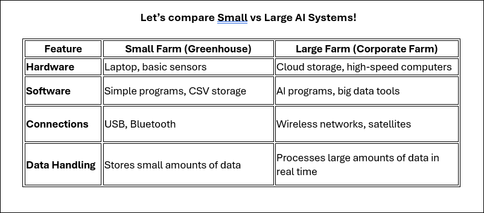

## Hardware and Software for AI in Agriculture
AI is helping farmers make better decisions by using computers, sensors, and data analysis. A small farm might use simple tools like a laptop and basic sensors, while a large farm needs more advanced systems like cloud storage, powerful computers, and satellite data. In this lesson, you will compare the hardware and software needed for different types of farms and understand when simple technology is enough and when more advanced systems are required.
________________________________________

### Small-Scale AI Systems (For Small Farms or Greenhouses)

Farmers with small farms or greenhouses can use AI without expensive equipment. A basic AI system for a greenhouse may include:

•	A laptop (to store and analyze data)

•	Soil moisture and temperature sensors (to check water levels and temperature)

•	Basic connections (USB or Bluetooth to send data to the laptop)

•	Python programs (to save and process data in a simple spreadsheet format like CSV)

### Key Idea: Small farms use simple, low-cost tools to collect and store data.

However, this setup has limits. A laptop and a few sensors are not enough for large farms that need to track data across many fields.

1.	What are two examples of hardware used in a small-scale AI farm system?

2.	Why is a laptop good enough for a small farm but not for a large farm?

3.	How does using sensors help a small farmer make better decisions?

### Large-Scale AI Systems in Agriculture

Big farms cover many acres, so farmers need more advanced AI systems to manage everything. These farms use:

-	Cloud storage (to store huge amounts of data from sensors and satellites)

-	High-speed computers with powerful processors (GPUs) (to quickly analyze large sets of farm data)

-	Wireless networks (to connect thousands of sensors and drones)

-	AI programs (to track weather, predict crop growth, and manage watering systems automatically)

### Key Idea: Big farms need faster computers, more storage, and better networks to handle large amounts of data.

1.	Why do big farms store data in the cloud instead of on a laptop?

2.  How do wireless sensors and satellite images help big farms monitor their crops?

3.	Why do large farms need powerful computers to process their data?

#### Let’s compare Small vs Large AI Systems!

1.	What are two big differences between AI systems in small farms and large farms?

2.	How does the amount of data collected affect the type of AI system a farm needs?

#### Real-World Scenario: Tackling Crop Yield Decline on a Large-Scale Farm in South Carolina with Azure

AI can improve farming, but it also comes with challenges:

- High costs (big farms need expensive equipment)
- Technical skills needed (farmers must learn how to use AI tools)
- Internet access (some farms don’t have fast internet for cloud-based AI)

1.	What is one problem a farmer might face when trying to use AI?

2.	Why might small farms hesitate to invest in AI even if it could help them?

### Final Reflection

1.	How does AI-powered hardware and software help farmers make better decisions?

2.	If you were advising a farmer, how would you help them choose between a small-scale or large-scale AI system?
