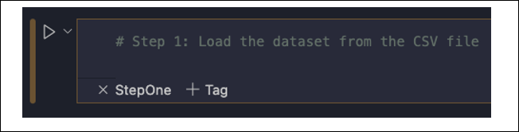

## L11 Lesson Plan: Hardware and Software for AI in Agriculture
### Lesson Description:
In this lesson, students will explore how AI systems are packaged and scaled for agriculture. They will learn that a small-scale AI project—such as a sensor-based system running on a laptop—requires a minimal hardware/software footprint, while large-scale corporate AI solutions demand robust infrastructure, including data centers, GPUs, satellite data, and advanced cloud platforms. This lesson sets the stage by comparing the two approaches, preparing students to appreciate the spectrum of solutions and the challenges of scaling up.

### Main Learning Goal:
Students will understand the differences in hardware and software requirements for small-scale versus large-scale AI solutions in agriculture and learn when each type of system is appropriate.

### Essential Question:
How do hardware and software requirements change when scaling an AI solution from a small project to a large corporate farm?

### Standards:

•	IAI.A1.1: Identify and relate how hardware and software are used within given AI solutions. 

### Objectives:

•	Explain the components required for a small-scale AI project (e.g., a laptop, basic sensors, Bluetooth, Python environment).  

•	Identify additional hardware/software needs for large-scale corporate AI solutions (e.g., data centers, GPUs, satellite data, enterprise cloud platforms).  

•	Compare and contrast the requirements of small-scale and large-scale systems.    

•	Discuss when a minimal hardware/software footprint is sufficient and when more robust infrastructure is needed.

### Total Duration: 110 minutes (2 days)

#### Important Vocabulary:

1.	Hardware Footprint:

    a.	Definition: The physical components required to run a system.

    b.	Example: Laptop, sensors, CPU

2.	Software Footprint

    a.	Definition: The software resources required to run a system.

    b.	Example: Python, cloud licenses

3.	Scalability: 

    a.	Definition: The ability of a system to handle increased demands (data volume, processing power).

    b.	Example: Small project vs. data center

4.	Data Center:

    a.	Definition: A facility that houses computer systems and related components for large-scale processing.

    b.	Example: Corporate farm server clusters

5.	GPU:

    a.	Definition: Graphics Processing Unit, used to accelerate AI computations.

    b.	Example: NVIDIA Tesla GPUs

### Engage (Elicit/Develop) ~ 5 minutes
#### Activity Name: Day One - Small-Scale AI Systems in Agriculture (~5 minutes)

Activity Walkthrough: 

1.	The teacher will facilitate a classroom discussion.

    a.	**Q1: What hardware and software components would you need for a small-scale AI project on a laptop?**

    Mention that we’d want an affordable laptop or PC to store and analyze data, soil moisture and temperature sensors to collect data, and a Python programming environment to read and process this data.  

2.	The teacher may then explain what would be needed to scale up the same system for hundreds of greenhouses, or a large corporate farm. 

    a.	These farms use:   

    i.	Cloud storage (to store huge amounts of data from sensors and satellites) 

    ii.	High-speed computers with powerful processors (GPUs) (to quickly analyze large sets of farm data) 

    iii.	Wireless networks (to connect thousands of sensors and drones)  '

    iv.	AI programs (to track weather, predict crop growth, and manage watering systems automatically)

3.	The teacher will instruct students to answer the following questions in SREB_U3_L11_Handout_HardwareandSoftware:

    a.	**Q1: What are two examples of hardware used in a small-scale AI farm system?**

    A laptop, environmental sensors, USB and/or Bluetooth connections.

    b.	**Q2: Why is a laptop good enough for a small farm but not for a large farm?**

    A laptop can handle a small amount of data from a few sensors on a small farm, but a large farm generates too much data for a laptop to process quickly or store effectively.

    c. **Q3: How does using sensors help a small farmer make better decisions?**

    Sensors provide real-time data about soil, weather, and plant health, allowing farmers to water, fertilize, or protect crops more efficiently based on actual conditions.

### Explore (Develop/Deploy) ~ 40 minutes 
#### Activity Name: Day One - Small Scale Farm in South Carolina (~ 40 minutes)

**Activity Walkthrough:** 

1.	The teacher will introduce the scenario to students and explain the given dataset, **SREB_U3_L11_SmallFarmData**.

    a.	“Imagine a family-run farm in South Carolina that grows a variety of crops such as peaches, tomatoes, and green beans. The farmers want to use AI to optimize irrigation, monitor soil conditions, and improve crop yields. With the set-up previously described, they plan to use a basic setup—a laptop, a few sensors, and simple Python scripts—to analyze their data.”

    b. **Each row provides information about:**  

    i.	Farm_ID: A unique identifier for each plot.  

    ii.	Crop: The type of crop grown (e.g., Peaches, Tomatoes, Green Beans).  

    iii.	Soil_pH: The acidity or alkalinity of the soil, which affects crop growth.  

    iv.	Rainfall (inches): The amount of rainfall received.  

    v.	Temperature (°F): The average temperature in the plot.  

    vi.	Irrigation Type: The method used for watering (e.g., Drip, Pivot, Rainfed).  

    vii. Yield (tons/acre): Crop yield, an indicator of productivity.  

    viii. Fertilizer Used: Whether fertilizer was applied (Yes/No).
    
2.	The teacher will then instruct students to open the Python notebook **SREB_U3_L11_Notebook**.

    a.	The completed version for teacher guidance is named **SREB_U3_L11_Notebook_Completed**.

    b.	Before continuing, ensure students understand that they need to write their code in the tagged code blocks and press play afterwards, as seen in figure 1 below. 

    

    c.	Students will also need to have downloaded the CSV file on the same folder that the notebook is running from.  

3.	The teacher will guide students through Step 1 and Step 2 of the coding analysis. 

    a.	**Step 1: Loading**

    i.	The main detail to get across is that we are using the python module csv to help us get information from the dataset. We open the file, skip the header, and then store each row in our variable ‘data’. ‘Data’ can be thought of as a list of lists.  

    b.	**Step 2: Cleaning** 

    i.	The main detail to get across is that our data is stored initially as text (otherwise called strings) unless we tell the program otherwise. For example, in Excel, we would simply change the data type to “Number”. This step is essentially doing the same for the given columns. Students should understand that we cannot do math operations on this data unless we mark it as a number.

    
    c.	Resource: RealPython: [Reading and Writing CSV Files in Python](https://realpython.com/python-csv/)
    
4.	The teacher will continue to guide students through steps 3 and 4.

    a.	**Step 3: Calculating Average** 

    i.	The main detail to get across is the ease of average calculation using list comprehension and the sum function. We then print these values out, which students will see once they run this code. 

    ii.	Resource: [W3 Schools: Python - List Comprehension](https://www.w3schools.com/python/python_lists_comprehension.asp)

    b.	**Step 4: Warning Statements** 

    i.	The main detail to get across is the concept of conditional logic (i.e., if this statement is true, then do this action). We use conditional logic to check if the soil pH is too low, or if the rainfall is too high, and if either is true, we will print out statements with a small warning message. Students will also see these statements once they run the code block.

### Explain (Refine) ~ 5 minutes
#### Activity Name: Day One - Wrap-Up Discussion (~5 minutes)

**Activity Walkthrough:** 

1.	The teacher will facilitate a classroom discussion with the following questions:

    a.	**Q1: How did processing this dataset help you understand the needs of a small-scale AI project in agriculture?** 

    Responses may vary by student, but they can highlight the differences in needs for small scale and large-scale projects.

    b.	**Q2: How does using CSV files and Python libraries help keep the system efficient?**

    Responses may vary by student, but they may mention how Python libraries allow them to do data analysis with just a few lines of code.

### Engage (Elicit/Develop) ~ 25 minutes
#### Activity Name: Day Two - Large-Scale AI Systems in Agriculture (~5 minutes)

**Activity Walkthrough:**

1.	The teacher will facilitate a classroom discussion.

    **a.	Q1: What additional resources do you think a large corporate farm need compared to a small greenhouse project? Why?**

    Large farms need more powerful tools like **data centers, high-speed internet, drones, and advanced AI software** because they collect and process much more data than a small greenhouse. 

### Activity #2 Name: Day Two - Large-Scale Corporate Farm Infrastructure Needs (~20 minutes)

**Activity Walkthrough:**

1. The teacher will introduce the large-scale corporate farm hypothetical and discuss its hardware and software components.

    a. **Hardware Components:**

    i. Data Centers or Cloud Services

    - Key Idea: Large farms generate massive amounts of data, so they need powerful systems—on-site or in the cloud—to store and manage it.

    ii.	High-Performance Servers and GPUs

    - Key Idea: Servers and GPUs work together to process large data sets quickly, allowing AI tools to analyze sensor and drone data in real time.

    iii. Advanced Networking and Connectivity

    - Key Idea: Fast and reliable internet connects all devices across the farm, enabling immediate data transfer/quick decision-making.

    iv.	Satellite Imagery and Drone Integration

    - Key Idea: Aerial technology provides a wide view of crop health and growth patterns, supplementing data from ground sensors.

    b. **Software Components:**

    i.	Enterprise Cloud Platforms and Data Storage

    - Key Idea: Cloud platforms give the farm scalable space and tools to store, organize, and process huge volumes of data securely.

    ii.	Advanced AI Frameworks

    - Key Idea: AI frameworks help build smart systems that use data to make accurate predictions—like identifying crop issues early.

    iii. Data Visualization and Analytics Tools

    - Key Idea: These tools turn complex data into charts and maps, helping farmers quickly understand conditions and take action.

2.	The teacher will instruct students to answer the following questions in **SREB_U3_L11_Handout_HardwareandSoftware.docx**:

    a.	Q1: Why do big farms store data in the cloud instead of on a laptop? 

    Big farms use the cloud because it can store and manage much more data than a laptop can.

    b.	Q2: How do wireless sensors and satellite images help big farms monitor their crops? 

    Wireless sensors and satellite images give real-time updates on crop conditions across large areas.

    c.	Q3: Why do large farms need powerful computers to process their data?

    Large farms need powerful computers to quickly process huge amounts of sensor and image data for decision-making.

3.	The teacher will show the Small vs Large AI Systems comparison table to the students and instruct them to answer the following questions in **SREB_U3_L11_Handout_HardwareandSoftware.docx**:

    a.	Q1: What are two big differences between AI systems in small farms and large farms? 

    Large farms use more sensors and advanced tools like drones and cloud storage. Small farms use simpler tools like a laptop and a few sensors.

    b.	Q2: How does the amount of data collected affect the type of AI system a farm needs?

    More data means the farm needs more powerful AI systems with strong storage, fast processing, and advanced software to handle it all.

### Explore (Develop/Deploy) ~ 30 minutes 

#### Activity Name: Day Two - Real-World Scenario: Tackling Crop Yield Decline on a Large-Scale Farm in South Carolina with Azure (~ 30 minutes)

**Activity Walkthrough:**

1.	The teacher will now walk students through the real-world scenario for GreenFields farm’s AI system in Azure.

    a.	**Phase 1: Data Collection**

    i.	Key Idea: Use thousands of sensors, drones, and satellites to collect real-time data on soil, weather, and crop health.

    b.	**Phase 2: Data Transmission and Storage Using Azure**

    i.	Key Idea: Send all data to Microsoft Azure’s cloud servers using fast internet, where it's securely stored and scaled as needed.

    c.	**Phase 3: Data Processing and Analysis with Azure Services**

    i.	Key Idea: Use Azure’s powerful AI tools to process big data, detect problems, and generate smart recommendations for the farm.

    d.	**Phase 4: Decision Making and Real-Time Action with Azure Dashboards**

    i.	Key Idea: AI results are shown in live dashboards, and automated systems like irrigation respond instantly to field conditions.

    e.	**Phase 5: Cost, Maintenance, and Long-Term Impact**

    i.	Key Idea: While there are upfront and ongoing costs, the AI system boosts efficiency and yields—paying off in the long run.

2.	After running through the phases, the teacher will instruct students to answer the following questions in SREB_U3_L11_Handout_HardwareandSoftware.docx:

    a.	**Q1: What is one problem a farmer might face when trying to use AI?**

    Setting up AI systems can be complex and require technical skills or outside help (which increases labor costs).

    b.	**Q2: Why might small farms hesitate to invest in AI even if it could help them?**

    The upfront cost and equipment needed might be too expensive for smaller budgets.

### Explain (Refine) ~ 5 minutes

#### Activity Name: Day Two - Final Reflection (~5 minutes)

**Activity Walkthrough:**

1.	The teacher will instruct students to discuss the following questions with their neighbors and answer them in SREB_U3_L11_Handout_HardwareandSoftware.docx:

    a.	**Q1: How does AI-powered hardware and software help farmers make better decisions?** 

    It collects and analyzes real-time data to give accurate advice on watering, pest control, and planting – all of which save time, money, and resources.

    b.	**Q2: If you were advising a farmer, how would you help them choose between a small-scale or large-scale AI system?**

    Students may mention looking at a farm’s size, budget, and goals

