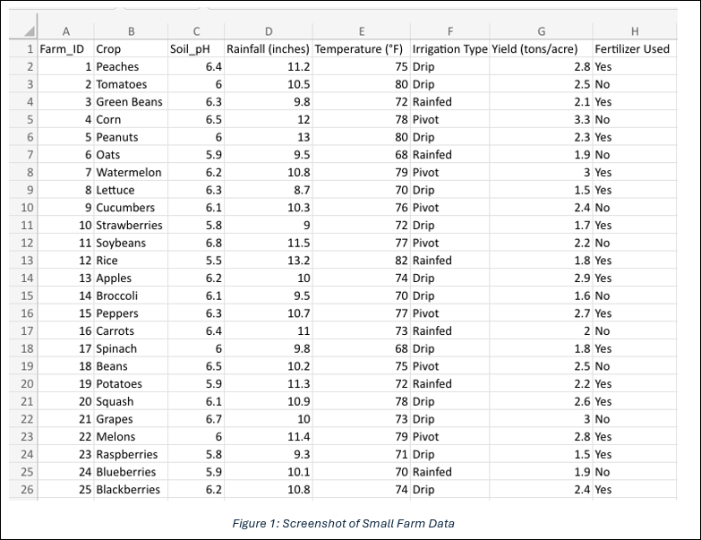
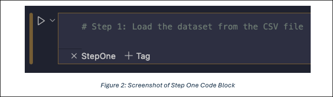
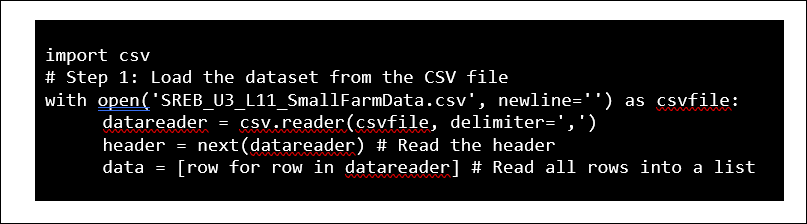
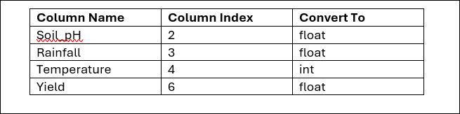
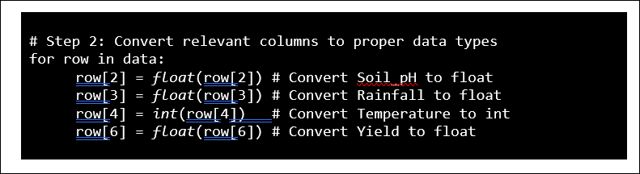
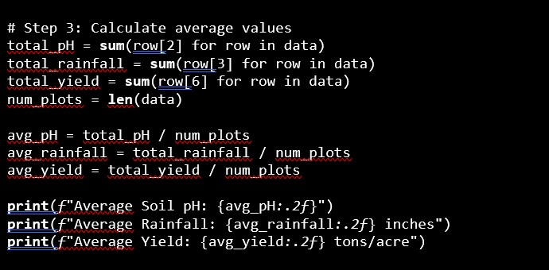
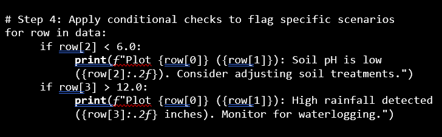
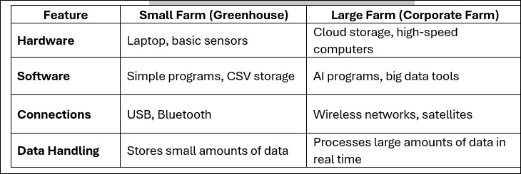

## Lesson 11: Hardware and Software for AI in Agriculture
### Lesson Description:
In this lesson, students will explore how AI systems are packaged and scaled for agriculture. They will learn that a small-scale AI project—such as a sensor-based system running on a laptop—requires a minimal hardware/software footprint, while large-scale corporate AI solutions demand robust infrastructure, including data centers, GPUs, satellite data, and advanced cloud platforms. This lesson sets the stage by comparing the two approaches, preparing students to appreciate the spectrum of solutions and the challenges of scaling up.

### Main Learning Goal:
Students will understand the differences in hardware and software requirements for small-scale versus large-scale AI solutions in agriculture and learn when each type of system is appropriate.

### Essential Question:
How do hardware and software requirements change when scaling an AI solution from a small project to a large corporate farm?

### Standards:
•	IAI.A1.1: Identify and relate how hardware and software are used within given AI solutions.

### Objectives:

•	Explain the components required for a small-scale AI project (e.g., a laptop, basic sensors, Bluetooth, Python environment). 

•	Identify additional hardware/software needs for large-scale corporate AI solutions (e.g., data centers, GPUs, satellite data, enterprise cloud platforms).

•	Compare and contrast the requirements of small-scale and large-scale systems. 

•	Discuss when a minimal hardware/software footprint is sufficient and when more robust infrastructure is needed.

### Small-Scale AI Systems in Agriculture
Imagine you have a small greenhouse where you want to monitor your plants’ health by measuring temperature and soil moisture. In a small-scale AI project, we design our system to use only the essential, minimal resources. This not only makes it affordable but also easy to build and manage.

Discuss the following question with your class:

**What hardware and software components would you need for a small-scale AI project on a laptop?**

Farmers with small farms or greenhouses can use AI without expensive equipment. A basic AI system for a greenhouse may include: 

- A laptop (to store and analyze data)
- Soil moisture and temperature sensors (to check water levels and temperature) 
- Basic connections (USB or Bluetooth to send data to the laptop) 
- Python programs (to save and process data in a simple spreadsheet format like CSV)

This minimal setup—using a basic laptop and a few sensors—is ideal for a single greenhouse. For example, a local farmer might monitor one greenhouse with this system, collecting data that is processed with a Python script to decide if watering or temperature adjustments are needed.

However, if you scale up to monitor hundreds of greenhouses, the same laptop will struggle. Larger operations require:

- Advanced Hardware: Data centers or high-performance servers, more RAM (e.g., 64GB or more), multiple CPUs, and GPUs (such as NVIDIA Tesla cards) to process massive datasets. 
- Enhanced Software: Enterprise-level cloud platforms, big data analytics tools, and advanced AI frameworks to handle real-time, high-volume processing.

Answer the following questions in **SREB_U3_L11_Handout_HardwareandSoftware.docx**:

1.	**What are two examples of hardware used in a small-scale AI farm system?**

2.	**Why is a laptop good enough for a small farm but not for a large farm?**

3.	**How does using sensors help a small farmer make better decisions?**

### Small Scale Farm in South Carolina

Imagine a family-run farm in South Carolina that grows a variety of crops such as peaches, tomatoes, and green beans. The farmers want to use AI to optimize irrigation, monitor soil conditions, and improve crop yields. With the set-up previously described, they plan to use a basic setup—a laptop, a few sensors, and simple Python scripts—to analyze their data. 

This farm has already collected data for us to use which we can see in Figure 1 below. You can also find this dataset in **SREB_U3_L11_SmallFarmData**.

The dataset contains 25 rows of data representing different farm plots on the small farm. Each row provides information about: 

•	**Farm_ID:** A unique identifier for each plot. 

•	**Crop:** The type of crop grown (e.g., Peaches, Tomatoes, Green Beans). 

•	**Soil_pH:** The acidity or alkalinity of the soil, which affects crop growth. 

•	R**ainfall (inches):** The amount of rainfall received. 

•	**Temperature (°F):** The average temperature in the plot. 

•	**Irrigation Type:** The method used for watering (e.g., Drip, Pivot, Rainfed). 

•	**Yield (tons/acre):** Crop yield, an indicator of productivity. 

•	**Fertilizer Used:** Whether fertilizer was applied (Yes/No).

Let’s dive into the data analysis to help this farm! We’ll be loading in the CSV dataset, processing and cleaning it, calculating and printing averages, and using conditional logic to flag issues such as low soil pH or high rainfall.  

Open the Python notebook **SREB_U3_L11_Notebook** to follow along. 

Before we continue, note that each step’s code block will be written in the code block for that step. Once you are done writing out the code, make sure to press the play button so that it actually runs. You can see an example of these in Figure 2 below.

#### Step 1: Loading the Dataset from the CSV File

In this step, we import the csv module and load the dataset from **SREB_U3_L11_SmallFarmData.csv**. The dataset's first row contains headers, which we read and skip, and then we load the remaining rows into a list called data. 

In the code cell marked **StepOne,** type the following code:

Stepping through the code block, we can interpret the following steps happening:

- import csv loads Python's built-in CSV functions.

- with open(..., newline='') as csvfile: opens the CSV file safely.

- csv.reader(csvfile, delimiter=',') reads the file, splitting the data by commas.

- header = next(datareader) reads and skips the header row.

- A list comprehension is used to store all rows into the list data.

Think of data like a list holding a bunch of mini-lists inside it — one for each row of the file (but not the header row, since we skipped that with header = next(datareader)).

#### Step 2: Converting Relevant Columns to Proper Data Types

When we read a CSV file, everything comes in as a string – even numbers. Strings are treated like text – for example “6.5” and “75”. But if we want to do math, we can’t use strings, we need actual numbers!

So, in this step, we will convert the data in our list from strings to the proper data types. The following table shows what we will be converting:

Translating this into code, we’ll have our script go through each row in the data list and update the values at the specified positions.

In the code cell marked **StepTwo**, type the following code:

#### Step 3: Calculating Average Values

Now that we’ve made sure our numbers are actual numbers, we can do some math on them! We want to figure out the average of the soil pH, rainfall, and yield. 

In the code cell marked **StepThree**, type the following code

To do this, we first compute the total values for each of these variables by looping through the data list. These totals are stored under the variables: total_pH, total_rainfall, and total_yield. 

Next, we determine how many rows (or farm plots) are in the dataset using len(data), which counts the number of entries. Once we have both the total and the count, we calculate the average for each variable by dividing the total by the number of plots.

Finally, we print the results, rounding them to two decimal places for clarity. 

#### Step 4: Applying Conditional Checks

In this step, we will use conditional logic to flag specific scenarios for the farmers.

In the code cell marked **StepFour**, type the following code:

First, we loop through each row in the dataset and check:

a.	If the soil pH for a plot is below 6.0. This could suggest that the soil is too acidic and print a warning statement.

b.	If the recorded rainfall for a plot exceeds 12.0 inches. This could lead to waterlogging, so we print another warning statement.

#### Small Scale Farm Wrap-Up Discussion

Discuss the following questions with your class:

- **How did processing this dataset help you understand the needs of a small-scale AI project in agriculture?**

- **How does using CSV files and Python libraries help keep the system efficient?**

#### Large-Scale AI Systems in Agriculture
Now that we’ve explored how a small greenhouse project can use simple tools like a laptop, a few sensors, and basic Python scripts, let’s think bigger.

Discuss the following question with your class:

- **What additional resources do you think a large corporate farm need compared to a small greenhouse project? Why?**

### Large-Scale Corporate Farm Infrastructure Needs

Imagine a 5,000-acre corporate farm in South Carolina that grows a variety of crops—corn, soybeans, tomatoes, and peaches—across multiple fields. Unlike a small greenhouse project that relies on a single laptop and a few sensors, this farm deploys hundreds of sensors throughout its fields to track soil moisture, temperature, humidity, and pest activity in real time.

It also uses satellite imagery and drones to gather aerial data on crop health and yield estimates. The data volume is enormous, requiring sophisticated infrastructure to store, process, and analyze it all.

**Hardware Components:**

1.	**Data Centers or Cloud Services**

    a.	**What It Is:** Think of a data center like a giant library filled with super powerful computers that store and process a huge amount of information. Alternatively, a cloud service is like renting space in this giant library over the internet. 

    b.	**Example:** If your personal notebook is great for writing a few stories, a data center is like a massive digital library where millions of books are stored. For a big farm, it means all the data from thousands of sensors and drones gets stored and managed in one place. 

    c.	**Why It’s Needed:** A big farm generates loads of data every day—from sensors measuring soil moisture to drones taking pictures of the crops. A small computer can’t handle all that, so a data center or cloud service is used to store and process it quickly.

2.	**High-Performance Servers and GPUs**

    a.	**What They Are:** Servers are super-powerful computers that can do many tasks at once. GPUs (Graphics Processing Units) are like extra-fast helpers that do lots of calculations at the same time, especially useful for complex tasks like recognizing patterns in images. 

    b.	**Example:** Imagine you have a superhero team instead of just one helper. The server is the team leader, and the GPUs are like sidekicks who can work on many parts of a big puzzle at the same time. This team works together to analyze all the data coming from the farm. 

    c.	**Why They’re Needed:** When the farm collects thousands of data points from sensors and images from drones, it needs a powerful team (servers and GPUs) to crunch all those numbers and make decisions fast.

3.	**Advanced Networking and Connectivity**

    a.	**What It Is:** This means having very fast and reliable internet connections and systems that let all the devices (like sensors and drones) talk to each other and to the central computer. 

    b.	**Example:** Think of advanced networking like a super-fast highway that lets cars (data) travel very quickly from one place to another. On a big farm, this highway ensures that all the information from faraway sensors reaches the data center without delay.

    c.	**Why It’s Needed:** For a large farm, data needs to move fast so decisions (like adjusting irrigation) can be made in real time. A strong network is key to keeping everything connected.

4.	**Satellite Imagery and Drone Integration**

    a.	**What It Is:** These tools capture images from above the farm to show a complete picture of what’s happening over a large area. Drones can fly over the fields to take detailed pictures, and satellites can give weather and crop health information. 

    b.	**Example:** Imagine taking a picture of your entire school playground from the top of a tall building. Drones and satellites do that for a big farm, showing which areas are healthy and which might need extra care.  

    c.	**Why It’s Needed:** Ground sensors tell you about specific spots, but aerial images help see the bigger picture. This extra data helps farmers make better decisions for the entire farm. 

### Software Components

1.	**Enterprise Cloud Platforms and Data Storage**

    a.	What They Are: Cloud platforms (like AWS, Azure, or Google Cloud) are services that let you store and work with large amounts of data on the internet. They are like the digital shelves in our giant library. 

    b.	Example: If you think of a data center as a giant library, then a cloud platform is like having an online version of that library where you can store and access your data anytime, anywhere. 

    c.	Why They’re Needed: With so much data coming in from sensors and drones, a big farm needs a place that can grow with it—one that doesn’t run out of space and can process data fast.

2.	**Advanced AI Frameworks**

    a.	What They Are: AI frameworks like TensorFlow or PyTorch are software tools that help build and train computer models to make predictions and decisions. 

    b.	Example: Think of an AI framework like a really smart robot brain. It learns from past data and then uses that learning to predict what might happen next—like telling you which field might need more water or fertilizer. 

    c.	Why They’re Needed: Advanced models require lots of computing power and specialized software. For example, a model that predicts crop yield from drone images needs to process huge amounts of data, which these frameworks are designed to do.

3.	**Data Visualization and Analytics Tools**

    a.	What They Are: Tools like Tableau, Power BI, or Python libraries such as Matplotlib help turn complex data into easy-to-understand charts and graphs. 

    b.	Example: Imagine you’re looking at a colorful map that shows where all your friends live. Data visualization tools create similar maps for farm data, showing patterns like which areas are too dry or too wet. 

    c.	Why They’re Needed: These tools help farmers see the big picture quickly, so they can make smart decisions about watering, fertilizing, and more.
    Now, with all that being said, answer the following questions in SREB_U3_L11_Handout_HardwareandSoftware.docx:

1.	**Why do big farms store data in the cloud instead of on a laptop?**

2.	**How do wireless sensors and satellite images help big farms monitor their crops**

3.	**Why do large farms need powerful computers to process their data?**

#### Let’s compare Small vs Large AI Systems!

Based off what we’ve discussed so far and the table above, answer the following questions in **SREB_U3_L11_Handout_HardwareandSoftware.docx**:

1.	**What are two big differences between AI systems in small farms and large farms?**

2.	**How does the amount of data collected affect the type of AI system a farm needs?**

### Real-World Scenario: Tackling Crop Yield Decline on a Large-Scale Farm in South Carolina with Azure

Let’s explore how a real farm could use advanced AI to solve big problems.

Imagine GreenFields Farm—a corporate operation covering 10,000 acres in South Carolina growing corn, soybeans, and peanuts—is facing a decline in crop yields. The farm suspects this is due to things like:

- Inconsistent watering

- Pests damaging crops

- Uneven soil quality

To fix this, they use Microsoft Azure, a cloud-based system, to create an advanced AI-powered solution. Here’s how it works, step by step:

#### Phase 1: Data Collection

**What They Do:** 

The farm places more than 1,000 sensors across its fields to measure things like soil moisture, pH, temperature, and humidity. They also fly drones weekly and use satellite images to monitor crop health from above.

**How They Do It:**

- Soil Sensors: Gather data 24/7—millions of data points per day
- Drones & Satellites: Provide detailed images of crops and weather conditions

**Why They Do It:** 

You can’t solve a problem without understanding it! Collecting a vast amount of real-time data is the foundation of the AI system. With this data, the farm can identify trends, detect anomalies, and gain an in-depth understanding of field conditions across thousands of acres.

#### Phase 2: Data Transmission and Storage Using Azure

**What They Do:** 

All the sensor and drone data is sent to Microsoft Azure’s cloud servers using high-speed internet.

**How They Do It:**

- High-Speed Connectivity: Fiber-optic cables and wireless mesh networks ensure that data is rapidly transmitted from remote fields. 

- Azure Storage: The farm uses Azure Blob Storage to securely store massive amounts of sensor data and drone images. Azure’s scalable storage solutions automatically adjust to the growing volume of data.

**Why They Do It:**

Cloud storage keeps all the data organized and accessible for analysis. Azure’s robust cloud infrastructure makes it easy to handle increasing data volumes, even as the number of sensors and images grows.

#### Phase 3: Data Processing and Analysis with Azure Services

**What They Do:** 

Azure’s computing tools process the huge amounts of data and use AI to spot problems and suggest solutions.

**How They Do It:**

- Azure Virtual Machines & Azure Batch: High-performance servers hosted on Azure, featuring multi-core CPUs and large memory capacities, process large datasets. 
- Azure GPUs: For intensive tasks like image analysis and predictive modeling, Azure’s GPU-enabled virtual machines (such as those powered by NVIDIA Tesla GPUs) accelerate the AI workloads. 
- Big Data Tools: Azure Databricks and Azure Synapse Analytics are used to process and analyze data in parallel. These tools help quickly sift through the massive data collected from sensors and drones. 
- AI Frameworks: Models are trained using Azure Machine Learning Studio, which leverages frameworks like TensorFlow and PyTorch to predict yields, detect pest outbreaks, and optimize irrigation schedules.

**Why They Do It:**

Real-time data analysis is critical for informed decision-making. Azure’s big data and AI services enable the farm to process millions of data points rapidly, detect issues early, and provide actionable insights that improve crop yield and resource management.

#### Phase 4: Decision Making and Real-Time Action with Azure Dashboards

**What They Do:** 

Results from the AI are shown on dashboards, and automated systems make changes immediately—no waiting around!

**How They Do It:**

- Azure Power BI: The farm uses Azure Power BI to create interactive dashboards that display real-time trends, anomalies, and predictions. These dashboards help managers quickly understand field conditions. 
- Azure IoT Hub: This service connects all sensors and devices, ensuring that data flows seamlessly from the fields to the Azure cloud. 
- Automated Actuation: Based on AI model outputs, automated irrigation systems (such as pivot or drip systems) are triggered via Azure IoT Central, adjusting water delivery in real time. 
- Mobile Alerts: Farm managers receive notifications through integrated Azure Notification Hubs, enabling rapid responses to issues like low soil moisture or high rainfall.

**Why They Do It:**

Real-time dashboards and automated actions ensure the farm can respond immediately to changing conditions. This minimizes crop stress, prevents water wastage, and improves overall productivity.

#### Phase 5: Cost, Maintenance, and Long-Term Impact

**What They Do:**

The farm pays for Azure services up front and as they go, but the system leads to improved efficiency, increased yields, and better resource management over time.

**How They Do It:**

- High Initial Investment: Renting or setting up Azure services (storage, compute, and networking) involves upfront and subscription costs. 
- Ongoing Costs: Maintenance fees, power consumption, and cloud service fees add to the operational expenses. 
- Return on Investment: The system’s ability to optimize irrigation, reduce waste, and enhance yields can result in long-term savings and higher profitability.

**Why They Do It:**

Evaluating costs against the benefits helps stakeholders understand the trade-offs in scaling up. Though expensive, the advanced infrastructure provides critical improvements in efficiency and productivity that justify the investment over time.

Now that we know a bit more about the ins and outs of a large-scale corporate farm’s AI infrastructure, answer the following questions in **SREB_U3_L11_Handout_HardwareandSoftware.docx**:

1.	**What is one problem a farmer might face when trying to use AI?**

2.	**Why might small farms hesitate to invest in AI even if it could help them?**

### Final Reflection

To top off the past two lessons, discuss the following questions with your neighbor. Make sure to write your answers in **SREB_U3_L11_Handout_HardwareandSoftware.docx**!

1.	**How does AI-powered hardware and software help farmers make better decisions?**

2.	**If you were advising a farmer, how would you help them choose between a small-scale or large-scale AI system?**

