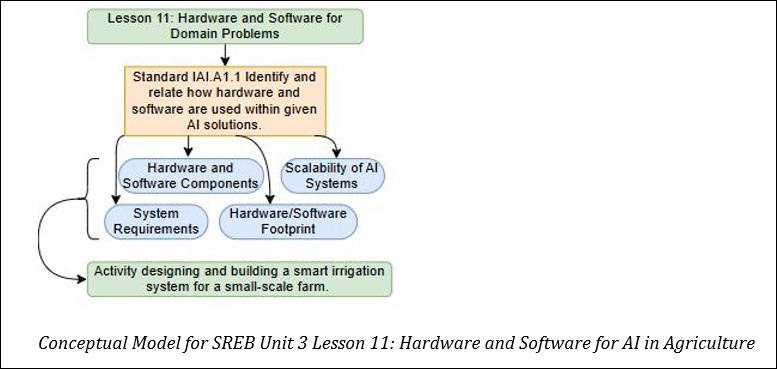

## Lesson 11: Hardware and Software for AI in Agriculture Teacher Page
### Module Name: Hardware and Software for AI in Agriculture
#### Conceptual Model:

### Standards:

- IAI.A1.1: Identify and relate how hardware and software are used within given AI solutions.

### Objectives:

- Explain the components required for a small-scale AI project (e.g., a laptop, basic sensors, Bluetooth, Python environment).  

- Identify additional hardware/software needs for large-scale corporate AI solutions (e.g., data centers, GPUs, satellite data, enterprise cloud platforms). 

- Compare and contrast the requirements of small-scale and large-scale systems. 

- Discuss when a minimal hardware/software footprint is sufficient and when more robust infrastructure is needed.

### Storyline

In this lesson, students will explore how AI systems are packaged and scaled for agriculture. They will learn that a small-scale AI project—such as a sensor-based system running on a laptop—requires a minimal hardware/software footprint, while large-scale corporate AI solutions demand robust infrastructure, including data centers, GPUs, satellite data, and advanced cloud platforms. This lesson sets the stage by comparing the two approaches, preparing students to appreciate the spectrum of solutions and the challenges of scaling up.

### Main Learning Goal

Students will understand the differences in hardware and software requirements for small-scale versus large-scale AI solutions in agriculture and learn when each type of system is appropriate.

### Focus Question

How do hardware and software requirements change when scaling an AI solution from a small project to a large corporate farm?

