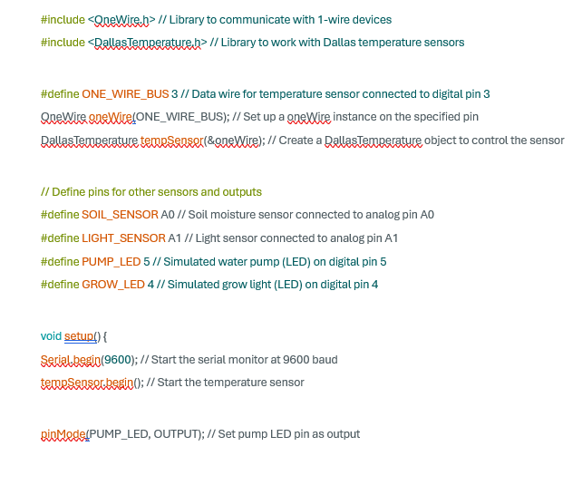

## Smart Farm with Arduino MKR WiFi 1010
This guide walks you through the complete setup of a Smart Farm monitoring system using:

- Arduino MKR WiFi 1010
- KS4009 Sensor Shield (Keyestudio 45-in-1)
- Soil moisture sensor (analog)
- Light (photocell) sensor (analog)
- DS18B20 temperature sensor (digital)
- Red & white LED modules (for simulated pump and grow light)

### Step 1: Install the Arduino IDE

Download & Install:

https://www.arduino.cc/en/software

Supports macOS, Windows, and Linux.

### Step 2: Install Required Arduino Libraries

1. OneWire Library (for DS18B20)

    - GitHub: https://github.com/PaulStoffregen/OneWire
    - Click "Code" > "Download ZIP"
    - If it unzips automatically, right-click the folder > "Compress" to create a .zip file
    - In Arduino IDE: go to Sketch > Include Library > Add .ZIP Library... and select the ZIP file

2. DallasTemperature Library

    - GitHub: https://github.com/milesburton/Arduino-Temperature-Control-Library
    - Download and install as a ZIP file using the same steps as above

### Step 3: Wire the Hardware (using KS4009 Sensor Shield)

Use the 2-pin connectors labeled V, G on the shield for sensor modules.

**Temperature sensor (DS18B20)**

- S → Pin 3
- V → VCC (3.3V)
- G → GND

**Soil Sensor**

- S → A0
- V → VCC (3.3V)
- G → GND

**Photocell Sensor**

- S → A1
- V → VCC (3.3V)
- G → GND

**Red LED Module (Pump)**

- S → Pin 5
- V → VCC (3.3V)
- G → GND

**White LED Module (Grow Light)**

- S → Pin 4
- V → VCC (3.3V)
- G → GND

Ensure all connections use the correct V/G pin rows from the sensor shield.

### Step 4: Upload the Arduino Code
Use the following sketch:

### Step 5: View Data in Excel 

1.	Open **Serial Monitor** in Arduino IDE (set baud to 9600)

2.	Wait a few lines to collect data
3.	Press Copy all
4.	Open Excel and paste the data
5.	Go to **Data > Text to Columns > Delimited > Comma** to split into columns
You can now graph, analyze, or visualize the sensor data directly in Excel.
