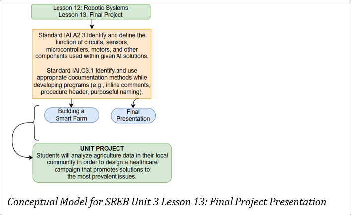

## Lesson 13: Final Project Presentation Teacher Page
### Module Name: Final Project Presentation
#### Conceptual Model:

### Standards:

- IAI.A2.3: Identify and define the function of circuits, sensors, microcontrollers, motors, and other components used within given AI solutions.
- IAI.C3.1 Identify and use appropriate documentation methods while developing programs (e.g., inline comments, procedure header, purposeful naming)

### Objectives:
- Apply previously learned data collection, storage, and analysis skills using real-time sensor data.   
- Build a smart farm prototype using Arduino and environmental sensors.
- Evaluate collected sensor data to identify trends and patterns.  
- Improve their farm design by modifying hardware and code.   
- Compare performance of original vs. optimized systems using data analysis and visualization.

### Storyline

In this culminating lesson, students will bring together all they’ve learned in the agriculture unit to build and optimize a smart mini farm using Arduino. Using moisture, light, and temperature sensors, students will collect data from their farms and analyze it using skills developed in Lessons 3–11. They will evaluate their system’s performance, modify it by adding additional sensors, update the code, and collect new data to compare outcomes.   
This project allows students to engage in real-world engineering and data science practices, reinforcing their understanding of structured/unstructured data, hardware/software systems, data types, and machine learning concepts.

### Main Learning Goal

Students will use previously learned skills to design, build, analyze, and improve a smart farm using Arduino and sensors.

### Focus Question

How can we design and improve smart farming systems using technology, data, and knowledge from real-world agricultural problems?

### Tables