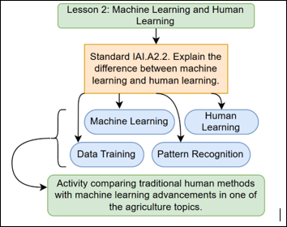

## Lesson 2: Human & Machine Learning Teacher Page

### Module Name: Human & Machine Learning

#### Conceptual Model:

 
Conceptual Model for SREB Unit 3 Lesson 2: Human & Machine Learning

#### Standards:

• IAI.A2.2. Explain the difference between machine learning and human learning. 

#### Objectives:

•	Students will be able to distinguish between human and machine learning and explain their key differences. 

•	Students will be able to describe and analyze the "Sense-Deliberate-Act" process used by machines. 

•	Students will be able to recognize and categorize real-world examples of both human and machine learning. 

•	Students will be able to evaluate the strengths and limitations of each learning type. 

•	Students will develop critical thinking and debate skills, effectively defending their stance using evidence-based arguments.

•	Students will be able to evaluate the strengths and limitations of each learning type. 
•	Students will develop critical thinking and debate skills, effectively defending their stance using evidence-based arguments.

#### Storyline

In this lesson, students will explore how humans learn and how machines process information using algorithms. They will identify key differences between human and machine learning, including the limitations of artificial intelligence. Additionally, students will examine the role of machine learning in agriculture and engage in a debate on whether traditional or modern agriculture methods are more effective.

#### Main Learning Goal

Students will be able to distinguish between human and machine learning and effectively articulate and defend their stance in a debate.

#### Focus Question

How do machines learn and process information compared to humans, and are they more effective than human intelligence?

### Tables