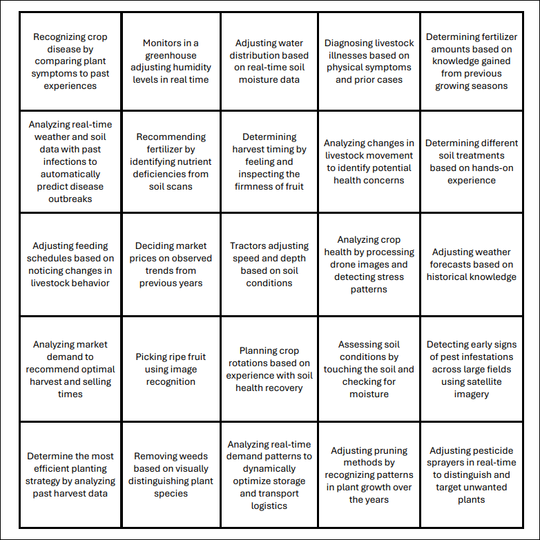
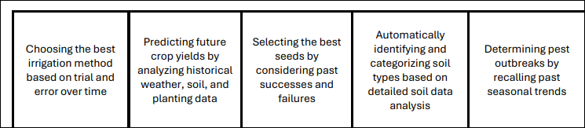

### Human Learning:

1. Recognizing crop disease by comparing plant symptoms to past experiences.
2. Diagnosing livestock illnesses based on physical symptoms and prior cases.
3. Determining fertilizer amounts based on knowledge gained from previous growing seasons.
4. Determining harvest timing by feeling and inspecting the firmness of fruit.
5. Determining different soil treatments based on hands-on experience.
6. Adjusting feeding schedules based on noticing changes in livestock behavior.
7. Deciding market prices based on observed trends from previous years.
8. Adjusting weather forecasts based on historical knowledge.
9. Planning crop rotations based on experience with soil health recovery.
10. Assessing soil conditions by touching the soil and checking for moisture.
11. Removing weeds based on visually distinguishing plant species.
12. Adjusting pruning methods by recognizing patterns in plant growth over the years.
13. Choosing the best irrigation method based on trial and error over time.
14. Selecting the best seeds by considering past successes and failures.
15. Determining pest outbreaks by recalling past seasonal trends.

### Machine Learning:

1. Monitors in a greenhouse adjusting humidity levels in real time.
2. Adjusting water distribution based on real-time soil moisture data.
3. Analyzing real-time weather and soil data with past infections to automatically predict disease 
outbreaks.
4. Recommending fertilizer by identifying nutrient deficiencies from soil scans.
5. Analyzing changes in livestock movement to identify potential health concerns.
6. Tractors adjusting speed and depth based on soil conditions.
7. Analyzing crop health by processing drone images and detecting stress patterns.
8. Analyzing market demand to recommend optimal harvest and selling times.
9. Picking ripe fruit using image recognition.

10. Detecting early signs of pest infestations across large fields using satellite imagery.
11. Determining the most efficient planting strategy by analyzing past harvest data.
12. Analyzing real-time demand patterns to dynamically optimize storage and transport logistics.
13. Adjusting pesticide sprayers in real-time to distinguish and target unwanted plants.
14. Predicting future crop yields by analyzing historical weather, soil, and planting data.
15. Automatically identifying and categorizing soil types based on detailed soil data analysis