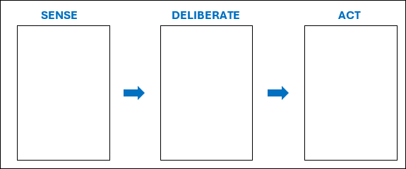
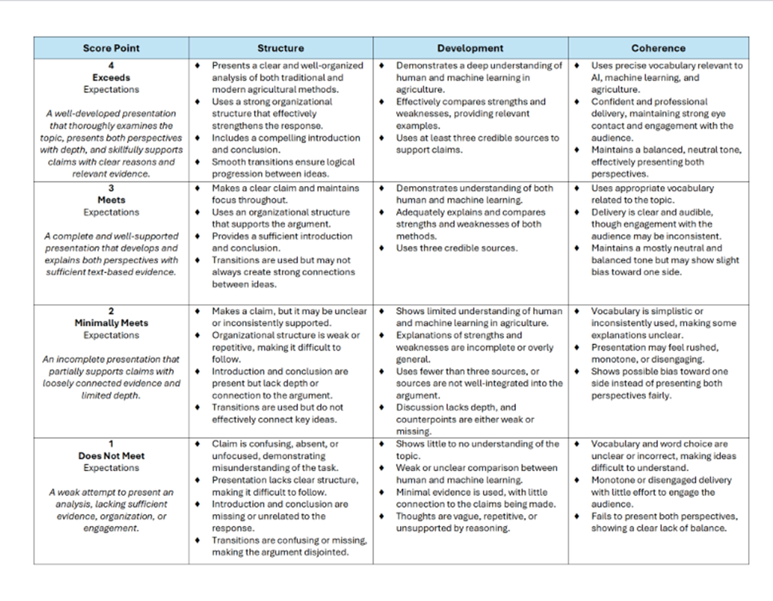

## Cognition vs Code 
Have you ever wondered how we actually learn new things? Think about learning to ride a bike—do we read a manual, or do we figure it out through trial and error? Now, what if a machine had to learn the same task? Would it learn the same way we do?

Some tasks come naturally to us—like recognizing familiar faces or making quick decisions—while machines rely on massive amounts of data to detect patterns and improve over time.

So, which is better? It’s a battle between cognition and code. Let’s find out who wins!

Recognizing images during “I Spy” is a pretty easy task for us humans. But **do you think a computer would be able to recognize these images as easily as we do? Why or why not?**

**What are the major strengths of human intelligence and learning?**

While watching the video, “How AIs, like ChatGPT, Learn,” fill out the steps for “Sense-Deliberate-Act" below with information from the video.

Now in groups of 2-3, you will choose an agricultural innovation to research. You will compare traditional human methods with machine learning advancements and evaluate the impact of automation.

#### Possible topics include:

•	Image analysis for disease detection

•	Weed identification

•	Yield prediction

•	Soil analysis

•	Crop monitoring

•	Greenhouse climate control

•	Any other relevant topic that you can effectively argue and support with evidence

#### Presentation Guidelines:

Their presentations must include:

1.	How humans and ML systems learn to perform the task
2.	The strengths and weaknesses of humans and ML systems for their technology
3.	At least 3 credible sources to support their findings

#### Presenting Guidelines:

1.	Your presentations must be AT LEAST 5 minutes but NO MORE than 8 minutes

2.	Each student must present at least one slide

Afterwards as a class, you will debate whether human or machine learning is better for this task. You must be ready to back up your claim with evidence. Evaluate the presentations using the rubric on page 4 (attached to this WS).

#### Final Debate:

Is using either human learning or machine learning clearly superior to the other? How do money, time, resources, efficiency, ethics, etc. affect your answer?

To conclude, let’s reflect on everything we’ve discussed and revisit the comparison between human and machine learning:

•	Is it fair to compare human and machine learning?

•	Can a machine truly be considered "smart"?

•	Who is smarter—a human or a machine?

•	Does a machine "learn" in the same way a human does?

•	Will machines ever replace human intelligence entirely? Why or why not?

