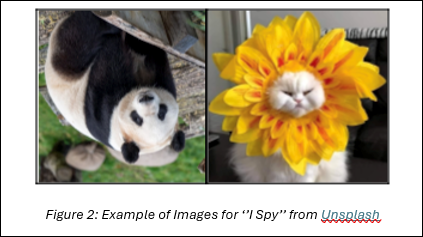
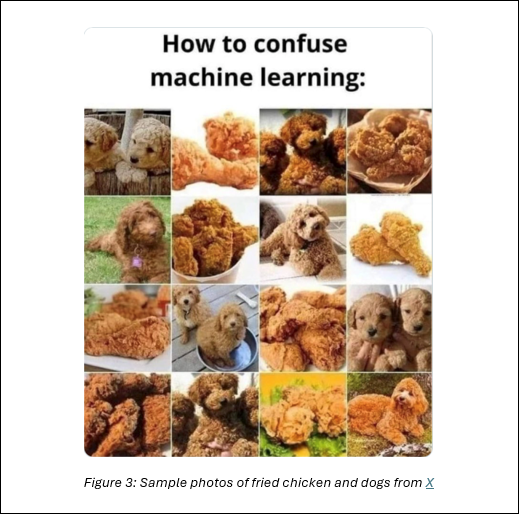
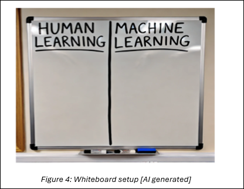

## Lesson 2: Human & Machine Learning
### Lesson Description:

In this lesson, students will explore how humans learn and how machines process information using algorithms. They will identify key differences between human and machine learning, including the limitations of artificial intelligence. Additionally, students will examine the role of machine learning in agriculture and engage in a debate on whether traditional or modern agriculture methods are more effective.

#### Main Learning Goal:
Students will be able to distinguish between human and machine learning and effectively articulate and defend their stance in a debate.

#### Essential Question:
How do machines learn and process information compared to humans, and are they more effective than human intelligence?

#### Standards:
•	IAI.A2.2. Explain the difference between machine learning and human learning. 

#### Objectives:
•	Students will be able to distinguish between human and machine learning and explain their key differences.
•	Students will be able to describe and analyze the "Sense-Deliberate-Act" process used by machines.
•	Students will be able to recognize and categorize real-world examples of both human and machine learning.
•	Students will be able to evaluate the strengths and limitations of each learning type.
•	Students will develop critical thinking and debate skills, effectively defending their stance using evidence-based arguments

### I Spy
### I spy with my little eye something... yellow!

To kick off today’s lesson, we will start with a fun game to think about how we learn. Use the “I Spy” presentation and identify the objects shown on each slide. Each slide should feature a single, easily recognizable object. You can also look at Figure1, below.

You will find a few trickier slides with images that challenge your perception. Look at Figure 2, below.

Even with the trickier slides, you should still be able to recognize each object fairly easily. But why is that? 

Volunteeer and explain how you knew what the object was, even if it was upside down or looked unusual. 

Consider the following question:

• **Q1: Do you think a computer would be able to recognize these images (as shown in Figure 3) as easily as we do? Why or why not?**

Record your answer on this worksheet, SREB_U3_L2_Handout_MachineLearningandHumanLearning.

Now, let's analyze the differences between Human Learning versus Machine Learning.

Humans have an incredible ability to learn quickly and apply knowledge flexibly. Unlike machines, we do not need large amounts of data to recognize patterns or make decisions. In many cases, we can see or experience something once or twice and still understands it well enough to use it in different situations.

For a human, learning is the process of gaining new knowledge, skills, or behaviors through experience, practice, or observation. It is shown by changes in behavior, understanding, or brain function. This process involves:

•	Focusing on important information

•	Organizing it into a meaningful structure

•	Connecting it to what is already known from memory. 

•	Consider the following source: APA Dictionary of Psychology

That is why if you see an upside-down panda, you still recognize it as a panda, even though you have probably never studied thousands of images of upside-down pandas before. This ability to generalize from limited experiences is a fundamental strength of human learning.

On the other hand, a computer would have a harder time identifying these images. A computer requires extensive data training to recognize patterns and make decisions. Computers only know what it has been “taught” through large datasets and pattern recognition.

Machine Learning (ML) is a branch of artificial intelligence (AI) focused on enabling computers and machines to imitate the way that humans learn, to perform tasks autonomously, and to improve their performance and accuracy through experience and exposure to more data. Consider the following source from IBM, What is machine learning?

Although machines do not "think” like humans, they have their own cycle for “thinking.” It is called the “Sense-Deliberate-Act" cycle. In this cycle, computers:

•	Takes in information using sensors

•	Processes the data it receives

•	Acts to do something or make a decision

For example, a self-driving car uses sensors to detect its surroundings. If another car suddenly pulls in front of it, the system must quickly analyze the situation and decide whether to brake, slow down, or take another action to avoid a collision.
Write down the “major strengths of human intelligence and learning” on your worksheet.

Watch this video that describes How AIs, like ChatGPT, Learn (stop at 8:00 minutes). 

The video explains how computers are trained on massive amounts of sample data and go through multiple refinements to develop an accurate model.

While watching the video, identify an example of each step in the “Sense-Deliberate-Act" cycle. (In the worksheet).

As shown in the video, machines rely on large, high-quality datasets to learn effectively. In the next few lessons, we will explore how data is processed and applied in real-world scenarios.

For now, let’s shift our focus to how both human and machine learning are used in agriculture—and whether one is truly better than the other!

**Sort It Out**

Before diving back into our presentations, let’s start with a quick review game! 
The teacher will divide the board into two sections: “Human Learning” and “Machine Learning” as shown in Figure 4.

You and your classmates will form a line, and when it is their turn, the teacher will give you some pieces of paper with examples from Agriculture Sorting, with tape, then you will have to place it under the category you believe it fits best. 

Once all students have placed their example, we will review the choices as a class, discussing and correcting any misplacements as needed. There could be an argument to place an example on both sides.

Clearly, human and machine learning have distinct differences, but they also share important similarities in how they process and apply information.

#### Finalizing Your Debate

Today, all groups will be finishing the presentations, and then some groups will present. The rest of the groups will present the next class period. 

You will have time to finish and practice your presentations. Then, a couple groups will present before the end of class. As a reminder, you should: 

•	Review key points.

•	Anticipate questions.

•	Be able to support both sides of the debate with evidence. 

Close your laptops before presentations to avoid distractions.

#### Time to Present

Since we will not have time for everyone to present today, we will start with a few volunteers. If there are none, the teacher will choose a group at random. 

Presentations will be graded by the teacher according to this rubric. The audience/students will follow along with each presentation with this rubric. 

• Presentations must be between 5 and 8 minutes and every group member must present. 

•	After each presentation, take a quick poll by a show of hands:

o	**Q1: Do you think the traditional human method, or the modern machine-based approach is better?** 

Volunteer to defend your argument and allow other classmates to present counterarguments. If there is no debate, you can consider subjects such as money, time, resources, efficiency, ethics, etc. To deepen the discussion. Debates should take no longer than 5 minutes.

#### Debate Wrap Up

For a final debate question, which approach do you think is clearly superior to the other? Participate and defend your stance. 
Consider money, time, resources, efficiency, ethics, etc. to deepen your point of view.

Then record your answer on: “Is using either human learning or machine learning clearly superior to the other? How do money, time, resources, efficiency, ethics, etc. affect your answer?” on your worksheet. 

To conclude, let’s reflect on everything we’ve discussed and revisit the comparison between human and machine learning: 

•	Q1: Is it fair to compare human and machine learning? 

•	Q2: Can a machine truly be considered "smart"? 

•	Q3: Who is smarter—a human or a machine? 

•	Q4: Does a machine "learn" in the same way a human does? 

•	Q5: Will machines ever replace human intelligence entirely? Why or why not?
