# Lesson 14C: K-Means Clustering, Interpretation, and Traffic Operations Memo

### Estimated Timing: 60 Minutes

### Overview

In this lab, you will use Azure Machine Learning Designer to build a K-Means clustering pipeline for grouping road segments based on traffic patterns. You will create datasets from Azure SQL Database, configure and train a clustering model, and assign traffic records to clusters using operational metrics. Additionally, you will export clustering results back to Azure SQL Database to analyze traffic behavior and support smart city traffic operations. 

## Lab objectives

In this exercise, you will perform the following tasks:

- **Task 1:** K-Means Clustering – Grouping Road Segments

## Task 1: K-Means Clustering – Grouping Road Segments

1. Open the link below in your browser to access **Azure Machine Learning Studio**:

    ```
    https://ml.azure.com/
    ```

1. If prompted to sign in, enter your credentials.
 
   - **Email/Username:** <inject key="AzureAdUserEmail"></inject>
 
     .png)
 
   - **Password:** <inject key="AzureAdUserPassword"></inject>
 
     .png)
 
1. If prompted to stay signed in, you can click **Yes**.

   .png)

1. From the left navigation pane, select **Workspaces (1)** and then click on workspace **SmartCities-<inject key="Deployment ID" enableCopy="false" /> (2)**.

     

1. From the left navigation pane, go to **Assets**, select **Data (1)**, then open the **Datastores (2)** tab and click **+ Create (3)**.

     

1. On the **Create datasore** pane, enter the following details and then click **Create (9)**:

    - Datastore name: **traffic_sc_dataset (1)**
    - Datastore type: **Azure SQL database (2)**
    - Account selection method: **From Azure subscription (3)**
    - Subscription ID: Select the default subscription **(4)** 
    - Server name / database name: Select **smartcity-sqlserver-<inject key="Deployment ID" enableCopy="false" /> (5)**
    - Authentication type: **SQL Authentication (6)**
    - User ID: **<inject key="SQL Admin Login" enableCopy="false" /> (7)**
    - Password: **<inject key="SQL Admin Password" enableCopy="false" /> (8)**

      

1. Once the datastore is created successfully, the new datastore will appear in the **Datastores** tab. Click on it to open. 

    

1. Now click on **Create data asset** at the top.

    

1. On the **Create data asset** page, enter **Clustering_Dataset_Cleaned (1)** as the name, then click **Next (2)**.

    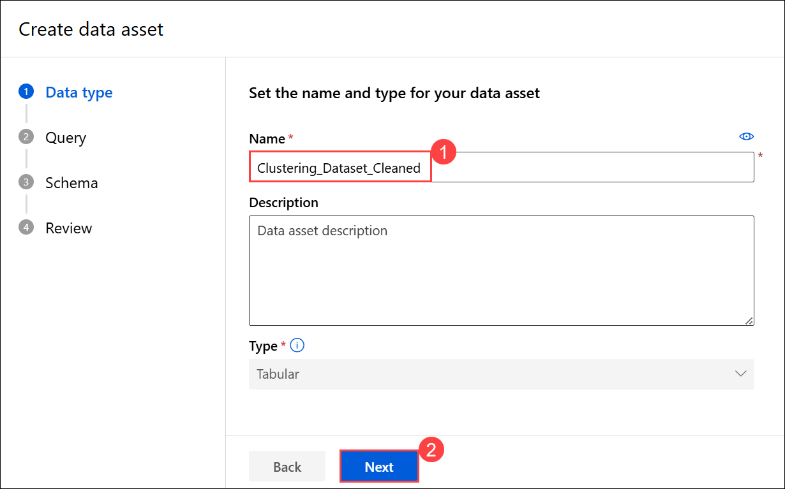

1. In the SQL query box, paste the following query **(1)** and click **Run query (2)**. Once the query executes successfully, a data preview will appear at the bottom showing sample rows from your Azure SQL table so you can validate the columns and data types. If everything looks correct, click **Next (3)** to proceed to the **Schema** step.

    ```sql
    SELECT * FROM dbo.SC_Clustering;
    ```

     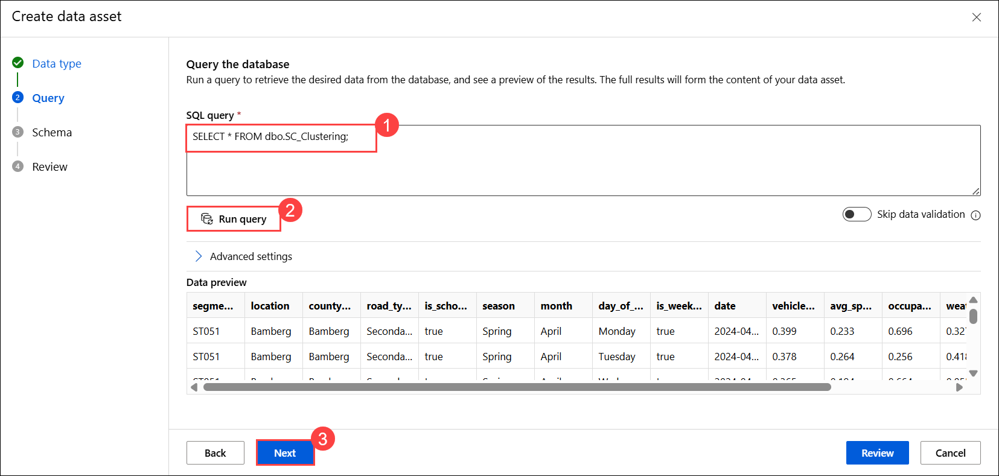

1. In the **Schema** page, leave everything as default and click on **Next**.

     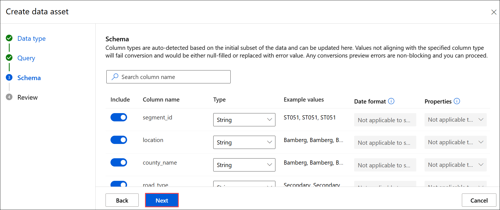

1. On the **Review** page, review the settings for your data asset and click on **Create**.

    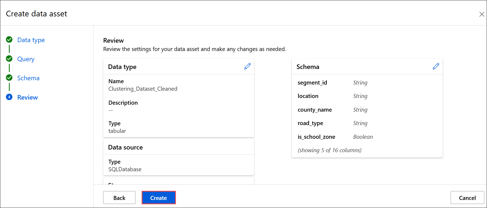

1. Once the data asset is created successfully, you will be redirected to the **Details** tab of **Clustering_Dataset_Cleaned**.

    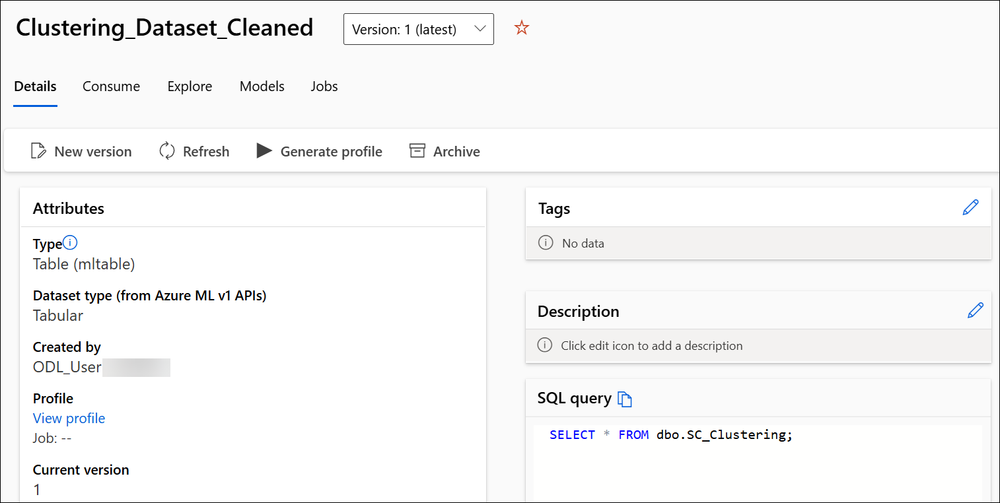

1. From the top menu, select the **Explore** tab to see the schema, sample records, and the SQL query used to pull data from Azure SQL.

    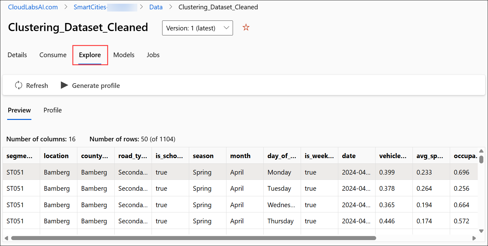

1. In Azure ML Studio, select **Designer (1)** from the left navigation menu, then under the **New pipeline** section (Classic prebuilt), click **+ Create a new pipeline using classic prebuilt components (2)**.

    

1. Under the **Data** tab, find your dataset **Clustering_Dataset_Cleaned** and drag it onto the pipeline canvas to use it as the starting point of your machine learning workflow.

    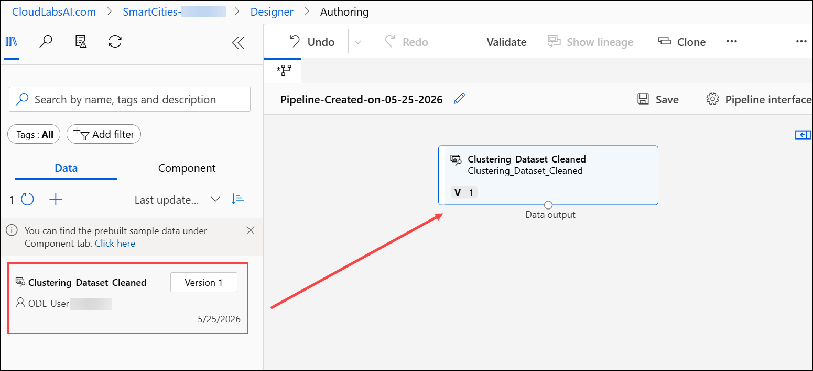

1. Click the **Component (1)** tab, use the search bar to find **K-Means Clustering (2)**, select it **(3)** from the results, and drag it onto the pipeline canvas.

    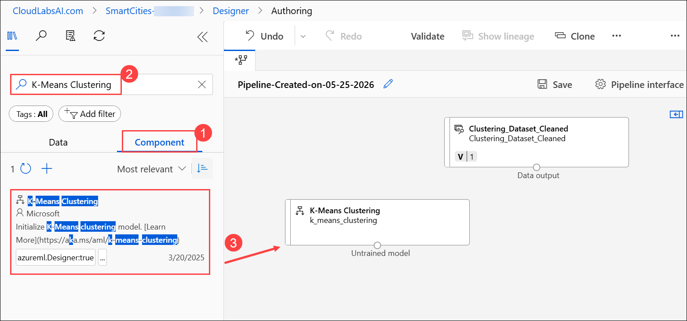

1. Double-click on **K-Means Clustering (1)** module, then in the right pane, provide following values:

    - **Create trainer mode:** SingleParameter **(2)**
	- **Number of centroids:** 3 **(3)**
	- **Initialization:** K-Means++ **(4)**
	- **Metric:** Euclidean **(5)**
	- **Normalize features:** True **(6)**
    - **Iterations:** 100 **(7)**
    - **Assign label mode:** Ignore label column **(8)**
	- Click Save **(9)** at the top to apply these settings.

      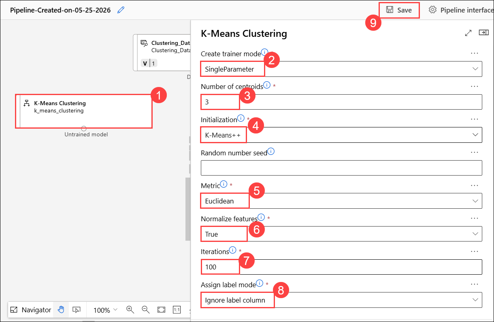

1. Click the **Component** tab, use the search bar to find **Train Clustering Model (1)**, select it **(2)** from the results, and drag it onto the pipeline canvas.

1. Connect the modules

    - Connect the output port of **K-Means Clustering (Untrained model)** → to the left input port of **Train Clustering Model (Untrained model) (3)**.
    
    - Connect the output port of **Clustering_Dataset_Cleaned (Dataset)** → to the right input port of **Train Clustering Model (Dataset) (4)**.

      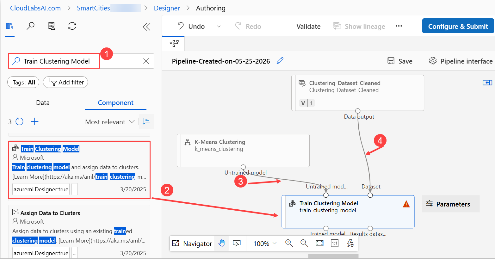

1. Double-click on **Train Clustering Model (1)** module, then in the left pane, click on **Edit column (2)**.

    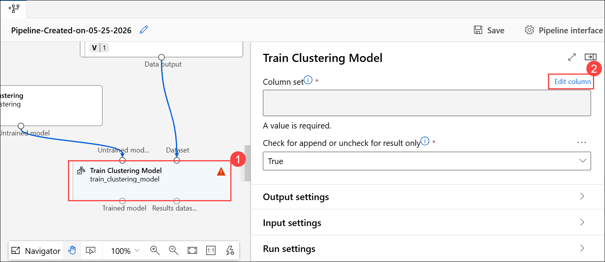

1. Under **Column set**, select  **vehicle_count_8am, avg_speed_8am, occupancy_8am, weather_index_8am (1)** and click **Save (2)**.

    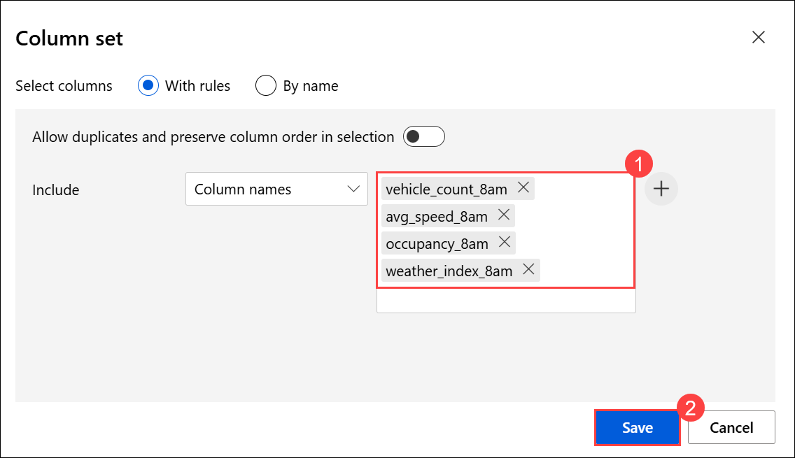

1. Verify **Check for append or uncheck for result dataset:** set to **True (1)** so results include these selected features and **Save (2)** configuration

    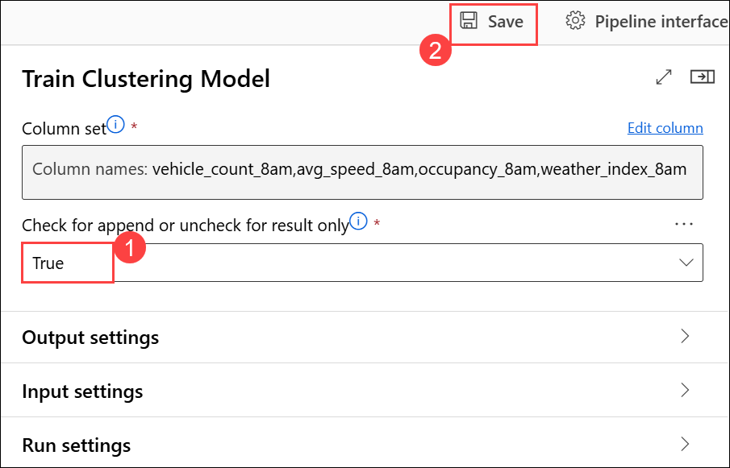

1. Click the **Component** tab, use the search bar to find **Assign Data to Clusters (1)**, select it **(2)** from the results, and drag it onto the pipeline canvas.

    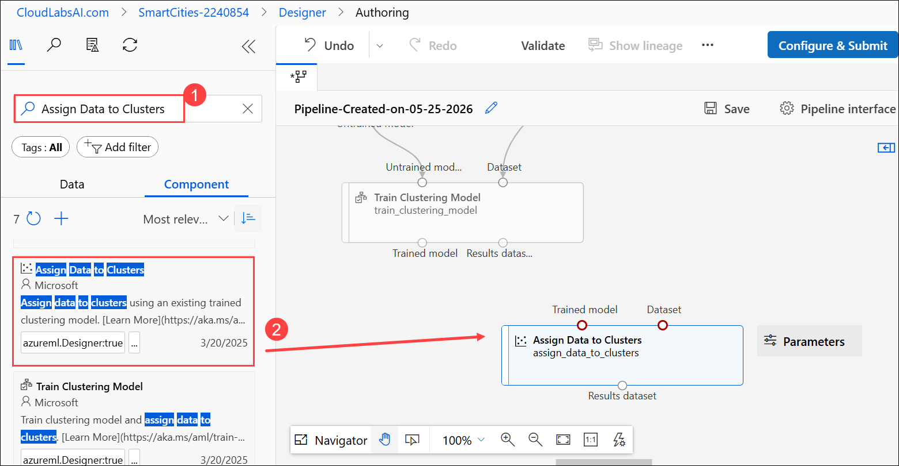

1. Connect the modules

    - Connect the output port of **Train Clustering Model (Trained model)** → to the left input port of **Assign Data to Clusters (Trained model) (1)**.
    
    - Connect the output port of **Clustering_Dataset_Cleaned (Dataset)** → to the right input port of **Assign Data to Clusters (Trained model) (2)**.

      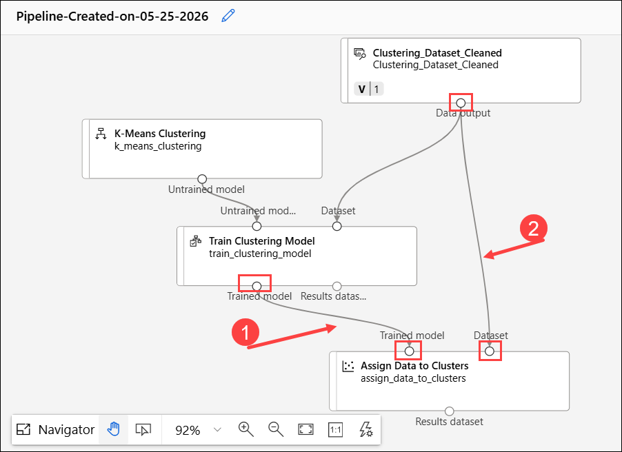

1. Double-click on **Assign Data to Clusters (1)** module, then in the right pane, provide following values:

    - Check for append or uncheck for result only: set to **True (2)**
    - Click **Save (3)** at the top of Designer.

      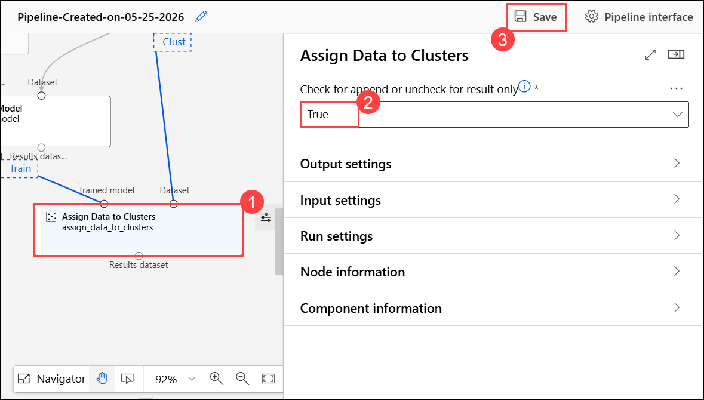

1. Switch to the **Component** tab in the left panel and search for **Export Data (1)**. Drag that component onto the canvas **(2)**.

    - Connect the output port of **Assign Data to Clusters (Results dataset)** → to the input port of **Export Data (Input path) (3)**, 

      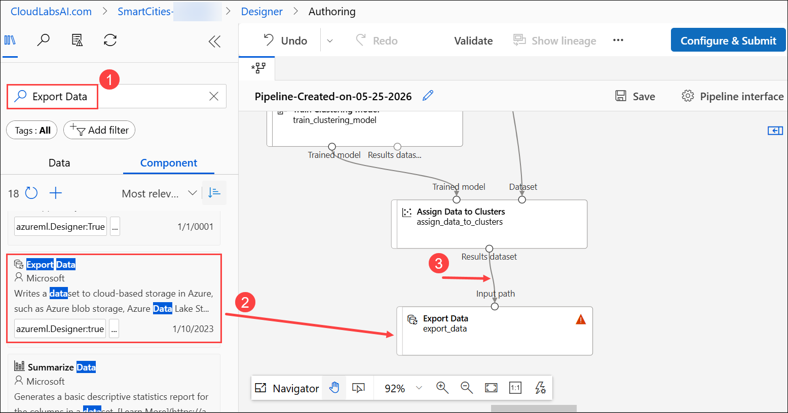

1. Double-click on **Export Data (1)** module, In the right-hand panel, set the following:

    - Datastore type: Azure SQL database **(2)**
    - Datastore: traffic_sc_dataset **(3)**
    - Export data table name: Clustering_Results_SC_Test **(4)**
    - Columns to export **(5)**:
        ```
        segment_id, location, county_name, road_type, is_school_zone, season, month, day_of_week, is_weekday, date, vehicle_count_8am, avg_speed_8am, occupancy_8am, weather_index_8am, pct_congested_8am, is_congested_label, Assignments, DistancesToClusterCenter no.0, DistancesToClusterCenter no.1, DistancesToClusterCenter no.2
        ```
    - Column names in export data table **(6)**:
        ```
        segment_id, location, county_name, road_type, is_school_zone, season, month, day_of_week, is_weekday, date, vehicle_count_8am, avg_speed_8am, occupancy_8am, weather_index_8am, pct_congested_8am, is_congested_label, cluster_assignment, dist_cluster0, dist_cluster1, dist_cluster2
        ```
    - Number of rows per operation: 50 **(7)**

    - Select **Save (8)**

      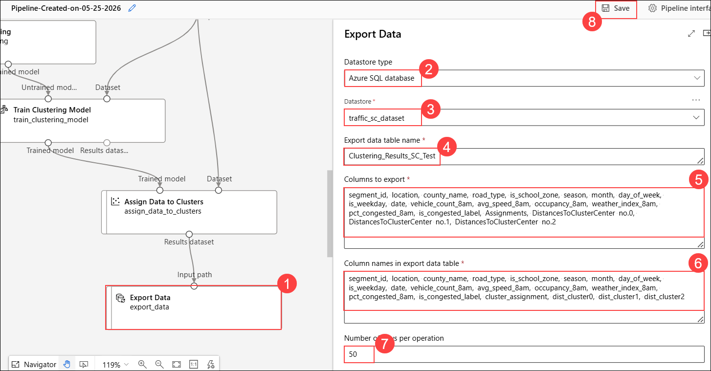

1. Make sure your pipeline is saved, then click **Configure & Submit** at the top of the screen.

    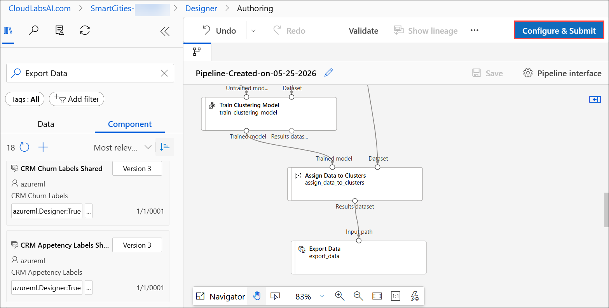

1. In the **Set up a pipeline job** pane, under the **Basic** section, enter the following details:

    - **Experiment name:** Select **Create new (1)**
    - **New experiment name:** `Clustering_8AM_Exp` **(2)**
    - Click on **Next (3)**

      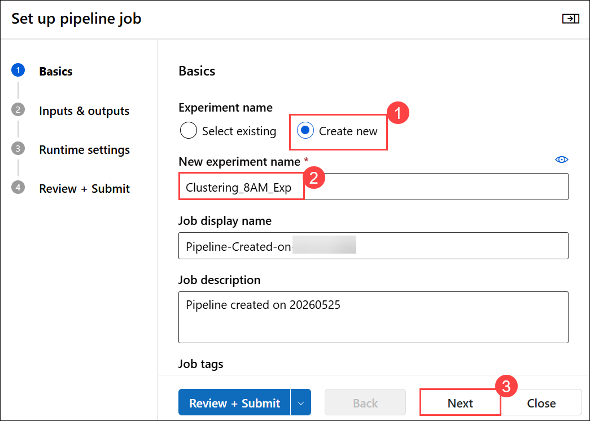

1. In the **Inputs & outputs** section, leave everything as default and click on **Next**.

    

1. Now we’re on the **Runtime settings** step of the pipeline submission process. This is where you choose the **computer (called a compute cluster)** that Azure will use to run your pipeline.

    - Select Compute Type: From the dropdown, select **Compute cluster (1)**.

    - Click on **Create Azure ML compute cluster (2)**

        

1. You are now in the **Virtual Machine** tab for setting up a compute cluster. This step helps Azure decide which kind of machine to use for running your pipeline.

    - **Location:** Confirm that the selected region is the same as your workspace (**<inject key="Region" enableCopy="false" />**) **(1)**
    - **Virtual Machine Tier:** Leave as default. (do not select "Dedicated" or "Low priority" unless specified otherwise for cost-saving purposes) **(2)**
    - **Virtual Machine Type:** Keep this as **CPU (3)** 
    - **Virtual Machine Size:** Choose **Standard_DS11_v2 (4)**
    - Click **Next (5)**  

         

1. **Advanced Settings:** Give a Compute Name as **Test (1)** and leave everything default. Then click **Create (2)**.

       

1. Select the Compute Created **Test (1)** and click **Next (2)**.   

        

     >**Note:** The creation of the compute cluster takes approximately 3–5 minutes. You’ll be able to select the cluster only after it’s fully created. Please wait until the process is complete, and keep refreshing the cluster.

1. Once on the **final** page, click **Submit**.     

     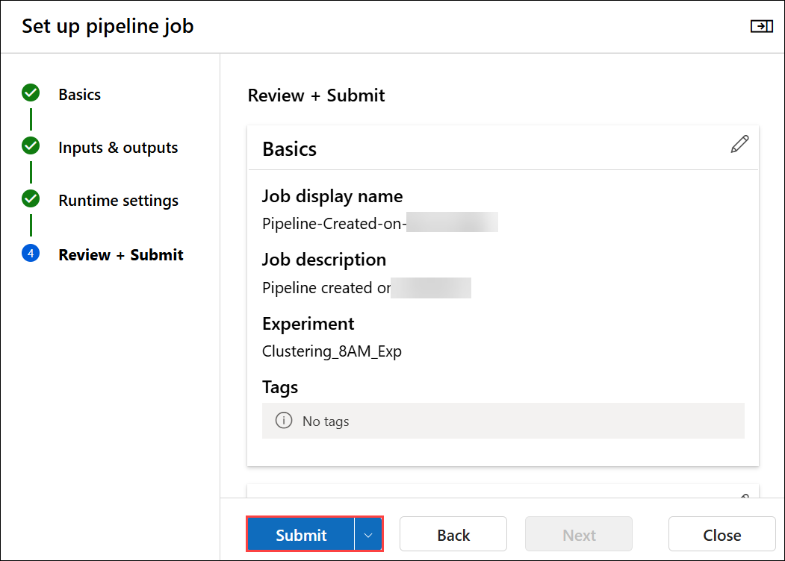 

1. Click **View Details** to open the job run page and monitor the pipeline’s execution progress.

    >**Note:** The job will take around 5 minutes to complete.

    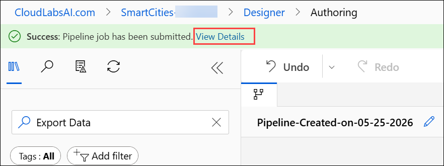

1. Once the job is completed, you should see something similar to the following with status displayed as **Completed**:

    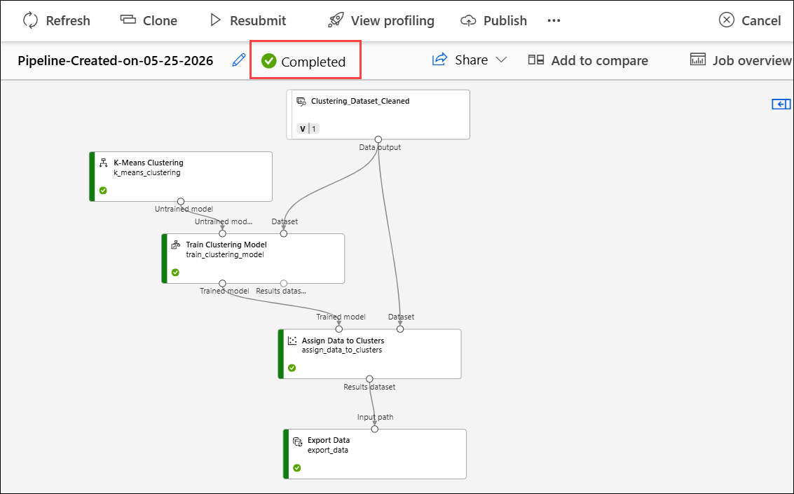

1. After the job completes, right-click on **Assign Data to Clusters (1)**, select **Preview data (2)**, and then click on **Results dataset (3)**.

    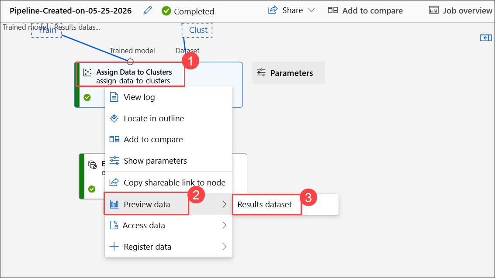

1. Click on the **Expand view to full screen** button to see the results.

    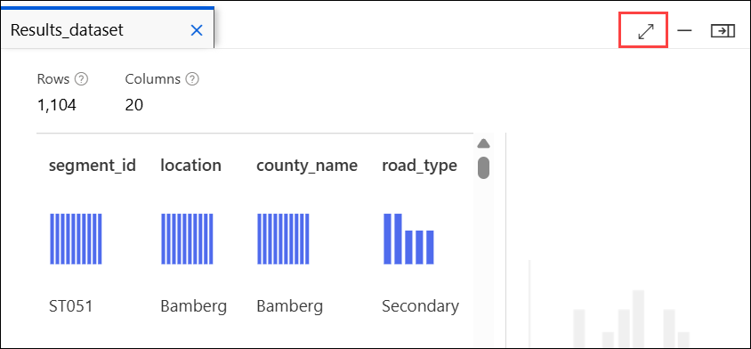

1. Review the output table:

    - Original traffic features (vehicle count, speed, occupancy, etc.).
    - Assignments → the cluster ID each segment belongs to (e.g., Cluster 0, 1, or 2).
    - DistancesToClusterCenter no.0 / no.1 / no.2 → how close each segment is to each cluster center. Smaller values = closer fit.

      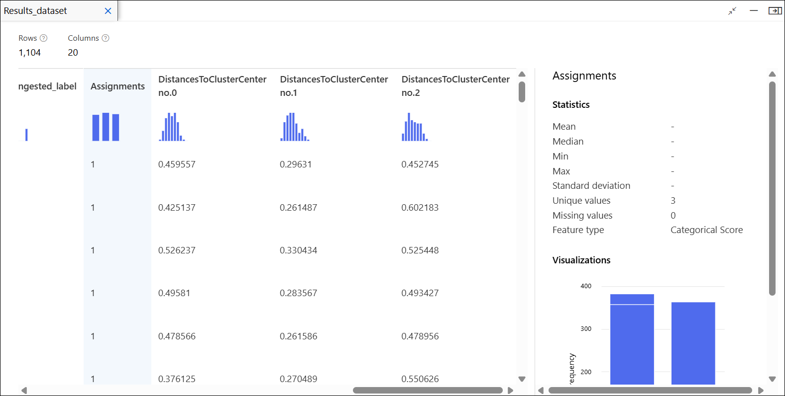

1. Navigate to Azure portal, search for **Azure SQL Database (1)**. From the search results under **Services**, click on **Azure SQL Database (2)**.

    

1. On the **SQL databases** page, under the list of databases, click on **SmartCityDB-<inject key="Deployment ID" enableCopy="false" />** to open the database overview page.

     

1. On the **SmartCityDB-<inject key="Deployment ID" enableCopy="false" />** page please select **Query Editor (1)**, choose **SQL authentication (2)**, enter **<inject key="SQL Admin Login" enableCopy="false" />**  in the **Username (3)** field and **<inject key="SQL Admin Password" enableCopy="false" />** in the **Password (4)** then select **Connect (5)**

     

1. In the **Explorer** pane, expand **dbo (1)** and **Tables (2)**, and then verify the **Clustering_Results_SC_Test (3)** table is available.

    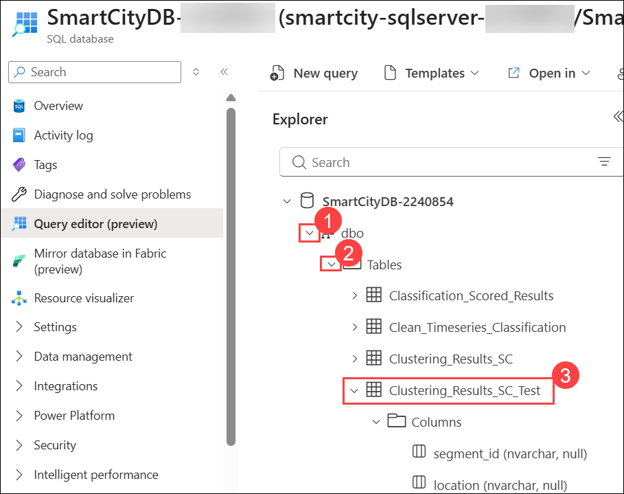

1. Select **New query (1)**, enter the SQL query in the query editor **(2)**, select **Run (3)** to execute the query, and then review the output in the **Results (4)** pane.

    ```sql
    SELECT * FROM dbo.Clustering_Results_SC_Test;
    ```

     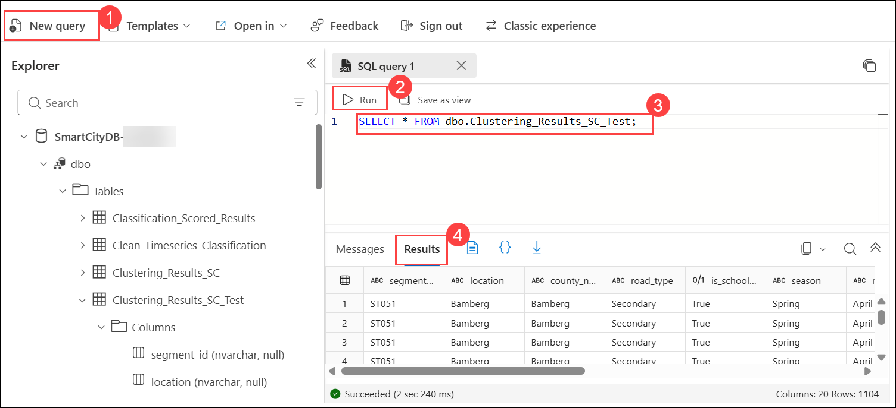

## Summary

In this lab, you used Azure Machine Learning Designer to build and execute a K-Means clustering pipeline for grouping road segments based on traffic characteristics. You created datasets from Azure SQL Database, trained a clustering model, and assigned traffic records to different clusters using operational metrics. You also reviewed clustering results and exported the output back to Azure SQL Database for further traffic analysis and smart city planning.

### Congratulations, you’ve successfully completed the hands-on lab!