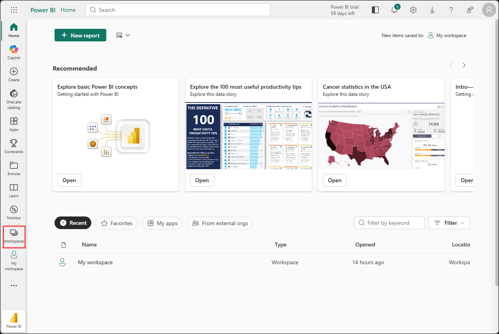
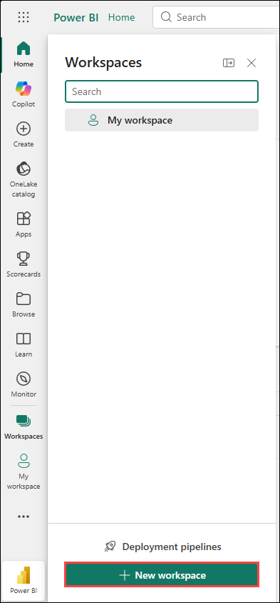
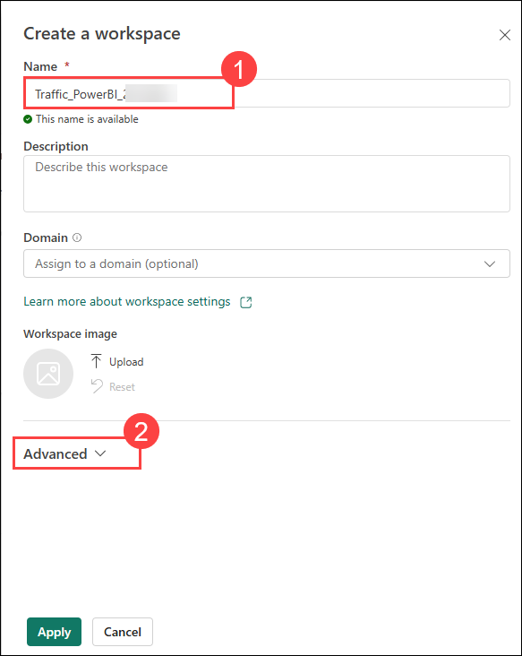
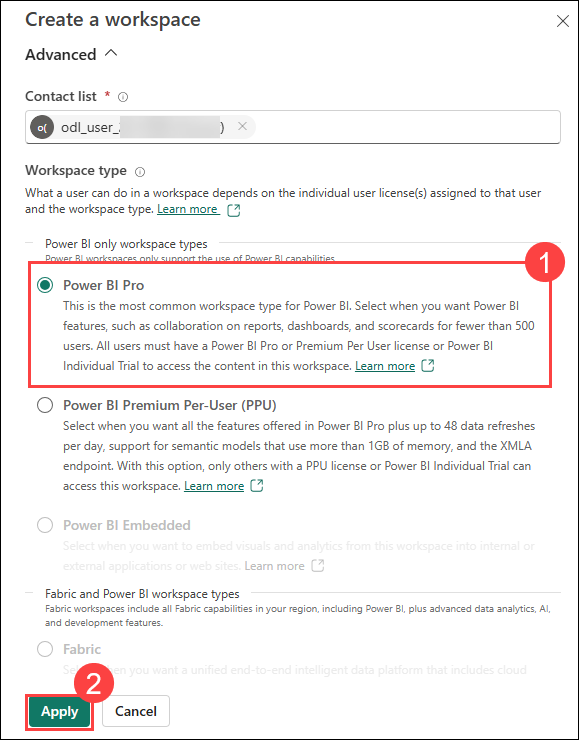
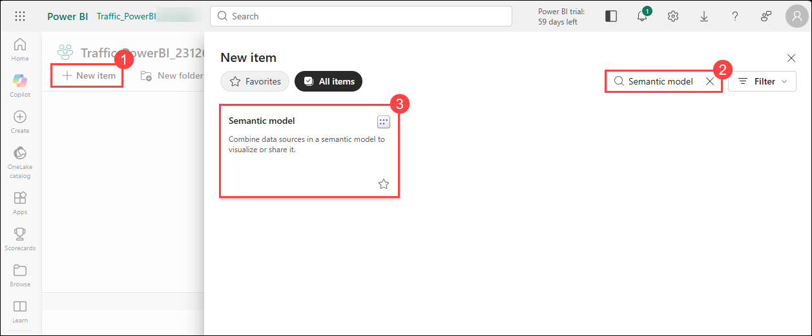
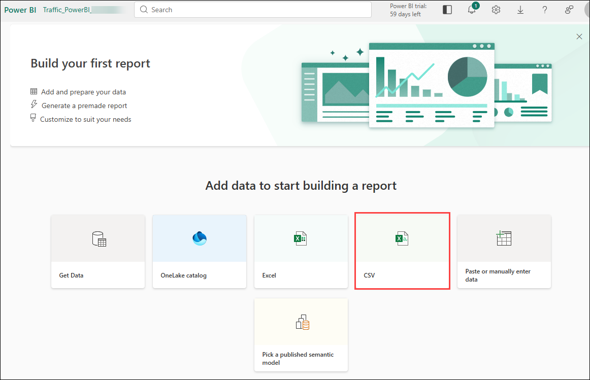
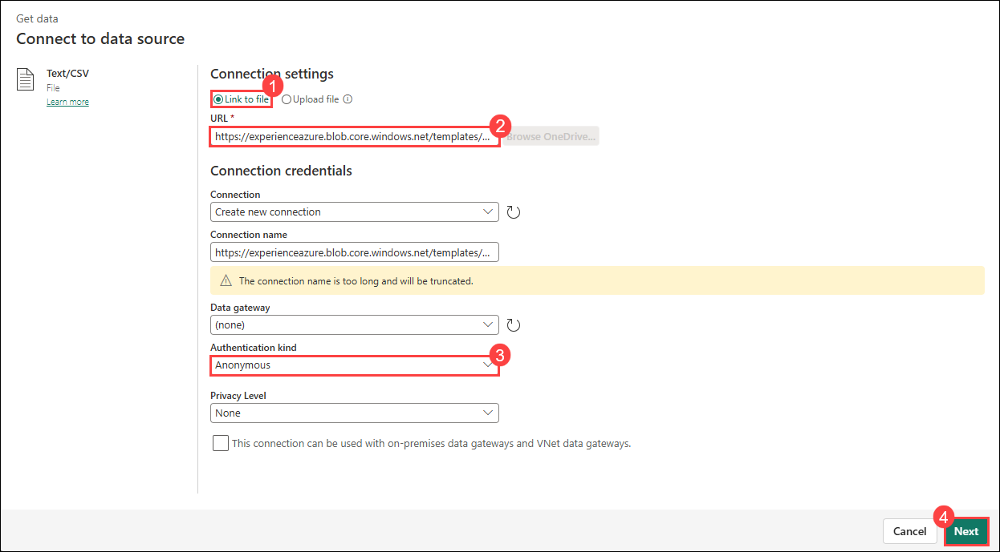
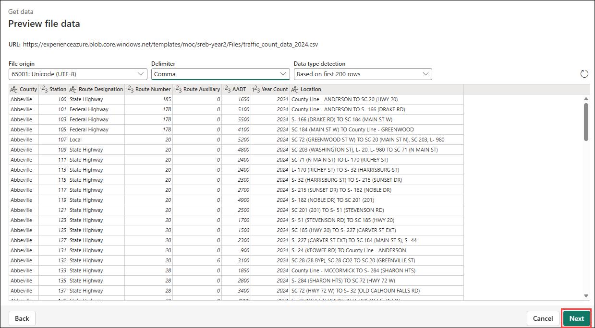
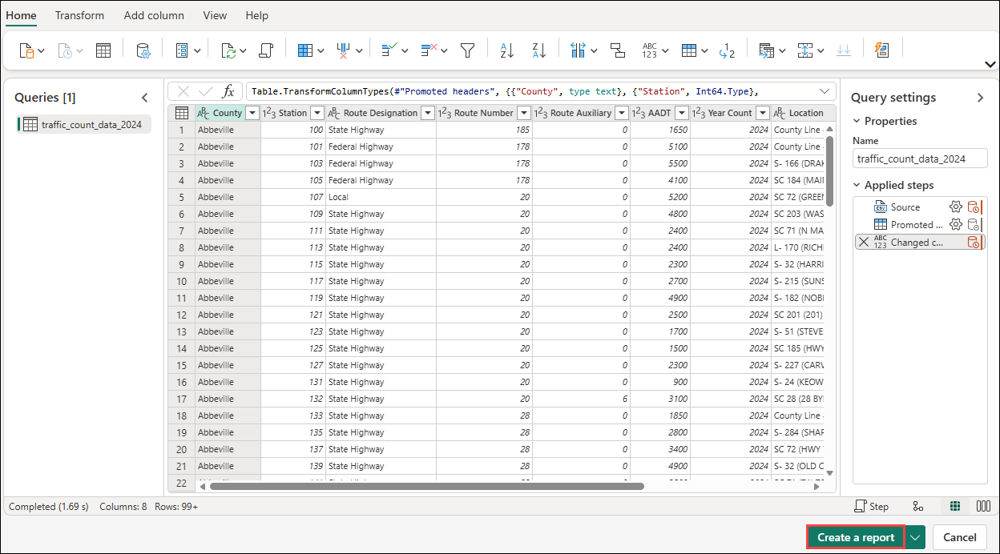
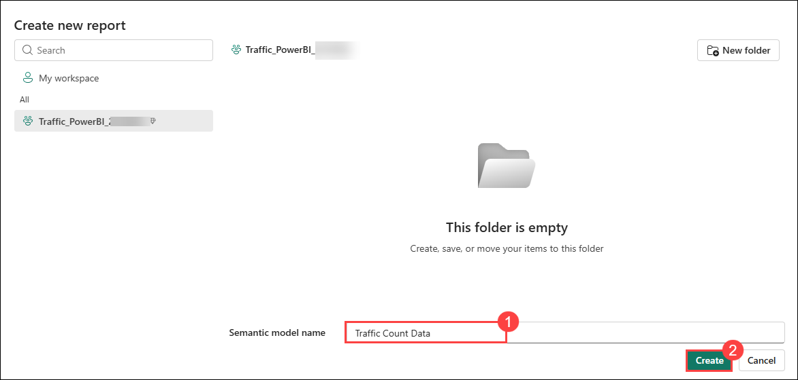

# Lesson 16: Challenge Guide - Power BI Fundamentals

### Estimated Timing: 120 Minutes

## Overview

Welcome to the Power BI Fundamentals Challenge. In this lab, you will explore Power BI, work with real traffic data, and figure out how to build meaningful visuals and an interactive dashboard on your own.

Your goal is to move from raw data to insight — just like real analysts do.

## Your Mission

You are acting as a **city traffic analyst** reviewing school-zone traffic data from South Carolina. City and school planners want to better understand traffic patterns in order to improve safety and planning.

Your mission is to:

1. Import and understand a real traffic dataset
2. Prepare and clean the data so it is usable
3. Build visuals that reveal traffic patterns
4. Use filters or slicers to interact with the data
5. Share at least one insight and recommendation

All of this work will be done using **Power BI**.

## Challenge Objectives

1. Define what a dashboard is in Power BI.
2. Import a dataset (traffic count CSV) into Power BI.
3. Identify and correct basic data issues (types, column names).
4. Apply filters to focus on relevant traffic data.
5. Create basic charts to compare traffic by road type or county.
6. Reflect on what their visualization shows.

### Explore and Understand the Traffic Dataset:

- Examine the columns available in the dataset, such as county, station, route type, route number, and traffic counts.
- Identify which fields are numeric and which are categorical or descriptive.
- Determine which columns may help you compare traffic patterns across routes, stations, or counties.
- *Analyst Tip:* Understanding the meaning and structure of the data is essential before creating any visuals.

### Prepare and Clean the Data:

- Review column names and determine whether any should be renamed for clarity.
- Identify any columns that are unnecessary for the analysis and could be removed.
- Verify that data types are set correctly so charts and calculations behave as expected.
- Analyst Tip: Poorly prepared data can result in misleading visuals and incorrect conclusions.

## Task 1: Uploading the Dataset and Look Through Power BI

1. Navigate to Power BI portal using the below URL:

    ```
    https://app.powerbi.com/
    ```

1. Add your **email (1)** - "<inject key="AzureAdUserEmail"></inject>" and click on **Submit**.

    

1. Once logged in to Power BI portal, click on **Workspaces** from left panel.

    

1. Click on **+ New workspaces**.

    

1. Provide the name of workspace as **Traffic_PowerBI_<inject key="Deployment ID" enableCopy="false" />** **(1)** and click on **Advanced (2)** tab.

    

1. Select **Power BI Pro (1)** for workspace type and click on **Apply (2)**.

    

1. Click on **Got it** again for **Introducing task flows** pop-up window.

    

1. Now, click on **+ New item (1)**, search for **Semantic model (2)** and select **Semantic model (3)** from the list.

    

1. If an **Upgrade to a paid Power BI license** pop-up window appears, click on **Try free**.

    

1. Then, another pop-up window appears that says **All paid features of Power BI are yours for 60 days**, click on **Got it**.

    

1. Again, click on **+ New item (1)**, search for **Semantic model (2)** and select **Semantic model (3)** from the list.

    

1. Select **CSV** file type for building report.
    > **NOTE:** After clicking on CSV, it may take few seconds for the window to open, please wait.

    

1. Copy the below provided URL and paste it in the **File path or URL (1)** space, select the **Authentication kind** as **Anonymous (2)** and click on **Next (3)**.

    ```
    https://experienceazure.blob.core.windows.net/templates/moc/sreb-year2/Files/traffic_count_data_2024.csv
    ```

    

1. Check the preview file data and click on **Next**.

    

1. Now, click on **Create a report** tab at bottom right corner.

    

1. Provide the semantic model name as **Traffic Count Data (1)** and click on **Create (2)**.

    

1. A blank page will appear with several tools available at the right side of the page.

    


## Task 2: Explore Power BI interface 

## Task 3: Understand the Dataset and Clean the Data

## Task 4: Filter and Visualize the Traffic Data

## Task 5: Scatter Plots and Tables

## Task 6: Interact with the Slicer


## Deliverables

To complete the challenge, you must submit:

1. Power BI Report with: 
- Minimum 4 visuals
- Minimum 1 slicer

2. Written Responses answering:
- One insight discovered using visuals or slicers
- One recommendation based on the data

## Success Criteria

To complete this challenge successfully:

- Verify that the Power BI report includes multiple well-chosen visuals and at least one slicer.
- Ensure that visuals respond correctly when filters or slicers are adjusted.
- Confirm that the dashboard clearly communicates traffic patterns or comparisons.
- Provide at least one data-backed insight and one reasonable recommendation.


## Conclusion

This challenge is designed to help you think beyond charts and begin thinking like a data analyst.

By exploring, cleaning, and visualizing data on your own, you practiced how professionals turn real-world data into understanding and action. These foundational skills will be used again as you move toward more advanced data storytelling projects.

If your dashboard helps someone better understand traffic patterns and make informed decisions, you’ve succeeded.