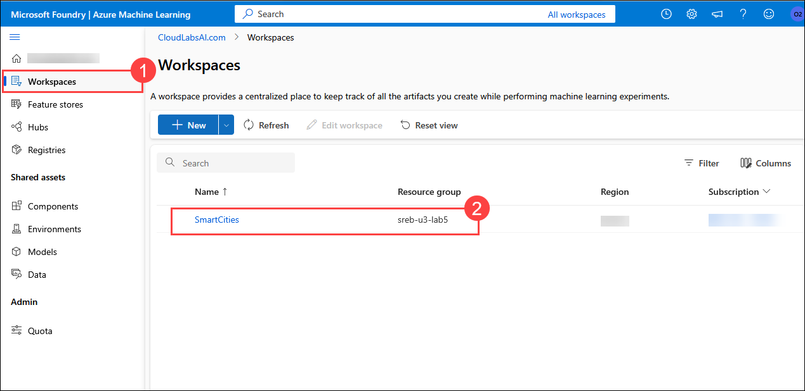

# Lesson 05: Predicting Delivery Delays Using Machine Learning

### Estimated Timing: 60 Minutes

## Lab overview

In this lab,

## Lab objectives

In this exercise, you will perform the following tasks:

- Task 1: Log in to Azure Machine Learning Studio
- Task 2: Uploading the Robot Logistics Dataset
- Task 3: Creating a New Designer Workflow
- Task 4: Evaluate the Model and Run the Pipeline
- Task 5: View and Interpret the Evaluation Results

## Task 1: Log in to Azure Machine Learning Studio

In this task,

1. Open the link below in your browser to access **Azure Machine Learning Studio**:

    ```
    https://ml.azure.com/
    ```

1. If prompted to sign in, enter your credentials.
 
   - **Email/Username:** <inject key="AzureAdUserEmail"></inject>
 
     .png)
 
   - **Password:** <inject key="AzureAdUserPassword"></inject>
 
     .png)
 
1. If prompted to stay signed in, you can click **No**.

   .png)

## Task 2: Uploading the Robot Logistics Dataset

In this task,

1. a

    

1. a

    

1. a

    
    
1. a

    
    
1. a

    
    
1. a

    

1. a

    

1. a

    
    
1. a

    
    
1. a

    
    
1. a

    
    
1. a

    

## Task 3: Creating a New Designer Workflow

In this task,

1. a

    
    
1. a

    
    
1. a

    
    
1. a

    
    
1. a

    
    
1. a

    
    
1. a

    
    
1. a

    

1. a

    
    
1. a

    
    
1. a

    
    
1. a

    
    
1. a

    
    
1. a

    
    
1. a

    
    
1. a

    
    
1. a

    
    
1. a

    
    
1. a

    
    
1. a

    
    
1. a

    
    
1. a

    

## Task 4: Evaluate the Model and Run the Pipeline    

In this task,

1. a

    
    
1. a

    
    
1. a

    
    
1. a

    
    
1. a

    

1. a

    

## Task 5: View and Interpret the Evaluation Results

In this task,

1. a

    
    
1. a

    
    
1. a

    
    
1. a

    
    
1. a

    

## Summary

In this lab, 

### Congratulations, you’ve successfully completed the hands-on lab!